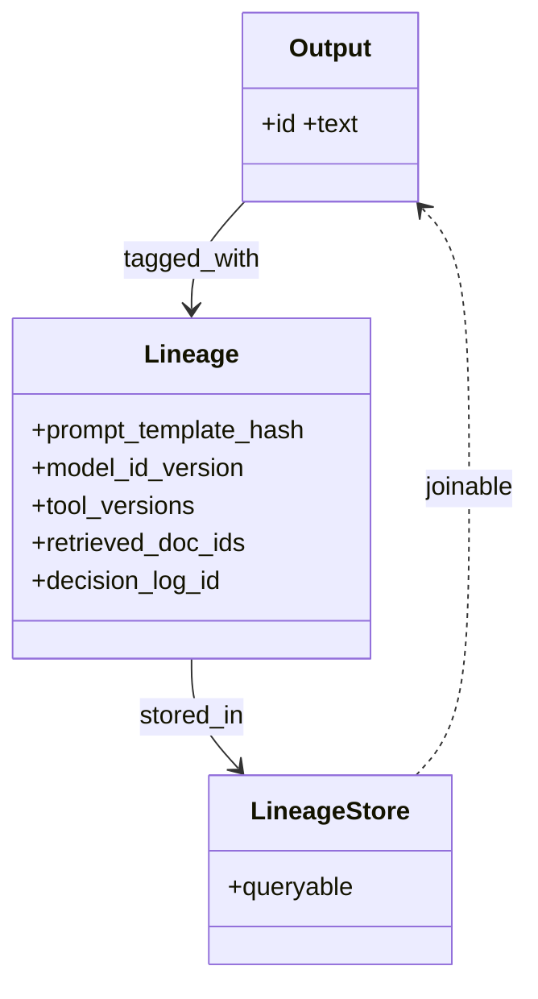

# Lineage Tracking

**Also known as:** Data Lineage, Prompt Versioning, Artefact Provenance

**Category:** Governance & Observability  
**Status in practice:** mature

## Intent

Track which prompt version, model version, and data sources produced each agent output.

## Context

Long-lived production agents where outputs are referenced months later and stakeholders ask 'which version produced this?'.

## Problem

Without lineage, output disputes are unanswerable; rolling back to a known-good state is guesswork.

## Forces

- Lineage metadata adds storage.
- Schema evolution of lineage is itself a problem.
- PII in lineage records (prompts contain user data).

## Applicability

**Use when**

- Output disputes, audits, or rollbacks require knowing exactly what produced an output.
- Prompts, models, tools, and retrieved documents change often enough that ad-hoc tracking fails.
- A queryable lineage store can be joined to the output store.

**Do not use when**

- The agent is a one-shot experiment with no audit need.
- No store exists to capture and join lineage records.
- Output volume is small enough that manual reconstruction is acceptable.

## Therefore

Therefore: stamp every agent output with prompt-template hash, model id and version, tool versions, retrieved-document ids, and decision-log id in a queryable store, so that any output can be traced back to the exact ingredients that produced it.

## Solution

Tag every agent output with: prompt template hash, model id and version, tool versions, retrieved-document ids, decision-log id. Store in a queryable lineage store. Make lineage joinable to the output store.

## Example scenario

A customer files a complaint about an agent answer they got six weeks ago. The team has no record of which prompt template was live then, which model version answered, or which retrieved documents were used; reproducing the answer is impossible. They add lineage-tracking: every output is tagged with prompt-template hash, model id and version, tool versions, retrieved-document ids, and the decision-log id, all stored in a queryable lineage table. The next disputed answer is fully reconstructed in minutes and traced to a since-rolled-back prompt change.

## Diagram

## Consequences

**Benefits**

- Output disputes are answerable.
- Targeted rollback becomes possible.

**Liabilities**

- Storage growth.
- Lineage schema must evolve carefully.

## What this pattern constrains

Outputs without lineage tags are not promoted to production storage.

## Known uses

- **Langfuse, LangSmith, Weights & Biases Prompts** — *Available*

## Related patterns

- *complements* → [provenance-ledger](provenance-ledger.md)
- *complements* → [model-card](model-card.md)
- *complements* → [cost-observability](cost-observability.md)
- *complements* → [replay-time-travel](replay-time-travel.md)
- *alternative-to* → [black-box-opaqueness](black-box-opaqueness.md)
- *alternative-to* → [hidden-mode-switching](hidden-mode-switching.md)
- *composes-with* → [prompt-versioning](prompt-versioning.md)
- *used-by* → [sovereign-inference-stack](sovereign-inference-stack.md)
- *complements* → [attention-manipulation-explainability](attention-manipulation-explainability.md)

**Tags:** governance, lineage, versioning
