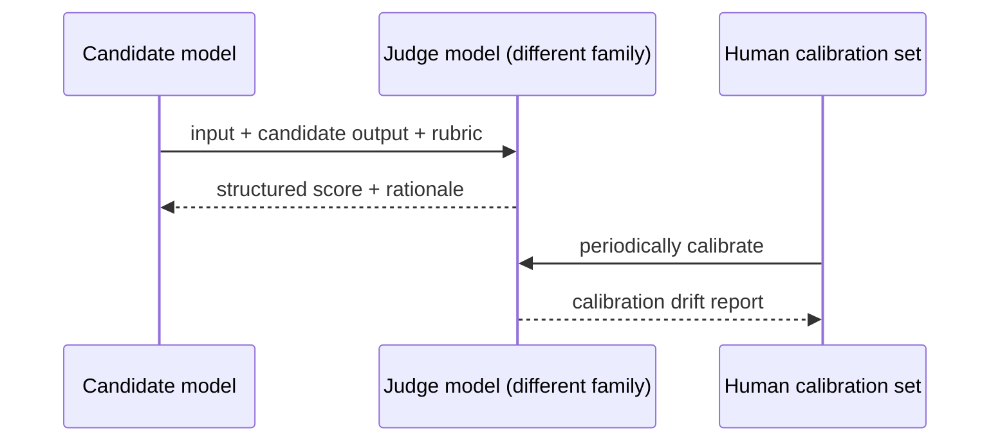

# LLM-as-Judge

**Also known as:** Model Grading, Auto-Evaluator

**Category:** Governance & Observability  
**Status in practice:** mature

## Intent

Use an LLM to score open-ended outputs against rubric criteria when no exact-match metric applies.

## Context

A team is evaluating an agent whose outputs are free-form text — summaries, generated code, long-form prose, support replies — where no single reference answer is uniquely correct. They want regression detection automated enough to run on every release or pull request, not paced by how many summaries a human can grade in a week. They are willing to write down what good looks like in the form of a rubric.

## Problem

Exact-match scoring fails on free-form outputs because there are many acceptable answers, and similarity metrics on raw text miss the qualities the team actually cares about such as faithfulness, completeness, or tone. Pure human grading is too slow to gate a CI pipeline that runs many times per day. The team is forced to choose between cheap-but-blind metrics that miss real regressions and expensive human review that does not scale.

## Forces

- Judges have biases (length, position, model-family preference).
- Calibration against human judgement is its own dataset.
- Same-model judging is suspect when the candidate is from the same family.

## Applicability

**Use when**

- Open-ended outputs need automated regression detection without a reference answer.
- A rubric can be written that covers the qualities you actually care about.
- Calibration against human-graded samples is feasible periodically.

**Do not use when**

- An exact-match or reference metric already grades the task.
- No rubric can be agreed and the judge would just rehearse model bias.
- Calibration data and review cycles cannot be sustained.

## Therefore

Therefore: prompt a judge model from a different family with the input, the candidate output, and an explicit rubric, and calibrate it periodically against human-graded samples, so that open-ended outputs get a structured score with rationale instead of an unscored verdict.

## Solution

Define a rubric. Prompt a judge model with the input, candidate output, and rubric. Receive a structured score plus rationale. Calibrate periodically against human-graded samples. Use a different model family for judge vs candidate where possible.

## Example scenario

A team running a summarisation eval relies on humans to grade 200 summaries per release, which takes a week and gates every deploy. They add llm-as-judge: a different model family scores each summary against a rubric (faithfulness, completeness, clarity) and emits a structured score plus rationale. They calibrate weekly against a 30-sample human-graded slice and flag drift. Releases now ship daily with an automated quality gate, and humans only spot-check.

## Diagram

## Consequences

**Benefits**

- Scales free-form evaluation.
- Rationales are debugging breadcrumbs.

**Liabilities**

- Judge biases skew scores in subtle ways.
- Cost: every eval is now N x judge calls.

## What this pattern constrains

Scores are advisory unless calibrated against human judgement at known intervals.

## Known uses

- **MT-Bench / AlpacaEval** — *Available*
- **Ragas / DeepEval / Langfuse** — *Available*

## Related patterns

- *used-by* → [eval-harness](eval-harness.md)
- *used-by* → [evaluator-optimizer](evaluator-optimizer.md)
- *generalises* → [agent-as-judge](agent-as-judge.md)
- *used-by* → [shadow-canary](shadow-canary.md)

## References

- (paper) Zheng et al., *Judging LLM-as-a-Judge with MT-Bench and Chatbot Arena*, 2023, <https://arxiv.org/abs/2306.05685>

**Tags:** eval, judge, scoring
