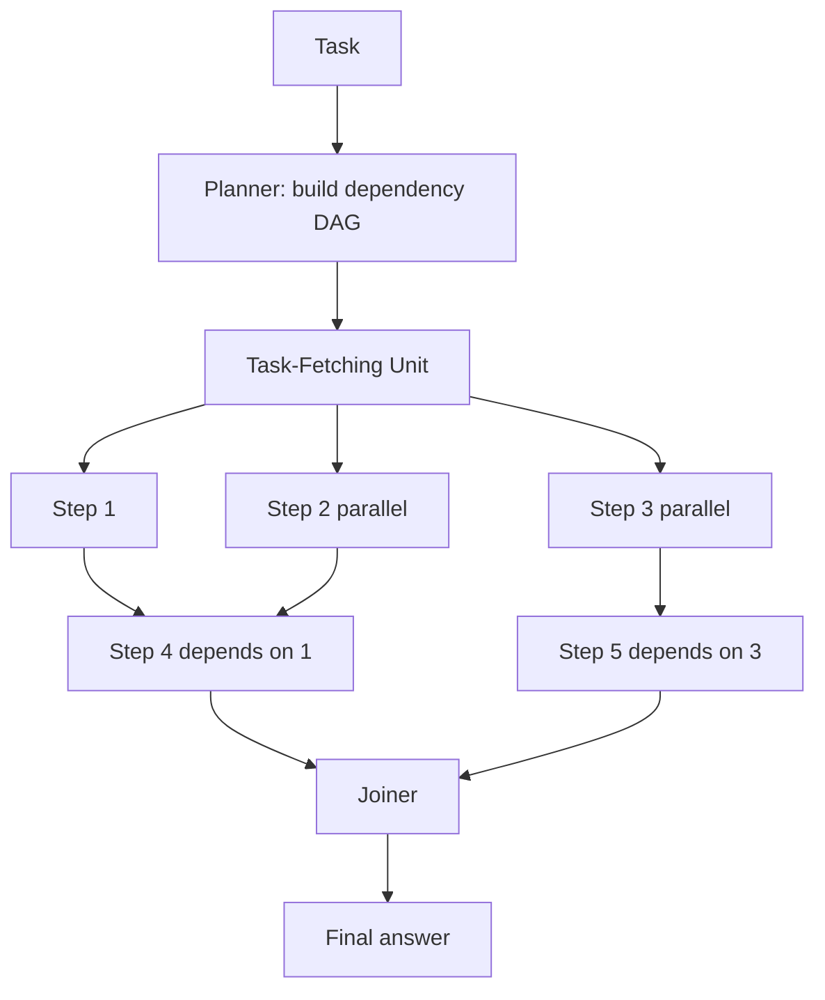

# LLMCompiler

**Also known as:** LLM Compiler, Parallel ReWOO

**Category:** Planning & Control Flow  
**Status in practice:** experimental

## Intent

Take ReWOO's plan-as-DAG and run independent steps in parallel through a task-fetching dispatcher.

## Context

A team runs an agent whose work consists of many tool calls — fetching prices for nine tickers, summarising five documents, querying three APIs — and most of those calls are independent of each other. The deployment is latency-sensitive: a user is waiting for an answer or a downstream system has a deadline. The team is already using a plan-then-execute style architecture such as ReWOO (Reasoning Without Observation), where the planner emits a directed acyclic graph of tool calls before any tool runs.

## Problem

A sequential executor walks the plan one tool call at a time, so end-to-end latency is the sum of every call even when the calls have no mutual dependency. Naive parallel-tool-calling (firing them all at once from a single chat turn) ignores the dependency graph and breaks when later calls reference earlier results. A bespoke parallel runner without bounded concurrency and a join step blows past provider rate limits, leaks errors across branches, and assembles results out of order. The team needs a runner that respects the dependency graph while overlapping independent work.

## Forces

- Concurrency control: limits per provider, rate limits, fan-out costs.
- Failure isolation: one branch failing should not kill others.
- Joiner correctness: combining out-of-order results.

## Applicability

**Use when**

- Latency-sensitive agents waste time waiting on independent tool calls in series.
- A planner can build a dependency DAG up front for the workload.
- Bounded concurrency and a join step are acceptable engineering investments.

**Do not use when**

- Tool calls are mostly sequential with strong dependencies.
- Parallel-tool-calls already gives most of the latency win at lower complexity.
- DAG planning cost dominates the savings on the actual workload.

## Therefore

Therefore: have the planner emit a dependency DAG and a task-fetching unit dispatch independent steps concurrently before a joiner assembles them, so that end-to-end latency collapses to the longest dependency chain instead of the sum of all calls.

## Solution

Three roles. Planner builds the dependency DAG. Task-Fetching Unit dispatches steps as their inputs become available, with bounded concurrency. Joiner assembles the final answer from the resolved DAG.

## Example scenario

An agent that builds a daily portfolio brief makes nine independent tool calls — fetch prices for nine tickers — strictly in sequence, taking 18 seconds where it could take two. The team rebuilds the loop as llm-compiler: the planner emits the call DAG up front, the task-fetching unit dispatches each fetch as soon as its dependencies (none, in this case) resolve, with concurrency capped at five, and the joiner assembles the brief. The brief returns in just over two seconds and the planner can express genuine cross-step dependencies when they exist.

## Diagram

## Consequences

**Benefits**

- End-to-end latency drops to the longest dependency chain.
- Cost remains roughly the same as ReWOO.

**Liabilities**

- Concurrency adds operational complexity.
- Planner mistakes are amplified by parallel execution.

## What this pattern constrains

Steps run only when all referenced upstream variables are resolved.

## Known uses

- **LLMCompiler (reference implementation)** — *Available*. Berkeley SqueezeAILab release of the LLMCompiler paper code.
- **LangGraph LLMCompiler example** — *Available*. LangGraph ships an LLMCompiler example.

## Related patterns

- *specialises* → [rewoo](rewoo.md)
- *uses* → [parallelization](parallelization.md)
- *alternative-to* → [parallel-tool-calls](parallel-tool-calls.md)
- *composes-with* → [subagent-isolation](subagent-isolation.md)
- *complements* → [graph-of-thoughts](graph-of-thoughts.md)

## References

- (paper) Kim, Moon, Tabrizi, Lee, Mahoney, Keutzer, Gholami, *An LLM Compiler for Parallel Function Calling*, 2023, <https://arxiv.org/abs/2312.04511>

**Tags:** planning, parallel, dag
