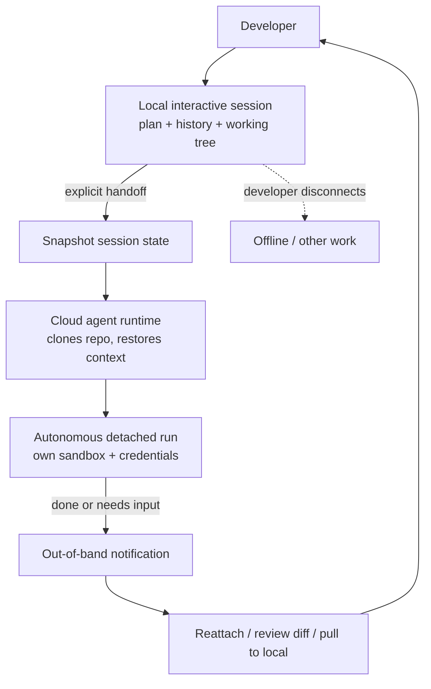

# Local-to-Cloud Handoff

**Category:** Planning & Control Flow  
**Status in practice:** emerging

## Intent

Promote an interactive local agent session mid-task to a detached cloud agent that keeps running after the developer disconnects and reports back asynchronously.

## Context

A developer is driving an agent interactively from a laptop or terminal, refining a plan turn by turn. At some point the work becomes long-running and self-contained: a refactor, a test-fixing loop, a multi-step build that will take minutes or hours and no longer needs steering. The developer wants to close the laptop, switch tasks, or go offline without abandoning or restarting the run.

## Problem

An interactive session is tied to the developer's presence: the process lives in a terminal or editor on the local machine, so disconnecting, sleeping the laptop, or losing the network stalls or kills the run. Keeping the machine awake and tethered for hours wastes the developer's time on a task that no longer needs input, while killing and re-prompting on a fresh remote agent loses the accumulated plan, context, and partial progress built up during the interactive phase.

## Forces

- Long autonomous runs do not need a human watching, but starting them fresh elsewhere discards local context.
- The developer's presence and the agent's execution are coupled when the session lives in a local process.
- Transferring an in-flight session must carry plan, conversation history, and working state, not just a prompt.
- Cloud execution needs its own credentials, repo access, and sandbox that the local machine implicitly had.
- A detached run that goes wrong must still surface to the developer rather than fail silently.

## Applicability

**Use when**

- An interactive run becomes long and self-contained and no longer needs turn-by-turn steering.
- The developer needs to disconnect, sleep the machine, or go mobile without killing the run.
- A cloud runtime with repo access, credentials, and a sandbox is available to continue execution.
- Accumulated plan and context are worth preserving rather than re-prompting from scratch.

**Do not use when**

- The task is short enough to finish in the local session before the developer would step away.
- The work needs continuous human judgement and cannot run unattended.
- No trusted cloud runtime exists, or repo and secret access cannot be safely delegated to it.
- Out-of-band notification and budget limits are not in place to catch a detached run going wrong.

## Therefore

Therefore: at a chosen point, serialise the live session — plan, history, and working tree — and hand it to a cloud runtime that continues execution detached from the local process, then notifies and lets the developer reattach when it finishes or needs input.

## Solution

Expose an explicit handoff action in the interactive session (a command, prefix, or button) that snapshots the current state and transfers it to a cloud agent runtime. The cloud runtime clones or mounts the repository, restores the plan and conversation context, and resumes the run autonomously in its own sandbox with its own credentials. The local client detaches: the developer can disconnect, and the run survives. On completion or when input is required, the cloud agent notifies the developer out of band and offers a way to reattach, review the diff, or pull the run back to local. The defining move is decoupling execution from the local interactive session so it outlives disconnect; this is distinct from agent-to-agent control transfer and from resuming a previously saved session.

## Example scenario

A developer is iterating with a local CLI agent on a large dependency upgrade and, once the plan is settled, prepends a marker to send the conversation to a cloud agent. The laptop closes; the cloud agent clones the repo, finishes the upgrade and test loop in its own VM, and pushes a branch. A notification arrives an hour later, and the developer reviews the diff on the web without the session ever having been local-bound.

## Diagram

## Consequences

**Benefits**

- The developer is freed from babysitting a long run and can disconnect, sleep the machine, or go mobile.
- Accumulated plan, context, and partial progress carry across the handoff instead of being thrown away.
- Cloud execution can outlast network drops, laptop sleep, and shift boundaries.
- The same task can be steered interactively while cheap, then detached once it becomes mechanical.

**Liabilities**

- The cloud runtime needs its own repo access, credentials, and sandbox, widening the trust and secret-handling surface.
- A detached run can drift or burn budget unobserved if notification and budget limits are weak.
- State transfer is lossy if local-only context (uncommitted files, environment, tool state) is not captured.
- Reattaching to a moved session adds UX and consistency complexity, especially if local and cloud both edit.

## What this pattern constrains

Execution must continue independently of the local interactive session once handed off, and the cloud agent must notify the developer rather than block silently when it completes or needs input.

## Known uses

- **[Google Jules](https://jules.google/docs)** — *Available* — Runs an approved plan autonomously in a cloud VM that clones the repo, then notifies on completion so the developer can move on while it handles the task.
- **[Cursor CLI Cloud Handoff](https://cursor.com/changelog/cli-jan-16-2026)** — *Available* — Prepending a marker to a message pushes the local conversation to a Cloud Agent that keeps running while the developer is away; the run is picked up later on web or mobile.
- **Claude Code delegate to cloud agent** — *Available* — A background session can be delegated to a cloud agent, passing full chat history and context to a run monitored remotely.

## Related patterns

- *complements* → [handoff](handoff.md)
- *complements* → [agent-resumption](agent-resumption.md)
- *complements* → [scheduled-agent](scheduled-agent.md)

## References

- (doc) *Jules documentation — autonomous cloud task execution*, <https://jules.google/docs>
- (blog) *Cursor CLI (Jan 16, 2026): CLI Agent Modes and Cloud Handoff*, <https://cursor.com/changelog/cli-jan-16-2026>
- (doc) *Cursor — Cloud Agents*, <https://cursor.com/docs/cloud-agent>

**Tags:** control-flow, async, cloud-execution, session-handoff
