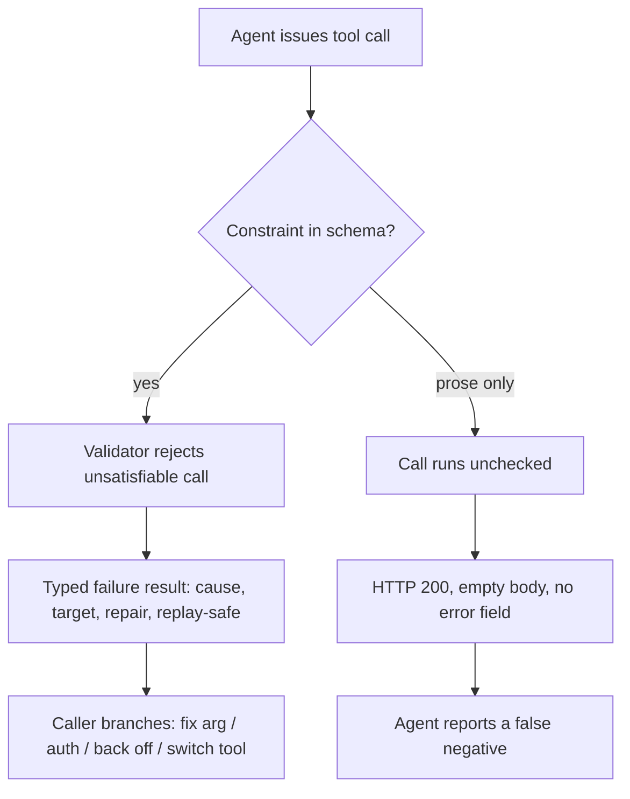

# Machine-Checkable Tool Contract

**Also known as:** Schema-Enforced Tool Constraint, Typed Tool Failure Result

**Category:** Tool Use & Environment  
**Status in practice:** emerging

## Intent

Express every constraint a tool places on its caller in the machine-readable schema rather than the prose description, and return failures as typed fields the caller can branch on.

## Context

A tool is exposed to an agent through an interface description such as an OpenAPI document or an MCP tool definition. That description has two channels: a machine-readable schema of parameters and types, and a prose field meant for a human reader. Constraints that matter for a call to succeed — which values an enumeration accepts, which date ranges are servable, which combinations of arguments are legal — can be written into either channel. The prose channel is cheap to write, so it accumulates most of them.

## Problem

A constraint stated only in prose is enforced by nobody. The schema validator does not see it, the server often does not check it, and the model reads it as a suggestion among many. A call that violates such a constraint is not rejected: it runs, matches nothing, and returns a well-formed empty result with a success status. The caller has no field to branch on, cannot distinguish a query that legitimately matched nothing from one the server never understood, and so reports the empty result as a finding.

## Forces

- Prose is the cheapest place to record a constraint and the only place that can express nuance, but it is the one channel no validator enforces.
- A schema constraint costs authoring effort up front and rejects some calls that would have worked, while a prose constraint costs nothing and silently admits calls that cannot.
- An empty result and an unsatisfiable query are indistinguishable at the transport layer, so the caller cannot recover a distinction the provider never encoded.
- Typed failure fields are useful only if the provider commits to them; a boolean error flag tells the caller that something went wrong but not what to do next.

## Therefore

Therefore: move every caller-facing constraint into the schema where a validator can reject a bad call outright, and make each failure result carry typed fields naming the cause, the offending target, the repair, and whether a retry is safe.

## Solution

Treat the tool description as a contract with two obligations. On the way in, every constraint that determines whether a call can succeed is declared in the machine-readable schema — enumerations for closed value sets, patterns for formats, ranges for servable bounds — so an unsatisfiable call is rejected at validation time instead of running and returning nothing. On the way out, a failure is not a boolean flag but a structured result: a specific cause, the parameter or resource at fault, an executable repair where one exists, and whether replaying the call is safe. The caller then branches mechanically on the failure kind, fixing an argument, authenticating, backing off, or choosing another tool, rather than inferring intent from a prose message. Prose keeps the nuance a schema cannot hold, but it stops being the only record of anything load-bearing.

## Structure

```
Tool description = machine-readable schema (enums, patterns, ranges — validated) + prose (nuance only). Call --validate--> reject-or-run. Failure --> typed result {cause, target, repair, replay-safe} --> caller branches.
```

## Diagram



*A schema-declared constraint turns an unsatisfiable call into a typed failure the caller can act on; a prose-only constraint turns it into a silent empty success.*

## Example scenario

A research agent calls a company's public filings API for documents from 1998. The API only serves records back to 2001, a limit stated in the endpoint's description text but absent from the parameter schema. The call returns HTTP 200 with an empty list, and the agent tells the user the company filed nothing that year. Had the year range been declared in the schema, the call would have been rejected with a message the agent could act on.

## Consequences

**Benefits**

- An unsatisfiable call fails at validation instead of returning a well-formed empty result the caller reads as a finding.
- The caller can branch on failure kind mechanically, so repair, authentication, back-off and tool substitution stop depending on parsing a human-readable string.
- The distinction between an empty match and a misunderstood query survives the transport layer.

**Liabilities**

- Declaring constraints in the schema rejects some calls a permissive server would have served, so an over-tight enumeration turns a working call into a hard failure.
- Existing tool surfaces must be re-authored; audits of published interface documents find the great majority declare no machine-checkable constraint at all.
- A typed failure vocabulary is a commitment the provider has to keep as the tool evolves, and a stale taxonomy misroutes recovery.

## Failure modes

- The constraint stays in prose, the call runs, and an empty body with a success status is reported to the user as a confident negative finding.
- The failure result carries only a boolean error flag, so the caller cannot tell an authentication problem from a malformed argument and retries the same call.
- A structured-output constraint silently narrows what the tool returns, and the caller never learns that the omission came from the constraint rather than the data.

## What this pattern constrains

No constraint that determines whether a call can succeed may live only in the prose description; it must be declared in the machine-readable schema, and a failure result must not be a bare boolean flag.

## Applicability

**Use when**

- A tool is exposed to agent callers rather than to human developers who can read a description page.
- Some calls are unsatisfiable in ways the transport layer reports as success, such as an empty result set.
- Callers need to choose between repairing an argument, authenticating, waiting, and switching tools without parsing prose.

**Do not use when**

- The constraint is genuinely open-ended or contextual and cannot be expressed as an enumeration, pattern or range without rejecting valid calls.
- The tool is consumed only by human developers who read the description before writing the call.
- The interface is owned by a third party and cannot be changed, in which case caller-side validation is the available remedy instead.

## Components

- Machine-readable parameter schema — declares enumerations, patterns and ranges so an unsatisfiable call is rejected before it runs
- Request validator — enforces the schema at the boundary rather than trusting the caller to have read the description
- Typed failure result — carries specific cause, offending target, executable repair and replay safety instead of a boolean flag
- Prose description — retains the nuance a schema cannot express, but no longer holds any load-bearing constraint alone
- Caller branch table — maps each failure cause to a recovery action such as repair, authenticate, back off or substitute

## Tools

- OpenAPI or MCP tool definitions — the interface surface where the schema and prose channels both live
- JSON Schema validator — rejects calls that violate a declared enumeration, pattern or range
- Contract tests — assert that documented constraints are actually enforced and that failures carry the typed fields

## Evaluation metrics

- Fraction of caller-facing constraints declared in the schema versus stated only in prose
- Silent-failure rate — unsatisfiable calls that return a success status with a well-formed body
- Caller recovery rate after a failure — share of failures where the typed fields were sufficient to choose an action
- False-negative rate — findings reported to the user that came from an empty result the caller never questioned

## Known uses

- **[OpenAPI schema keywords (enum, pattern, minimum/maximum)](https://spec.openapis.org/oas/latest.html)** _available_ — The specification provides machine-checkable constraint keywords, but an audit of 2,501 independently published documents found only 15.2% of parameters declare any such constraint while 40.1% of descriptions state a constraint in prose alone.
- **[Model Context Protocol tool results (isError)](https://modelcontextprotocol.io/specification/2026-07-28/server/tools)** _available_ — MCP marks a failed tool result with isError, which tells a client that something went wrong but on its own carries no machine-readable cause, target, repair or replay-safety field to branch on.
- **[JSON Schema validation](https://json-schema.org/draft/2020-12/json-schema-validation)** _available_ — Supplies the enumeration, pattern and range vocabulary a tool contract needs so an unsatisfiable call is rejected before it reaches the server.

## Related patterns

- _complements_ **Tool Output Trusted Verbatim** — That anti-pattern is the caller failing to validate what comes back; this pattern constrains what the tool promises on the way in and the shape of its failures on the way out.
- _complements_ **Typed Refusal Codes** — The same machine-readable discipline applied to guard-surface refusals rather than to tool failures.
- _complements_ **Agent-Computer Interface** — Designs the tool surface for a model rather than a human; this pattern says which channel of that surface each constraint belongs in.
- _complements_ **Silent External-Source Rot** — There an external source changed under a stable wrapper; here nothing drifted, the constraint was never machine-enforced to begin with.
- _complements_ **Exception Handling and Recovery** — Recovery presupposes the failure is detectable; typed failure fields are what make it detectable.
- _complements_ **Structured Output** — Constrains what the model emits; this constrains what the tool accepts and what its failures look like.

## References

- [SilentProbe: Measuring Silent Failure in Production APIs Used as Agent Tools](https://arxiv.org/abs/2609.00035) — 2026
- [Can MCP Clients Decide What to Do After Failure? A Result-Only Actionability Study](https://arxiv.org/abs/2609.00072) — 2026
- [Fidelity Is Not Enough: Dispatch-Level Instrumentation for Agentic Data Extraction](https://arxiv.org/abs/2608.28439) — 2026
- [OpenAPI Specification](https://spec.openapis.org/oas/latest.html)
