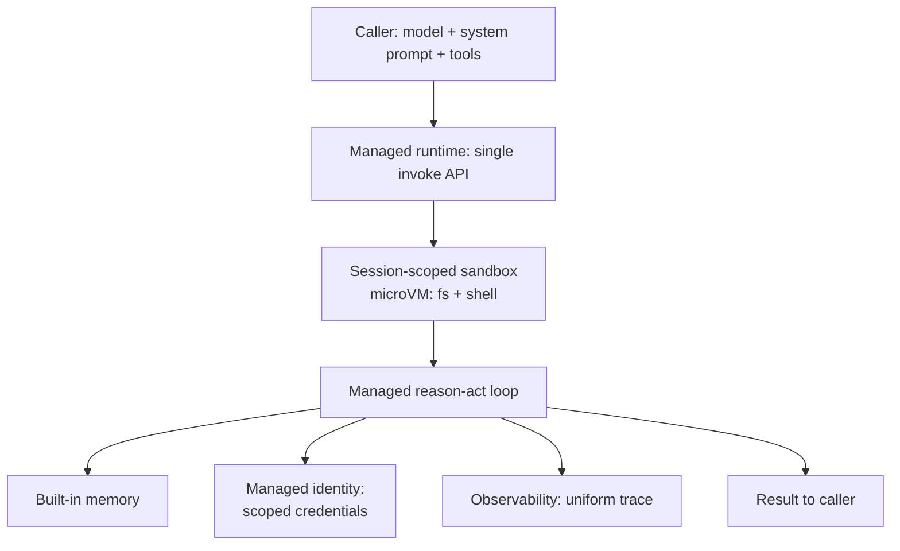

# Managed Agent Runtime

**Also known as:** Agent Loop as a Service, Managed Agent Loop, Serverless Agent Runtime

**Category:** Governance & Observability  
**Status in practice:** emerging

## Intent

Offer the agent loop itself as a managed cloud primitive so a caller supplies a model, system prompt, and tools and the platform runs the orchestration in an isolated, session-scoped runtime.

## Context

An organisation is shipping several agent products and every team has hand-rolled the same orchestration loop: the reason-act cycle, tool dispatch, session state, per-session isolation, identity for outbound calls, retries, and observability. Each loop is operated separately, drifts in behaviour, and carries its own on-call burden, while the cloud now exposes the loop as a service alongside memory, identity, and tracing.

## Problem

Re-implementing and operating the agent loop per team multiplies effort and risk. Each bespoke loop must solve session isolation, credential handling, resumability, and tracing on its own, and any one of them done weakly becomes a production incident. Sessions that share a process leak state into one another; outbound tool calls reach for ambient host credentials; a crash loses in-flight work because there was no checkpoint; and there is no uniform trace to debug across products. The loop is undifferentiated infrastructure that every team rebuilds and operates instead of consuming.

## Forces

- A bespoke loop gives full control over orchestration but multiplies operational surface across teams.
- Session-scoped isolation needs a sandbox per session, which adds cold-start latency.
- A managed runtime standardises identity, memory, and tracing but ties the deployment to a vendor contract.
- Built-in observability is uniform across products but constrained to what the platform emits.

## Applicability

**Use when**

- Several teams are each rebuilding and operating the same agent loop.
- Per-session isolation, identity, and tracing must be uniform across agent products.
- A cloud runtime that exposes the loop with session-scoped sandboxes is available.

**Do not use when**

- A single agent needs deep custom orchestration the managed loop cannot express.
- Vendor lock-in or per-session latency budgets rule out a hosted runtime.
- The workload is so simple that one in-process loop is cheaper to run than to outsource.

## Therefore

Therefore: invoke the loop through a managed runtime that accepts model, system prompt, and tools per call and executes the orchestration in a session-scoped isolated sandbox with built-in memory, identity, and tracing, rather than operating a hand-rolled loop per team.

## Solution

The platform exposes a single invoke endpoint that takes a model reference, a system prompt, and a tool set, then runs the full reason-act loop on the caller's behalf. Each session executes inside its own isolated sandbox, commonly a microVM with filesystem and shell access, so concurrent sessions never share state. The runtime wires in managed memory for short- and long-term context, a managed identity service that mints scoped credentials for outbound tool calls, and observability that emits a uniform trace of every step. The caller owns prompt, tools, and policy; the platform owns the loop, isolation, and operations.

## Example scenario

A company runs a coding agent, a research agent, and a support agent, each on a separately operated loop, and a state leak between two concurrent support sessions causes one user to see another's data. The teams move to a managed agent runtime: each defines its model, system prompt, and tools and invokes a single API, and the platform runs every session in its own microVM with built-in identity and tracing. The cross-session leak becomes structurally impossible and the three teams stop carrying three on-call rotations for the same loop.

## Diagram

## Consequences

**Benefits**

- Teams stop rebuilding and operating the same loop; orchestration becomes a consumed primitive.
- Session-scoped sandboxing makes cross-session state leaks structurally hard.
- Identity, memory, and tracing are uniform across every agent product on the platform.

**Liabilities**

- The agent loop and its operational behaviour are tied to a vendor contract and pricing model.
- Per-session sandbox provisioning adds cold-start latency that a long-lived in-process loop avoids.
- Custom orchestration that the managed loop does not expose is hard or impossible to inject.

## What this pattern constrains

Callers cannot run the orchestration loop in their own process; the loop runs only inside the platform's session-scoped sandbox, and each session is isolated rather than sharing a runtime.

## Known uses

- **[Amazon Bedrock AgentCore (Harness + Runtime)](https://docs.aws.amazon.com/bedrock-agentcore/latest/devguide/what-is-bedrock-agentcore.html)** — *Available* — Harness is a managed agent loop invoked with a single API call passing model, system prompt, and tools inline; each session runs in an isolated microVM with filesystem and shell access, with Runtime providing session isolation, built-in identity, and observability.
- **[Cloudflare Agents](https://developers.cloudflare.com/agents/)** — *Available* — Serverless durable agent runtime that hosts the agent on Cloudflare infrastructure and connects chat, voice, email, and webhooks to it.
- **[Modal Sandboxes](https://modal.com/docs/guide)** — *Available* — Serverless platform that spins up isolated, secure sandboxes per workload to execute agent-generated code with sub-second cold starts.

## Related patterns

- *uses* → [react](react.md)
- *uses* → [sandbox-isolation](sandbox-isolation.md)
- *complements* → [session-isolation](session-isolation.md)
- *complements* → [agent-resumption](agent-resumption.md)

## References

- (doc) *What is Amazon Bedrock AgentCore?*, <https://docs.aws.amazon.com/bedrock-agentcore/latest/devguide/what-is-bedrock-agentcore.html>
- (doc) *Cloudflare Agents*, <https://developers.cloudflare.com/agents/>
- (doc) *Modal Guide*, <https://modal.com/docs/guide>

**Tags:** runtime, orchestration, isolation, managed-service, observability
