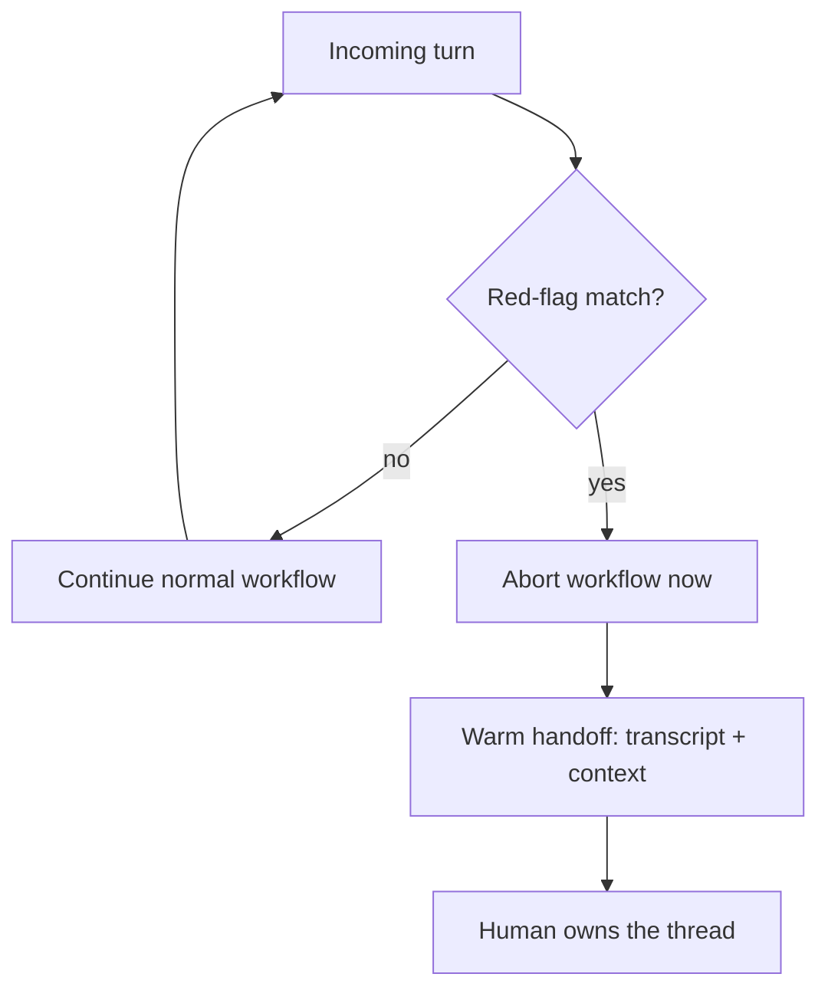

# Mandatory Red-Flag Escalation

**Also known as:** Unconditional Escalation Trigger, Red-Flag Short-Circuit

**Category:** Safety & Control  
**Status in practice:** established

## Intent

Maintain a deterministic set of high-risk triggers so that on any match the agent immediately aborts its workflow and hands off to a human, without weighing whether to escalate.

## Context

An agent runs a conversational or task workflow where a small fraction of inputs signal a life-, safety-, or money-critical situation: a clinical triage line, a crisis-support chat, a fraud or safety hotline, an industrial-control assistant. The workflow normally proceeds turn by turn, gathering context and acting, but a few signals mean that continuing the normal flow at all is the wrong move and a human must take over at once.

## Problem

When a high-stakes signal appears, an agent left to its own judgement tends to keep doing what it was doing: it asks one more clarifying question, finishes the current step, or scores the situation against a soft threshold before deciding to escalate. Each of those extra turns is a chance to mishandle an emergency, and a model that treats escalation as one option among many will sometimes rationalise staying in the loop. The system needs a guarantee that a matched red flag stops normal handling immediately, not a tendency that usually does.

## Forces

- Speed of handoff competes with completeness of context: aborting instantly is safest, yet a warm handoff still needs the situation captured so far.
- A deterministic trigger set is auditable and hard to talk past, but it must be tuned or it over-triages and trains operators to ignore it.
- Letting the model decide when to escalate is flexible but unreliable under pressure; hard-coding the abort is rigid but dependable.
- Red-flag rules drift as protocols change, so the trigger set is a maintained artifact rather than a one-time list.

## Therefore

Therefore: define the red flags as explicit, deterministic triggers checked on every turn, and on a match force an immediate abort-and-handoff that the model cannot reason its way out of, attaching the context gathered so far.

## Solution

Keep red-flag triggers as a maintained, deterministic rule set — keyword and phrase matches, classifier thresholds, or structured-field conditions — evaluated against every turn before the normal workflow runs. The check sits outside the model's discretion: a match fires regardless of what the agent was planning. On a match the runtime short-circuits the remaining workflow, stops any further autonomous handling, and performs a warm handoff that passes the human operator the transcript and any structured context already collected. The model never votes on whether to escalate; its only role after a match is to relay the brief, fixed escalation message while control transfers. The trigger set is versioned and reviewed against the underlying protocol so it stays neither too noisy nor too narrow.

## Structure

```
Every turn --> Red-flag check (deterministic) --no match--> Normal workflow continues
                                          --match--> Abort workflow --> Warm handoff (transcript + context) --> Human owns thread
```

## Diagram



*Every turn is checked first; a match forces an immediate abort and warm handoff, bypassing the rest of the workflow.*

## Example scenario

A telehealth triage voice agent is collecting symptoms when the caller says their father is not breathing. The phrase matches a red-flag trigger, so the agent abandons the symptom questionnaire mid-question, stops all further autonomous handling, and warm-transfers the call to an on-call nurse with the transcript and the fields gathered so far attached, rather than finishing the form first.

## Consequences

**Benefits**

- A matched high-risk signal can never be buried under further autonomous turns, because the abort is enforced outside the model's reasoning.
- The deterministic trigger set is auditable and testable: every red flag and the action it forces can be reviewed against the governing protocol.
- Handoff carries the context gathered so far, so the human starts informed rather than from zero.

**Liabilities**

- A trigger set that is too broad floods operators with false escalations and erodes trust in the signal.
- A trigger set that is too narrow misses a real emergency phrased outside the rules.
- Forcing an abort mid-flow discards work in progress and can interrupt a benign interaction that merely used a flagged phrase.

## Failure modes

- Discretionary drift — escalation is wired as a soft preference the model can override, so under load it keeps triaging past a real red flag.
- Over-triage fatigue — an untuned trigger set fires so often that operators learn to dismiss handoffs, defeating the guarantee.
- Lossy handoff — the abort fires but the gathered context is not passed, so the human restarts the assessment and loses time.
- Stale rules — the trigger set is not maintained against protocol changes and silently misses newly recognised red flags.

## What this pattern constrains

On a matched red flag the agent must abort the workflow and hand off to a human immediately; it may not continue autonomous handling, ask further questions, or treat escalation as one option to be weighed against continuing.

## Guardrails

- Evaluate the red-flag check on every turn before the normal workflow runs, never only at the end.
- Keep the trigger set deterministic and versioned, and review it against the governing protocol on a fixed cadence.
- On a match, capture and pass the transcript and structured context with the handoff rather than dropping it.

## Applicability

**Use when**

- A small set of inputs signal life-, safety-, or money-critical situations where continuing the normal workflow at all is unsafe.
- The high-risk signals can be expressed as deterministic, auditable triggers checked on every turn.
- A human or specialised path exists that must take over immediately on a match.

**Do not use when**

- Risk is graduated and the agent should keep handling lower-stakes cases autonomously, where tiered autonomy fits better than an all-or-nothing abort.
- The high-stakes condition cannot be detected reliably enough to justify forcing an abort, so the trigger would over- or under-fire.
- No human or escalation target is available to receive the handoff the trigger demands.

## Components

- Red-flag trigger set — the deterministic, versioned rules (phrases, classifier thresholds, field conditions) that define a high-risk signal
- Pre-turn check — evaluates the trigger set against every turn before the normal workflow runs
- Abort controller — short-circuits the remaining workflow and stops further autonomous handling on a match
- Warm-handoff bridge — transfers the thread to a human operator with the transcript and structured context attached
- Escalation message template — the fixed, brief message the agent relays while control transfers
- Trigger-set review process — the maintained cadence that keeps the rules aligned with the governing protocol

## Tools

- Deterministic matcher — keyword, phrase, and regex matching for explicit red-flag signals
- Risk classifier — scores turns against tuned thresholds for signals that need more than literal matching
- Handoff and routing layer — transfers the live conversation to a human operator or on-call queue
- Context store — holds the transcript and structured fields gathered before the abort for the handoff

## Evaluation metrics

- Missed-red-flag rate — fraction of true high-risk turns that did not trigger an abort (false negatives)
- Over-triage rate — fraction of handoffs that turned out not to need escalation (false positives)
- Turns-after-match — how many autonomous turns ran after a red flag fired; the target is zero
- Handoff context completeness — share of escalations that arrived with the transcript and structured context attached
- Time-to-human after match — latency from trigger match to a human owning the thread

## Known uses

- **[s10.ai AI phone agent](https://s10.ai/blog/how-to-automate-clinical-triage-and-emergency-escalation-in-ai-phone-agents)** _available_ — Clinical-triage voice agent that bypasses all menus and escalates immediately on emergency red-flag phrases such as a caller reporting that someone is not breathing.
- **[AssemblyAI telehealth triage voice agent](https://www.assemblyai.com/blog/telehealth-triage-voice-agent)** _available_ — Reference build whose stated rule is that red-flag escalation must be automatic, not conditional, and the agent must never continue triaging after a red flag is captured.

## Related patterns

- _uses_ **Conversation Handoff to Human** — The escalation fires the handoff: red-flag detection is the trigger, conversation-handoff is the transfer-and-state mechanism it invokes.
- _complements_ **Human-in-the-Loop** — Human-in-the-loop gates a planned action on approval; this aborts the whole flow on a detected signal rather than pausing one step for sign-off.
- _complements_ **Risk-Tiered Action Autonomy** — Risk tiers grade autonomy by materiality and let the agent keep working at lower tiers; a red flag is an all-or-nothing interrupt that ends autonomous handling outright.
- _complements_ **Input/Output Guardrails** — Guardrails validate inputs and outputs in line; the red-flag check is an input-side guardrail whose action is a forced abort-and-handoff rather than a block or rewrite.

## References

- [Build a Voice Agent for Telehealth Triage](https://www.assemblyai.com/blog/telehealth-triage-voice-agent) — 2025
- [How to Automate Clinical Triage and Emergency Escalation in AI Phone Agents](https://s10.ai/blog/how-to-automate-clinical-triage-and-emergency-escalation-in-ai-phone-agents) — 2025
- [Streamlining Telephone Triage: Improving Safety & Efficiency with a Red Flag List](https://www.myamericannurse.com/streamlining-telephone-triage-improving-safety-efficiency-with-a-red-flag-list/) — Yowell, Chernak, Albery, 2026
- [Clinical Escalation After-Hours Triage Protocols](https://triagelogic.com/clinical-escalation-after-hours-triage-protocols/) — 2024
- [Policy Cards: Machine-Readable Runtime Governance for Autonomous AI Agents](https://arxiv.org/abs/2510.24383) — 2025
