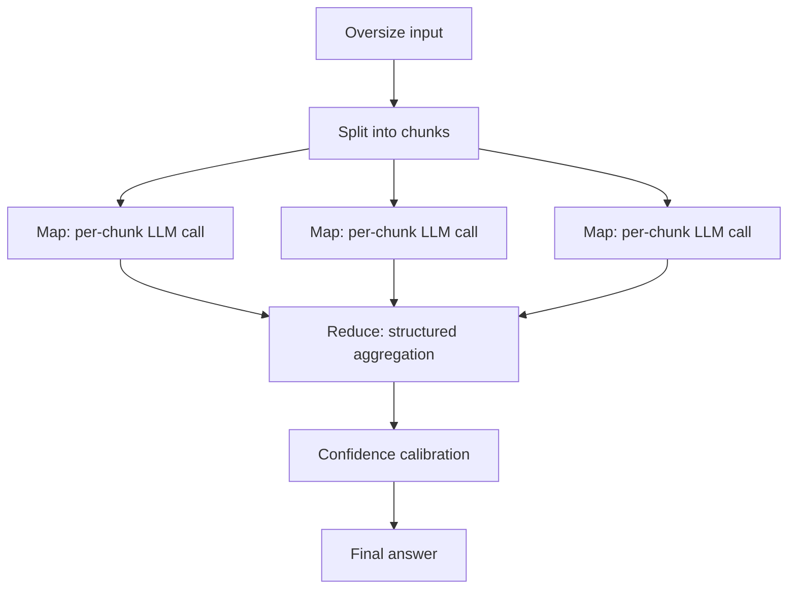

# MapReduce for Agents

**Also known as:** LLM×MapReduce, Divide-and-Conquer

**Category:** Planning & Control Flow  
**Status in practice:** emerging

## Intent

Split an oversize task into independent chunks, process each in parallel, then aggregate.

## Context

A team needs to apply a language model to an input that is too large for a single call — twelve hundred pages of vendor contracts, a million-row table, hundreds of documents to summarise — or to a task that decomposes naturally into independent pieces (per row, per document, per section). Per-piece work is short; what is hard is the scale.

## Problem

Stuffing the whole input into a long-context model still degrades quality past a certain point; quality drops in the middle of long documents and the model conflates entities across the input. Chunking the input and processing each chunk in isolation loses anything that depends on more than one chunk, such as cross-document deduplication or per-entity aggregation. Without a structured reduction step, conflicts between chunk answers go unresolved, and the team ends up either rerunning the whole thing in a giant call or hand-merging chunk outputs.

## Forces

- Naive chunking loses dependencies that span chunks.
- Conflicts between chunk answers need a resolver.
- Aggregation must not become its own context-window problem.

## Applicability

**Use when**

- Input is too large for any single context window to handle well.
- Chunks are mostly independent and a structured reducer can resolve cross-chunk dependencies.
- A confidence-calibration step can reconcile conflicting per-chunk answers.

**Do not use when**

- Long-context processing in one pass already produces acceptable quality.
- Cross-chunk dependencies dominate and chunked map cannot capture them.
- Aggregation cost erases the parallel speedup.

## Therefore

Therefore: split the oversize input into independent chunks, map an LLM call across each in parallel, then reduce with a structured protocol that resolves cross-chunk conflicts, so that the task scales beyond any single context window without losing cross-chunk dependencies.

## Solution

Map: split input into chunks; process each independently (per-chunk LLM call). Reduce: aggregate intermediate answers via a structured information protocol that surfaces dependencies, plus a confidence-calibration step to resolve conflicts.

## Example scenario

A compliance team needs to extract every clause about data-residency from a 1200-page set of vendor contracts. A single long-context call drops clauses past page 400 and conflates two vendors. The team applies map-reduce: each contract is chunked, each chunk runs a clause-extraction prompt in parallel, and a reduce step aggregates per-vendor with a confidence-calibration prompt that resolves contradictions between chunks. Coverage rises and the run completes in twelve minutes instead of an hour-long sequential crawl.

## Diagram

## Consequences

**Benefits**

- Scales to inputs orders of magnitude larger than the context window.
- Embarrassingly parallel; latency scales with chunk count, not input size.

**Liabilities**

- Cross-chunk dependencies must be modelled explicitly.
- Reduce stage can become the new bottleneck.

## What this pattern constrains

Each Map step sees only its chunk; cross-chunk reasoning is forbidden until the Reduce stage.

## Known uses

- **LLM×MapReduce paper implementation** — *Available*

## Related patterns

- *specialises* → [parallelization](parallelization.md)
- *alternative-to* → [self-consistency](self-consistency.md) — Both aggregate multiple LLM outputs but differ in whether inputs are the same.
- *used-by* → [graphrag](graphrag.md)
- *composes-with* → [pipes-and-filters](pipes-and-filters.md)

## References

- (paper) Zhou, Li, Chen, Wang et al., *LLM×MapReduce: Simplified Long-Sequence Processing using Large Language Models*, 2024, <https://arxiv.org/abs/2410.09342>

**Tags:** mapreduce, long-context, parallel
