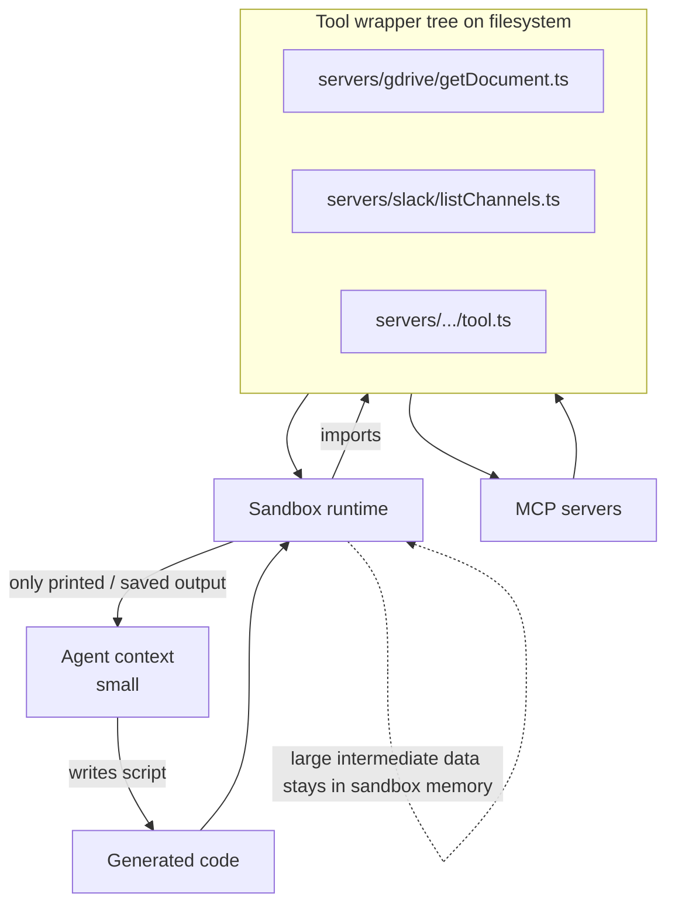

# MCP-as-Code-API

**Also known as:** Code-Execution-with-MCP, MCP-as-Typed-API, Filesystem-Mirrored Tools, Tools-as-Code-Modules

**Category:** Tool Use & Environment
**Status in practice:** emerging

## Intent

Materialize MCP servers as a directory of typed code wrappers so the agent writes code that imports them and large tool outputs flow between calls inside the sandbox without ever entering the model's context window.

## Context

A team is running an agent that is connected to many Model Context Protocol (MCP) servers at once: a Google Drive server, a Slack server, an internal Postgres server, a GitHub server. Each server exposes tens or hundreds of tools with verbose JSON outputs. The agent already has a code-execution sandbox available (a Python or TypeScript runtime it can use as its action channel).

## Problem

Conventional tool calling loads every advertised tool schema into the system prompt and routes every tool result back through the model's context window, even when the model is only going to pass that result straight to the next tool. A single workflow that joins a 5 megabyte spreadsheet with a paginated Slack thread can burn six-figure token counts before any actual reasoning happens, and most of those tokens are plumbing the model never has to read.

## Forces

- Tool schemas are static and discoverable on the filesystem, but model context is scarce and per-turn-priced.
- Intermediate data often flows tool-to-tool with no semantic reasoning in between, yet conventional MCP routes every byte through the model.
- Code execution can manipulate large objects locally for free, but only if tool wrappers exist as callable code.
- Typed wrappers give the model autocomplete-like affordances, but typing every tool by hand does not scale; wrappers must be generated from MCP schemas.
- Security boundaries previously enforced by the model reading tool output now shift to the sandbox; untrusted data may flow without an LLM checkpoint.

## Therefore

Therefore: generate a directory of typed code modules from each MCP server's schema, expose only that filesystem to the agent, and let the agent write code that imports the wrappers — keeping large intermediate results inside the sandbox so only the final summary returns to context.

## Solution

At connection time, walk each MCP server's tool list and emit a file per tool (e.g. servers/gdrive/getDocument.ts, servers/slack/listChannels.ts) with full type signatures derived from the JSON schema. Expose this tree to the agent as a readable filesystem and let it explore via standard list/read primitives rather than loaded schemas. The agent then writes execution code — a short script that imports the wrappers, chains calls, transforms results in-memory, and prints only the final answer. Tool outputs live in sandbox variables; only what the script prints (or saves to a designated output) crosses back into model context. Pair with progressive disclosure: the model reads only the tool files it intends to use.

## Structure

```
Agent <-> Model context (small) | Sandbox runtime executes generated code | Tool wrapper tree (one file per MCP tool, typed) | MCP servers behind wrappers | Large intermediate data stays in sandbox memory; only printed output returns to context.
```

## Diagram



*Tool wrappers live on a readable filesystem; the agent ships code that chains them in the sandbox, so bulk data never enters the context.*

## Example scenario

An assistant must take meeting notes from Google Drive, identify action items, and post them in the right Slack channels. The naive approach pulls the entire transcript into context, then pulls the channel list, then formats messages — burning ~150K tokens. With MCP-as-Code-API, the model writes a short TypeScript that imports gdrive.getDocument and slack.postMessage, filters action items in-process, and prints only a confirmation. Total tokens dropped to ~2K because the transcript never crossed the context boundary.

## Consequences

**Benefits**

- Massive token reduction — Anthropic reports 98.7% on representative workflows.
- Large tool outputs (sheets, transcripts, binaries) never enter context.
- Composition becomes ordinary programming: filters, joins, retries are code, not prompted loops.
- Tool discovery becomes filesystem navigation, reusing well-trained model behaviour.
- Schemas are loaded on demand rather than all upfront.

**Liabilities**

- Requires a working code-execution sandbox with network egress controls.
- Model must be strong at code generation in the chosen runtime.
- Untrusted data flowing through code without LLM checkpoints widens the prompt-injection surface inside the sandbox.
- Wrapper generation must stay in sync with upstream MCP schema changes.
- Debugging failures spans two layers — generated code and tool wrappers — rather than one tool call.

## What this pattern constrains

The model must not request raw tool outputs into context when they exceed a configured size; it must route large outputs through sandbox variables and return only printed summaries. It must not invent wrapper modules — only those materialized on the filesystem from real MCP schemas are callable.

## Applicability

**Use when**

- Workflows chain many MCP tools and intermediate data is large.
- A code-execution sandbox is already part of the agent stack.
- Token cost or latency dominated by tool-output round-tripping.
- Tool surface is too large to fit all schemas in prompt.

**Do not use when**

- Only a handful of tools are used and outputs are small.
- No code sandbox is available or code generation in the runtime is weak.
- Each tool result genuinely requires LLM reasoning before the next call.
- Compliance forbids untrusted data flowing without per-step LLM inspection.

## Known uses

- **[Anthropic Claude (engineering blog reference implementation)](https://www.anthropic.com/engineering/code-execution-with-mcp)** — *Available* — Reports ~98.7% token reduction on representative MCP workflows.
- **Cloudflare Code Mode** — *Available* — Exposes MCP tools as a typed code API the model writes against.

## Related patterns

- *specialises* → [mcp](mcp.md) — Materializes the MCP protocol as a typed code surface instead of inline tool calls.
- *composes-with* → [code-as-action](code-as-action.md) — The agent emits code as its action — but the action imports MCP-derived wrappers rather than ad-hoc helpers.
- *complements* → [tool-search-lazy-loading](tool-search-lazy-loading.md) — Filesystem layout enables on-demand schema loading: the model reads only the wrapper files for tools it plans to call.
- *alternative-to* → [tool-loadout](tool-loadout.md) — Loadout pre-selects a static tool subset; MCP-as-Code-API lets the model self-select at code-write time.
- *uses* → [sandbox-isolation](sandbox-isolation.md) — Relies on a code sandbox to hold large intermediate state outside model context.
- *alternative-to* → [tool-explosion](tool-explosion.md) — Avoids the bloat by never loading all schemas into prompt at once.

## References

- (blog) Anthropic Engineering, *Code execution with MCP: building more efficient AI agents*, 2025, <https://www.anthropic.com/engineering/code-execution-with-mcp>
- (blog) Simon Willison, *Code execution with MCP (annotation)*, 2025, <https://simonwillison.net/2025/Nov/4/code-execution-with-mcp/>
- (spec) *Model Context Protocol specification*, 2024, <https://modelcontextprotocol.io>

**Tags:** mcp, code-execution, token-efficiency, tool-use, sandbox
