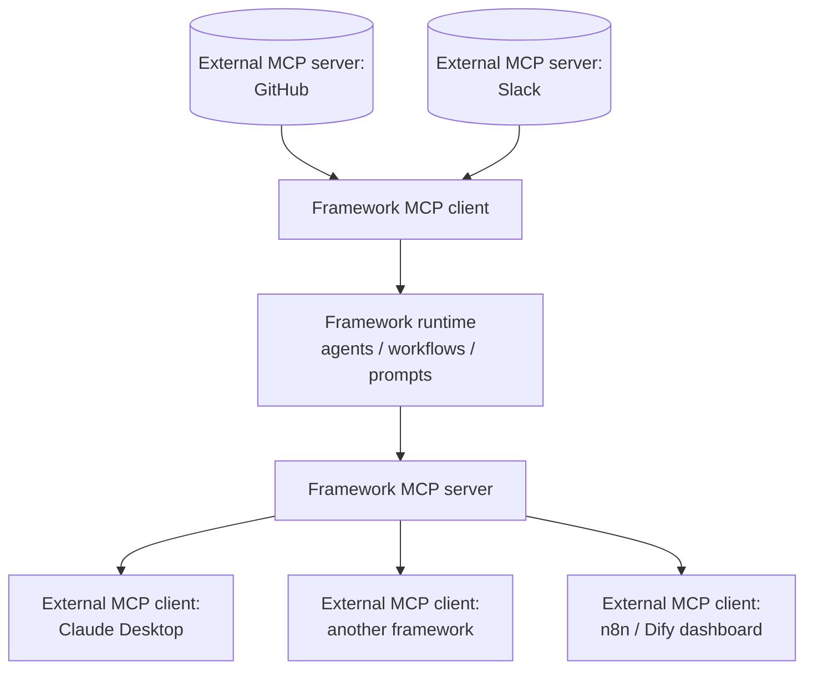

# MCP Bidirectional Bridge

**Also known as:** MCP Client and Server, Two-Way MCP, MCP Bridge Framework

**Category:** Tool Use & Environment  
**Status in practice:** emerging

## Intent

Run a framework as both MCP client (consuming external MCP servers as tools) and MCP server (publishing its own agents, tools, and workflows back over MCP) so capabilities flow both directions across the protocol boundary.

## Context

An organisation operates in a heterogeneous agent ecosystem where the Model Context Protocol (MCP) has become the common contract between tools, agents, and hosts. The team is choosing or building a framework that will both use external MCP services and offer its own agents and workflows to other MCP-speaking systems.

## Problem

A framework that only acts as an MCP client can consume external capabilities but cannot expose its own agents and workflows to peers, locking its value inside its own runtime. A framework that only acts as an MCP server can be called from outside but cannot integrate external MCP tools without writing per-vendor adapters. Either asymmetry forces teams to commit to one framework and rewrite integrations whenever they want to combine its agents with another system, defeating the point of having a shared protocol.

## Forces

- MCP is rapidly becoming the cross-framework tool contract; participating only on one side limits composability.
- Exposing internal agents as MCP servers requires careful contract design — schemas, auth, lifecycle, elicitation.
- A framework can expose at multiple granularities: a tool, an agent, a workflow, a prompt, a resource.
- Permission and credential management is non-trivial when the framework is both client and server.
- MCP-as-Code-API (where the agent writes code that calls MCP tools as imports) is a useful third axis.

## Applicability

**Use when**

- The framework participates in a heterogeneous MCP ecosystem.
- Internal artefacts (agents, workflows, prompts) should be reusable by external MCP clients.
- Anti-lock-in stance is part of the product positioning.
- External capabilities arrive through MCP rather than vendor SDKs.

**Do not use when**

- The framework is a single-vendor stack with no peer interoperability requirement.
- Publishing artefacts as MCP servers would expose internals that the team is not ready to support as a public contract.
- Credential and permission boundaries cannot be cleanly maintained across both surfaces.

## Therefore

Therefore: implement both the MCP client surface (consume external servers as tools) and the MCP server surface (publish your own agents, tools, and workflows over MCP), so that capabilities can flow in either direction and the framework is composable with other MCP-speaking systems.

## Solution

Build the framework with two symmetric MCP modules: a client module that lets agents call external MCP servers as tools (with auth, schema validation, and elicitation handling), and a server module that publishes internal artefacts — typically agents, tools, workflows, prompts, and resources — over MCP for external consumers. Treat the two as one architectural decision, not two: the same registry should describe both what the framework consumes and what it offers. Pair with mcp (the underlying protocol), mcp-as-code-api (code-as-import variant), and tool-agent-registry. The bridge is also a useful anti-lock-in stance — see vendor-lock-in.

## Structure

External MCP servers ↔ [framework MCP client] ↔ framework runtime ↔ [framework MCP server] ↔ external MCP clients.

## Example scenario

A platform team picks Mastra as its agent framework. On the client side, Mastra connects to external MCP servers — GitHub, Slack, an internal Postgres MCP — so agents can use those tools. On the server side, Mastra publishes the team's internal agents and workflows over MCP so the company's other tools (a Pydantic-AI service, a Dify dashboard, Claude Desktop, an n8n workflow) can call them directly without an HTTP wrapper. When the team later evaluates Pydantic-AI for one new product line, the integration is a configuration change rather than a rewrite — both frameworks already speak MCP both ways.

## Diagram

## Consequences

**Benefits**

- Capabilities flow both directions across the protocol boundary.
- Internal artefacts (agents, workflows, prompts) become reusable by any MCP-speaking peer.
- Switching framework on either side becomes a configuration choice.
- Composition with other MCP-speaking systems is straightforward.

**Liabilities**

- Double the surface area of the MCP integration — schemas, auth, lifecycle on both sides.
- Permission and credential boundary is harder to reason about when the framework is both ends.
- Versioning of exposed artefacts is now a public contract.

## What this pattern constrains

External capabilities must arrive through the MCP client surface and internal artefacts must be published through the MCP server surface; the framework's value is not allowed to be locked behind a non-MCP boundary that peers cannot cross.

## Known uses

- **Mastra (MCPClient + MCPServer)** — Mastra ships an MCPClient for consuming external servers and an MCPServer for exposing Mastra tools, agents, workflows, prompts, and resources. *Available* — [link](https://mastra.ai/docs/mcp/overview)
- **Pydantic-AI (MCP client + Agents-as-MCP-servers)** — Pydantic-AI documents both directions — agents can connect to MCP servers and agents can be used within MCP servers. *Available* — [link](https://pydantic.dev/docs/ai/mcp/overview/)
- **n8n (MCP Server Trigger + MCP Client node)** — n8n exposes workflows as MCP servers via the MCP Server Trigger node and consumes MCP via the MCP Client node. *Available* — [link](https://docs.n8n.io/integrations/builtin/core-nodes/n8n-nodes-langchain.mcptrigger/)
- **Dify (MCP tools consumption + apps as MCP servers)** — Dify consumes MCP tools and can publish apps as MCP servers. *Available* — [link](https://github.com/langgenius/dify)
- **LlamaIndex (MCP client + workflows as MCP)** — LlamaIndex exposes MCP client tooling and a workflow_as_mcp helper for serving Workflows over MCP. *Available* — [link](https://developers.llamaindex.ai/python/shared/mcp/)

## Related patterns

- *specialises* → [mcp](mcp.md)
- *complements* → [mcp-as-code-api](mcp-as-code-api.md)
- *complements* → [tool-agent-registry](tool-agent-registry.md)
- *alternative-to* → [vendor-lock-in](vendor-lock-in.md)

## References

- *doc*: [Mastra — MCP Overview](https://mastra.ai/docs/mcp/overview) — Mastra
- *doc*: [Pydantic-AI — MCP Overview](https://pydantic.dev/docs/ai/mcp/overview/) — Pydantic

**Tags:** tool-use, mcp, interoperability, mastra, pydantic-ai, n8n
