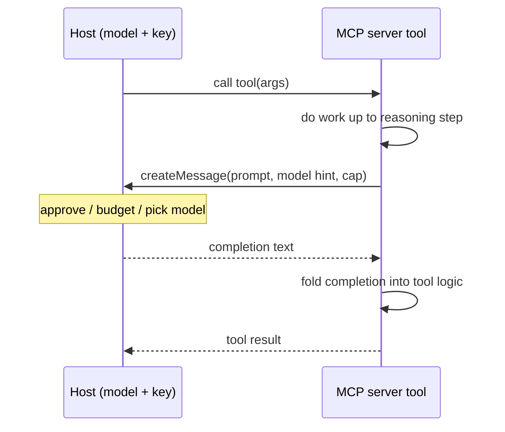

# MCP Server-Side Sampling

**Also known as:** Reasoning Inversion (MCP), createMessage Callback

**Category:** Tool Use & Environment  
**Status in practice:** emerging

## Intent

Let an MCP server, mid-tool-call, send a prompt back to the host through createMessage and use the host's model so the server does language work without holding its own model or key.

## Context

An MCP server exposes tools to a host that owns the model, the credentials, and the user relationship. Some of those tools need a language step partway through — summarising a fetched document, classifying a record, drafting a reply, deciding which branch of an internal workflow to take. The protocol now lets the host expose a sampling primitive to servers, so the direction of the call can reverse: the server, instead of only returning a result, can ask the host's model for a completion.

## Problem

A tool that needs reasoning has two unappealing options if the server must supply the model itself. Embedding a model key in the server duplicates billing, leaks a second credential surface, and pins the server to one provider while the host may already be on another. Returning the raw material to the host and asking it to reason instead forces the tool's internal logic out into the host's prompt, where the server cannot control or sequence it. The server needs to borrow the host's existing model for a scoped step without owning it.

## Forces

- A server that carries its own model key duplicates cost and credentials and pins itself to one provider, while a server with no model cannot do the language step its tool requires.
- Reasoning done inside the tool stays encapsulated and sequenced, but reasoning pushed back to the host's prompt leaks the tool's internal logic into the caller.
- A callback up to the host's model adds a network round-trip and a point where the host may deny, rate-limit, or modify the request, against the convenience of the server reasoning locally.
- The host owns the user relationship and the spend, so an unbounded server-issued completion request is a trust and budget hazard the host must be able to gate.

## Therefore

Therefore: have the server issue a scoped createMessage request back to the host mid-tool-call, so the host's model performs the language step under the host's approval and budget while the tool's orchestration stays on the server.

## Solution

The host advertises a sampling capability to connected servers. When a tool handler reaches a step that needs language work, instead of calling a model directly it constructs a sampling request — messages, a model-preference hint, a token cap — and sends createMessage back up the connection. The host receives the request, applies its own policy (optionally surfacing it to the user, enforcing a budget, choosing the model), runs the completion on the model it already holds, and returns the text down to the server. The server folds that text into the rest of the tool's logic and returns the final tool result. The model, the key, and the spend stay with the host; the orchestration and the prompt construction stay with the server.

## Structure

```
Host (owns model + key) <--createMessage(prompt)-- Server tool handler ; Host --completion text--> Server tool handler --tool result--> Host
```

## Diagram



*The server calls back up to the host's model mid-tool-call; the host keeps approval, budget, and model choice.*

## Example scenario

A document-fetcher MCP server exposes a 'summarise this contract' tool. Rather than carry its own model key, the server fetches the PDF, extracts the text, and sends a createMessage request back to the host: 'summarise the obligations in this text'. The host runs the completion on the model it already holds, returns the summary, and the server attaches it to the tool result — the server never touched a model credential.

## Consequences

**Benefits**

- A server gains a language step without shipping a model key, removing a credential surface and the duplicate billing that comes with it.
- The server stays provider-agnostic: the host's model choice, not the server's, runs the completion.
- The host keeps a single chokepoint for approval, budget, and model selection over every reasoning step its servers trigger.
- The tool's multi-step internal logic stays encapsulated on the server rather than leaking into the host's prompt.

**Liabilities**

- Each reasoning step is a round-trip the host can deny, throttle, or alter, so a tool that depends on sampling fails when the host withholds the capability.
- A server-constructed prompt is attacker-influenced if it folds in tool inputs or fetched content, turning the callback into a prompt-injection path into the host's model.
- Nested completions are hard to attribute: spend and latency from a deep server call surface on the host's bill without obvious provenance.
- Not every host implements the sampling primitive, so a server that relies on it is not portable across all clients.

## Failure modes

- Capability absent — the server assumes sampling and the host never advertised it, so the tool dead-ends instead of degrading.
- Injection via callback — untrusted tool input or fetched text is pasted into the createMessage prompt and steers the host's model.
- Runaway recursion — a sampled completion triggers another tool call that samples again, looping spend and latency the host did not bound.
- Silent provider mismatch — the server's model-preference hint is ignored and the host's model returns a shape the tool cannot parse.

## What this pattern constrains

The server must not call any model or hold any model credential of its own; every reasoning step it needs must be requested from the host through createMessage and may be denied, capped, or modified by the host.

## Applicability

**Use when**

- A tool handler needs a language step (summarise, classify, draft, route) partway through, but the server should not own a model or a key.
- The host already holds the model, the spend, and the user relationship, and should remain the chokepoint for any reasoning the server triggers.
- The server must stay provider-agnostic and let the host's model choice run the completion.

**Do not use when**

- The host does not implement the sampling capability, so a server that relies on it cannot run.
- The reasoning step must be deterministic, low-latency, or run offline, where a callback round-trip to the host's model is unacceptable.
- The prompt would fold in untrusted tool inputs or fetched content with no sanitisation, opening an injection path into the host's model.

## Components

- Host — owns the model, the key, and the user relationship; advertises the sampling capability and runs every server-requested completion
- MCP server tool handler — does the orchestration and constructs the sampling request when it reaches a language step
- Sampling request (createMessage) — the server-to-host message carrying prompt messages, a model-preference hint, and a token cap
- Host sampling policy — the approval, budget, and model-selection gate the host applies before running a server-requested completion
- Tool result — the final value the server returns to the host after folding in the host's completion

## Tools

- MCP transport — carries the reversed createMessage request from server back up to the host
- Host-owned model endpoint — the completion provider the server borrows instead of holding its own
- Token-budget accounting — the host's cap on per-request and aggregate server-triggered spend

## Evaluation metrics

- Server credential surface — count of model keys held by servers, which this pattern drives to zero
- Host sampling approval rate — fraction of server createMessage requests the host runs vs denies or caps
- Sampled-step latency — added round-trip time the callback imposes on a tool call
- Nested-completion spend per tool call — host-attributed cost of server-triggered reasoning, watched for runaway recursion

## Known uses

- **[Model Context Protocol (sampling primitive)](https://modelcontextprotocol.io/specification/2025-06-18/client/sampling)** _available_ — The protocol defines a client/host sampling capability that lets a server request a model completion from the host via createMessage, with the host retaining approval and model choice.
- **[MCP SDK servers using sampling](https://mcginniscommawill.com/posts/2026-03-25-mcp-sampling-elicitation-guide/)** _available_ — Server authors use the sampling request inside tool handlers to delegate summarisation and classification steps to the host's model rather than embedding their own.
- **FastMCP** _available_

## Related patterns

- _specialises_ **Model Context Protocol** — MCP standardises client-to-server tool calling; this pattern uses the reverse direction, where the server calls back to the host's model via the sampling primitive.
- _composes-with_ **MCP Bidirectional Bridge** — The bridge makes a framework both client and server as a topology; server-side sampling is the per-call reasoning inversion that flows over the server-to-host surface that topology opens.
- _complements_ **Composite Service** — A composite tool that bundles several API calls can insert a sampled reasoning step between them without the server holding a model of its own.
- _complements_ **Dual LLM Pattern** — Both move language work across a model boundary; the dual-LLM split isolates a quarantined model from tools, while sampling lets a tool server borrow the host's model.

## References

- [Sampling — Model Context Protocol specification (2025-06-18)](https://modelcontextprotocol.io/specification/2025-06-18/client/sampling) — 2025
- [Architecture overview — Model Context Protocol](https://modelcontextprotocol.io/docs/learn/architecture) — 2025
- [MCP Sampling and Elicitation: The Features That Make Servers Smart](https://mcginniscommawill.com/posts/2026-03-25-mcp-sampling-elicitation-guide/) — Will McGinnis, 2026
- [A survey of agent interoperability protocols: Model Context Protocol (MCP), Agent Communication Protocol (ACP), Agent-to-Agent Protocol (A2A), and Agent Network Protocol (ANP)](https://arxiv.org/abs/2505.02279) — Abul Ehtesham, Aditi Singh, Gaurav Kumar Gupta, Saket Kumar, 2025
- [Sampling — FastMCP documentation](https://gofastmcp.com/servers/sampling) — 2026
