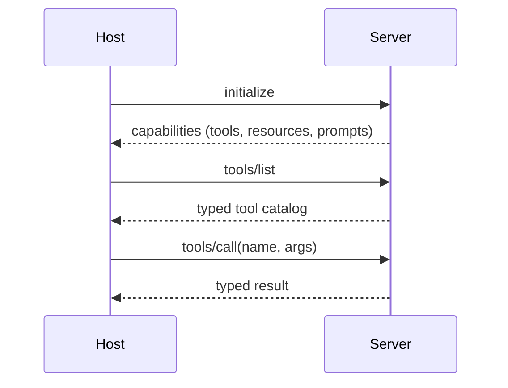

# Model Context Protocol

**Also known as:** MCP, Open Tool Protocol

**Category:** Tool Use & Environment  
**Status in practice:** mature

## Intent

Standardise how agents discover and call tools so that a tool written once is usable by any conformant agent.

## Context

An organisation operates several agent hosts at once: an IDE plugin, a desktop assistant, a custom CLI, a teammate's editor agent. Each of them wants access to the same underlying tools (a GitHub integration, a Postgres query tool, a documentation search) and ideally the team should be able to write each tool once.

## Problem

Without a shared protocol, every tool has to be re-implemented as a vendor-specific function-calling adapter for each host. The same GitHub integration ends up rewritten three times with subtly different argument names and error shapes, and the implementations drift as each host evolves. Authentication is rewired per host, and there is no clean way for a new agent host to discover what tools already exist in the organisation.

## Forces

- Agents need a stable contract; tool authors need freedom to evolve the implementation.
- Local (stdio) and hosted (HTTP) deployments have different operational shapes but should expose the same surface.
- Auth must travel without leaking host credentials to every tool.

## Therefore

Therefore: put every tool behind a server speaking a shared discovery/invocation protocol, so that tool authors and agent hosts evolve independently against a stable typed contract.

## Solution

Tools live behind a server speaking a common protocol. Hosts list available tools, call them with typed arguments, and receive typed results. The protocol covers discovery, invocation, errors, and (in some implementations) prompts and resources alongside tools.

## Applicability

**Use when**

- Tool palettes need to be portable across multiple host applications.
- Multiple clients (IDEs, agents, CLIs) consume the same tool set.
- Tools are written in different languages and a transport-level protocol is needed.

**Do not use when**

- Single host, single language, no portability requirement; native function calls are simpler.
- Tool latency is dominated by transport overhead and the extra hop hurts.
- Audit boundaries demand the tool live in the same process as the agent.

## Example scenario

A developer writes a 'GitHub PR review' tool once and exposes it via Model Context Protocol. Now it works in Claude Desktop, in Cursor, in their custom CLI agent, and in their teammate's VS Code agent — without rewriting the integration four times. The host and the tool only need to agree on MCP, not on each other's internal details.

## Diagram

## Consequences

**Benefits**

- Write a tool once, expose it to Claude Desktop, Claude Code, Cursor, custom hosts.
- Protocol-level auth (bearer-wrapped per-user tokens) keeps multi-tenancy out of each tool.

**Liabilities**

- Adds a process boundary; latency and operational surface increase.
- Schema versioning across servers and clients is a real concern as the protocol evolves.
- Long-lived SSE connections need server-side keep-alives and per-tool timeouts; connection drops mid-tool-call leave orphaned operations whose results are never reconciled.
- Streaming-tool backpressure: slow consumers can fill server buffers when the model lags behind the tool's stream output.

## What this pattern constrains

Agents can only see tools advertised by an MCP server; servers can only advertise tools matching the protocol's typed shape.

## Known uses

- **[Weft](https://github.com/luxxyarns/weft)** — *Available*. Node.js MCP server exposing Ravelry through the WEFT JSON format; stdio + HTTP entry points.
- **Anthropic Claude Desktop / Claude Code** — *Available*
- **Cursor MCP integration** — *Available*
- **OpenAI Agents SDK** — *Available*
- **Windsurf** — *Available*
- **Zed** — *Available*
- **GitHub Copilot** — *Available*

## Related patterns

- *generalises* → [tool-use](tool-use.md)
- *composes-with* → [translation-layer](translation-layer.md)
- *used-by* → [tool-discovery](tool-discovery.md)
- *complements* → [inter-agent-communication](inter-agent-communication.md)
- *complements* → [tool-output-poisoning](tool-output-poisoning.md)
- *complements* → [secrets-handling](secrets-handling.md)
- *used-by* → [cross-domain-agent-network](cross-domain-agent-network.md)

## References

- (doc) *Model Context Protocol*, <https://modelcontextprotocol.io>
- (blog) *Anthropic: Introducing the Model Context Protocol*, 2024, <https://www.anthropic.com/news/model-context-protocol>

**Tags:** mcp, protocol, interop
