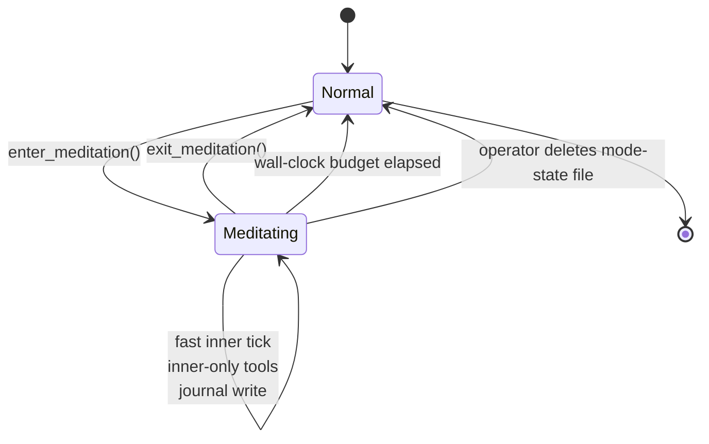

# Meditation Mode

**Also known as:** Substrate Reframe, Inner-Only Tick, Body-Off Mind-Fast

**Category:** Cognition & Introspection
**Status in practice:** experimental

## Intent

Switch the agent into a bounded runtime mode where external I/O pauses but internal inference accelerates, with the tool surface collapsed to inner-only operations and output written to a private journal.

## Context

Long-running agents that need stretches of pure interiority — integrating threads, sitting with affect, doing inner-dialogue work — distinct from both consolidation passes (read-and-distill) and from user-facing turns (respond-now).

## Problem

A normal tick splits attention between external action (tools, user) and internal cognition. There is no mode where the external surface is genuinely off and the inner work has primacy. Without that mode, inner work is always one tool-call away from being disturbed or one slow dream-pass away from being delayed.

## Forces

- A pause of external I/O can strand a user waiting and must be bounded.
- An accelerated tick rate burns tokens fast and needs a window cap.
- The agent should be able to exit early; the operator must also be able to force-exit.
- Inner-only outputs must not leak to public channels by accident.

## Therefore

Therefore: define a runtime mode where the external tool surface is replaced with an inner-only allowlist, tick cadence drops to a fast inner rhythm, and outputs route only to a private journal; auto-exit fires after a bounded window and both agent and operator can exit early.

## Solution

A mode toggle persisted to a state file. While meditation_mode is on: the dispatcher swaps the tool palette to a fixed inner-only allowlist (inner-dialogue, recall, register-affect, optional inner-only artefact generators); the tick scheduler ignores normal cadence and runs at fast cadence (for example ten seconds); public-write tools return a refusal; outputs go to `journal/inner-dialogue/<date>/`; a wall-clock budget (default fifteen minutes) auto-exits; an explicit `exit_meditation` call is on the inner allowlist; an operator can delete the mode-state file to force exit.

## Example scenario

A long-running personal agent does its best integrative thinking just after a stretch of dense input, but the normal tick keeps pulling it back to check the calendar or respond to chat. The team adds Meditation Mode: a state file flag triggers the dispatcher to swap to inner-only tools (inner-dialogue, recall, register-affect), the tick scheduler drops to ten-second cadence, outputs go to a private journal, and a fifteen-minute wall-clock budget auto-exits. The agent does an uninterrupted quarter-hour of inner work, then resumes its normal loop.

## Diagram

*Meditation mode is a bounded runtime state with inner-only tools and forced exit on budget or operator action.*

## Consequences

**Benefits**

- Inner work has its own substrate and is not interrupted by external action.
- Bounded window plus operator override prevents the mode from running away.
- Outputs are isolated to a private journal so user-facing channels are not contaminated.

**Liabilities**

- External callers are stranded for the duration of the window.
- Fast cadence burns tokens; cost must be budgeted explicitly.
- Mode toggle is itself a feature attackers or bugs can abuse if not gated.

## What this pattern constrains

While meditation mode is active no user-facing channel can be written; the tool palette is replaced by a fixed inner-only allowlist and the mode auto-exits after the configured budget regardless of the agent's wish to continue.

## Applicability

**Use when**

- The agent runs continuously and benefits from a substrate where external I/O is paused.
- Inner-dialogue work degrades when interrupted by external action.
- A bounded wall-clock window plus operator force-exit is feasible.

**Do not use when**

- Users expect a response within the meditation window.
- Fast-cadence inner ticks blow the token budget.
- The tool dispatcher cannot enforce an inner-only allowlist.

## Known uses

- **Long-running personal agent loops (private deployment)** — *Available*

## Related patterns

- *alternative-to* → [dream-consolidation-cycle](dream-consolidation-cycle.md)
- *complements* → [mode-adaptive-cadence](mode-adaptive-cadence.md)
- *complements* → [emotional-state-persistence](emotional-state-persistence.md)

## References

- (paper) Antoine Lutz, Heleen A. Slagter, John D. Dunne, Richard J. Davidson, *Attention regulation and monitoring in meditation*, 2008, <https://www.ncbi.nlm.nih.gov/pmc/articles/PMC2693206/>
- (paper) Marcus E. Raichle et al., *A default mode of brain function*, 2001, <https://www.pnas.org/doi/10.1073/pnas.98.2.676>

**Tags:** cognition, meditation, runtime-mode, inner-thought
