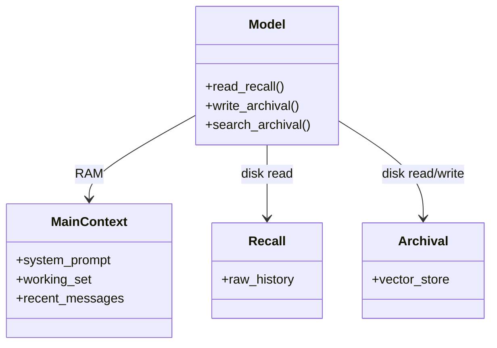

# MemGPT-Style Paging

**Also known as:** Virtual Context, Memory Paging, OS-Style Memory

**Category:** Memory  
**Status in practice:** emerging

## Intent

Treat the LLM context window as RAM and external storage as disk, with the model issuing tool calls to page memory in and out.

## Context

A long-running agent's conversation or document state grows past the model's context window. The team needs to keep the agent useful over interactions that may span thousands of turns, or over documents that are larger than any window the provider offers.

## Problem

A fixed context window forces a hard choice between losing state and stuffing irrelevant content. Naive truncation drops whatever happens to be at the boundary, which may be exactly the information the next turn needs. Stuffing the window with potentially-relevant content from the past inflates cost and dilutes the model's attention on the actually-relevant pieces. Neither option scales; both degrade quality. The team needs a paging discipline — the way an operating system pages between main memory and disk — where the model itself can decide what to load in and what to swap out as the task evolves.

## Forces

- Paging tools compete for context space themselves.
- Eviction policy (LRU? LFU? salience?) affects quality.
- Tool latency on page faults adds to user-visible time.

## Applicability

**Use when**

- Long-running agents need state that exceeds the model's context window.
- The model can be trusted to manage memory via tool calls (read, write, search).
- External recall and archival storage tiers are available and queryable.

**Do not use when**

- Context easily fits the working set and external paging is overkill.
- Tool-call latency for paging is unacceptable for the use case.
- Simpler retrieval-on-demand patterns already serve the workload.

## Therefore

Therefore: let the model treat its context window as RAM and an external store as disk, with explicit tool calls to page memory in and out, so that the agent decides what to remember without retraining its context size.

## Solution

Two memory tiers. Main context: system prompt, working set, recent messages. External context: recall (raw history) and archival (vector store). The model has tool calls for read_recall, write_archival, search_archival. Paging happens at the agent's discretion; the model treats main context as RAM and external as disk.

## Example scenario

A long-running personal assistant that tracks a user's projects across six months hits the context window every conversation and starts dropping older but still relevant context. The team adopts memgpt-paging: a small main context holds the system prompt and the active turn; recall and archival tiers live in external storage; the model uses search_archival and read_recall tool calls to page in what it needs. The agent now treats the window as RAM it explicitly manages instead of as a hard ceiling.

## Diagram

## Consequences

**Benefits**

- Conversation continuity beyond the context window.
- Inspectable memory tiers; archival is queryable independently.

**Liabilities**

- Tool definitions consume context budget.
- Page-fault tool calls add latency.

## What this pattern constrains

Memory beyond the working set is accessible only via paging tool calls; the agent cannot directly read external state.

## Known uses

- **[Letta (formerly MemGPT)](https://github.com/letta-ai/letta)** — *Available*

## Related patterns

- *uses* → [vector-memory](vector-memory.md)
- *alternative-to* → [five-tier-memory-cascade](five-tier-memory-cascade.md)
- *uses* → [tool-use](tool-use.md) — Paging operations are tool calls.
- *alternative-to* → [cross-session-memory](cross-session-memory.md)
- *alternative-to* → [context-window-packing](context-window-packing.md)

## References

- (paper) Packer, Wooders, Lin, Fang, Patil, Stoica, Gonzalez, *MemGPT: Towards LLMs as Operating Systems*, 2023, <https://arxiv.org/abs/2310.08560>

**Tags:** memory, paging, os
