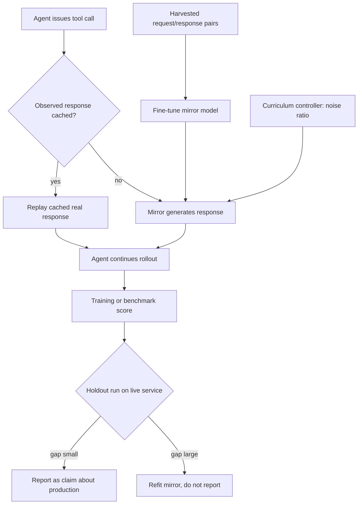

# Mirrored Tool Environment

**Also known as:** Simulated Tool Environment, Virtual API Server, Mirror API, LLM-as-Search-Engine Simulator

**Category:** Tool Use & Environment  
**Status in practice:** emerging

## Intent

Replace the live external tool during agent training and benchmarking with a fine-tuned model that emits responses in that tool's shape, so runs stay cheap, reproducible and controllable in difficulty.

## Context

A team trains or benchmarks an agent that calls an external service: a web search engine, a public REST API, a commercial data provider. Every rollout of a reinforcement-learning run and every replay of a benchmark issues real calls against that service. A single training run can require hundreds of thousands of requests. The service charges per call, returns different content between runs, goes down, rate-limits bulk traffic and deprecates endpoints over the life of the benchmark.

## Problem

The live service is the wrong thing to train or measure against, for two independent reasons. Per-call pricing on frequent rollouts bounds how much training is affordable at all. And the content that comes back is outside anyone's control: response quality varies unpredictably between runs, so the same agent scores differently on the same task, and a misaligned response corrupts the reward signal by penalising correct reasoning or rewarding a fabricated answer. Freezing a static snapshot of the service removes the cost and the variance but introduces its own misalignment, because the snapshot stops answering the queries the agent learns to ask.

## Forces

- Reinforcement-learning rollouts can run to hundreds of thousands of requests per training run, so per-call pricing decides how much training is affordable rather than how much is useful.
- Live responses vary between runs in ways nobody controls, so the same task returns a different reward and the signal becomes noisy rather than merely hard.
- A static snapshot removes cost and variance but drifts out of alignment with the queries the agent learns to ask, and that misalignment corrupts the reward by penalising correct reasoning or rewarding hallucination.
- A generated response is useful only if behaviour learned against it transfers, so fidelity traded away for cost reappears later as a gap between measured and live performance.
- Difficulty under local control is a training asset because noise can be scheduled, but the same control makes it easy to train against an environment that is systematically gentler than production.

## Therefore

Therefore: fine-tune a model on real request and response pairs from the tool, put it in the tool slot for training and benchmark runs, and schedule the quality of what it returns instead of accepting whatever the live service happens to give.

## Solution

Harvest real request and response pairs from the tool being mirrored, then fine-tune a model to produce a same-shaped response for a request it has not seen. During training or benchmark runs the mirror occupies the tool slot: the agent issues an ordinary call and receives an ordinary-looking result, with no signal that the responder generated it rather than fetched it. Because the responder is a local model, response quality becomes a scheduled variable instead of an accident, so a curriculum can begin with clean, useful results and mix in a rising proportion of noise as training proceeds, forcing the agent to reason through bad retrieval rather than memorise one retrieval distribution. A cache of genuinely observed responses sits in front of the mirror and serves whatever it can, handing the mirror only the requests real data cannot cover, which keeps fidelity high where evidence exists. The mirror stands in for the tool's response channel only; it never substitutes for the agent's own reasoning, and any number measured against it is checked against a smaller holdout run on the live service before it is reported as a claim about production.

## Structure

```
Harvested request/response pairs --fine-tune--> mirror model. Run harness tool slot = cache (observed responses) else mirror (generated). Curriculum controller sets the noise ratio per training stage. Periodic live-service holdout measures the gap between mirrored and real performance.
```

## Diagram



*The mirror occupies the tool slot behind a cache of really observed responses, with a curriculum controlling response quality; a periodic holdout on the live service is what licenses any claim about production.*

## Example scenario

A small team wants to train an agent to search well, but each training run would send several hundred thousand queries to a paid search API, and the results come back different every day. They fine-tune a model on real query-and-result pairs, drop it into the search slot, and start each run with clean results before mixing in more and more junk. Training now costs nothing per query and gives the same numbers twice. Once a week they run a short check against the real search engine, to make sure the agent has not learned to trust a mirror that flatters it.

## Consequences

**Benefits**

- Training and benchmark runs stop paying per-call fees to a commercial provider, so run cost no longer scales with the provider's price list; TRUSTEE reports task generation, user simulation, tool simulation and trajectory evaluation all covered by a free open model as small as 8B.
- Runs are reproducible, because the responder does not change between them the way a live service does.
- Response quality becomes a schedulable curriculum, so an agent can be trained deliberately against degrading retrieval instead of whatever noise the live service happened to emit that day.
- A tool whose live endpoint is down, deprecated or rate-limited still has a benchmark presence, so scores stay comparable across time.
- Behaviour learned in the mirror can transfer: SearchGym reports a Qwen2.5-7B agent trained purely in simulation beating a web-enhanced baseline by 10.6% relative across nine benchmarks.

**Liabilities**

- The mirror is a model, so it can emit a plausible response the real service would never return, and an agent that learns against that fabrication carries the error into production.
- Fidelity has to be measured rather than assumed; without a periodic holdout against the live service the gap between mirrored and real performance stays invisible.
- Building the mirror needs a corpus of real request and response pairs, so the live service must first be called enough to harvest one — MirrorAPI's corpus spans more than 7,000 APIs.
- A curriculum degrades responses only in the ways the mirror knows how to degrade them, which trains resilience against a narrow slice of the real failure distribution.
- The mirror inherits the licensing and terms of service of the provider whose responses it was fitted to, and redistributing it can redistribute that provider's data.

## Failure modes

- The mirror is never checked against the live service, and a benchmark number that describes only the mirror is reported as a claim about production behaviour.
- Curriculum noise is scheduled but never validated, so the hard end of the curriculum is gentler than an ordinary bad day on the real service.
- The agent overfits to the mirror's stylistic tells — formatting, phrasing, result ordering — and loses accuracy the moment it meets real responses.
- The mirror is quietly left in the tool slot outside training, so a live run answers an end user from generated data.
- The harvested pairs go stale and the mirror keeps reproducing an interface the provider has since changed.

## What this pattern constrains

A mirrored responder may occupy the tool slot only during training and benchmark runs; it must never serve a production request, and no claim about live behaviour may be made from mirror-only results without a holdout run against the real service.

## Applicability

**Use when**

- Reinforcement-learning or benchmark runs would issue enough calls to an external service that per-call cost or rate limits decide the size of the experiment.
- Benchmark scores must stay comparable over time, but the live service changes its results, goes down or deprecates endpoints between runs.
- Training benefits from controlling how good the tool's answers are, for example scheduling retrieval quality from clean to noisy.
- Enough real request and response pairs exist, or can be harvested once, to fit a responder that is faithful in shape and content.

**Do not use when**

- The run serves an end user, where a generated response would be presented as a real result.
- No corpus of real request and response pairs exists, so the mirror would be fitted to guesses about the interface.
- The measurement is specifically about live-service behaviour such as latency, uptime, freshness or rate-limit handling.
- The tool is already cheap, stable and deterministic, in which case calling it directly is simpler and more faithful.

## Components

- Request and response corpus — real calls harvested from the tool being mirrored, and the training data for the responder
- Mirror model — fine-tuned responder that emits a result in the tool's shape for a request it has not seen
- Response cache — serves genuinely observed responses first, so the mirror only handles what real data cannot cover
- Curriculum controller — schedules how much noise the mirror mixes into its responses as training proceeds
- Tool slot adapter — presents the mirror behind the same interface the live tool exposes, so the agent's call path is unchanged
- Live-service holdout — a small periodic run against the real tool that measures the gap between mirrored and real performance

## Tools

- Supervised fine-tuning stack — fits the mirror model to harvested request and response pairs
- Reinforcement-learning rollout framework — drives the training runs whose tool calls the mirror answers
- Recorded-interaction store — holds harvested pairs and backs the cache layer in front of the mirror
- Benchmark runner — replays a fixed task set against the mirror so scores stay comparable between runs
- Response-fidelity scorer — compares mirrored responses against held-out real ones

## Evaluation metrics

- Simulation fidelity — how closely mirrored responses match the real service on held-out requests
- Mirror-to-live gap — difference in agent score between the mirrored environment and a live-service holdout
- External call cost per run — provider spend displaced by the mirror
- Run-to-run score variance — spread of the same agent's score across repeated benchmark runs
- Curriculum coverage — range of response-quality levels the agent was actually exposed to during training
- Cache hit share — fraction of tool calls answered from really observed responses rather than generated ones

## Known uses

- **[ZeroSearch (Alibaba Tongyi Lab and Peking University)](https://github.com/Alibaba-NLP/ZeroSearch)** _available_ — Fine-tunes an LLM into a retrieval module that generates both useful and noisy documents for a query, then degrades document quality along a curriculum during reinforcement-learning rollouts, so search capability is trained without calling a search API. Motivated explicitly by unpredictable document quality and per-request API cost.
- **[StableToolBench (Tsinghua)](https://github.com/THUNLP-MT/StableToolBench)** _available_ — Replaces the unstable live-API backend of ToolBench with a virtual API server that combines a caching system and API simulators, so benchmark scores stop moving with third-party API status.
- **[MirrorAPI](https://arxiv.org/abs/2503.20527)** _available_ — Trains specialised models on request and response pairs harvested from more than 7,000 real APIs, using supervised fine-tuning and chain-of-thought reasoning to raise simulation fidelity, and serves them as mirrors of the tool environment.
- **[SearchGym](https://arxiv.org/abs/2601.14615)** _pure-future_ — Research framework that names the three-way trade-off between live-API cost, static-snapshot misalignment and simulation fidelity, and reports that an agent trained only in simulation transfers to real search benchmarks.
- **[TRUSTEE](https://arxiv.org/abs/2604.17739)** _pure-future_ — Research method that simulates the whole tool-learning environment — task generation, user simulation, tool simulation and trajectory evaluation — with a free open model as small as 8B, putting the approach within reach of teams without commercial API budgets.

## Related patterns

- _complements_ **World Model as Tool** — There a running agent knowingly calls a simulator to look ahead over world state before committing; here the simulator silently occupies the tool slot during training and the agent behaves as though it called the real service.
- _complements_ **Mental-Model-In-The-Loop Simulator** — That simulator scores a candidate strategy the agent is about to execute for real; this one replaces the environment the agent is being trained or measured in.
- _alternative-to_ **Semantic Response Cache** — A cache replays responses that were really observed and returns nothing below its threshold; a mirror generates unseen responses and is steered to degrade them on purpose. Virtual API servers usually run both, cache first.
- _complements_ **Dimensional Synthetic Eval Set** — That pattern synthesises the evaluation inputs; this one synthesises the environment's outputs, and a self-contained benchmark generally needs both.
- _used-by_ **Eval Harness** — A regression harness needs a responder that does not change between runs; the mirror supplies one for tools whose live endpoint would.
- _complements_ **Dual Evaluation (Offline + Online)** — Mirror results are the offline track; the live-service holdout and production monitoring are what keep a mirror score honest.
- _complements_ **Demo-to-Production Cliff** — Shipping on a mirror-only score, with no holdout against the live service, is one route onto that cliff.

## References

- [ZeroSearch: Incentivize the Search Capability of LLMs without Searching](https://arxiv.org/abs/2505.04588) — 2025
- [StableToolBench: Towards Stable Large-Scale Benchmarking on Tool Learning of Large Language Models](https://arxiv.org/abs/2403.07714) — 2024
- [StableToolBench-MirrorAPI: Modeling Tool Environments as Mirrors of 7,000+ Real-World APIs](https://arxiv.org/abs/2503.20527) — 2025
- [SearchGym: Bootstrapping Real-World Search Agents via Cost-Effective and High-Fidelity Environment Simulation](https://arxiv.org/abs/2601.14615) — 2026
- [Democratizing Tool Learning with Environments Fully Simulated by a Free 8B Language Model](https://arxiv.org/abs/2604.17739) — 2026
- [StableToolBench virtual API server](https://github.com/THUNLP-MT/StableToolBench)
