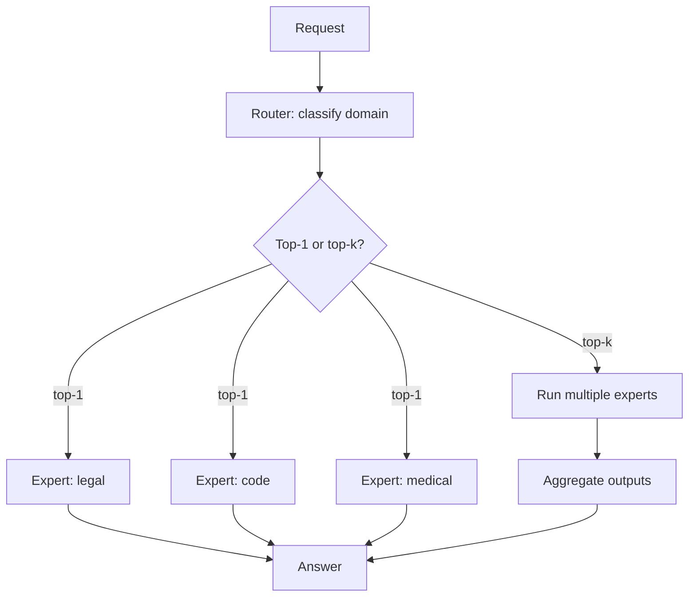

# Mixture of Experts Routing

**Also known as:** MoE Routing (Agent-Level), Expert Selection

**Category:** Routing & Composition  
**Status in practice:** emerging

## Intent

Route each request to one or more domain-expert agents, where each expert holds deep capability in a narrow area.

## Context

A team is building one agent that serves users across several substantially different professional domains — for example legal questions, medical questions, financial planning, and technical support. Each of these domains has its own vocabulary, its own authoritative sources, and its own conventions for what a good answer looks like. A single shared prompt cannot credibly carry deep expertise in all of them at once because the prompt budget and the model's attention are finite.

## Problem

A generalist agent ends up shallow in every domain: it knows enough legal language to sound competent but misses important distinctions a tax specialist would catch, and the same is true on the medical side. Users in specialist domains feel under-served and the team cannot improve any one domain without bloating the shared prompt with material that hurts the others. Adding more general examples does not fix the depth problem because the model is forced to flatten its expertise across the whole surface.

## Forces

- Expert maintenance scales with domain count.
- Routing classification must match expert coverage.
- Cross-domain queries challenge single-expert routing.

## Applicability

**Use when**

- Users in specialist domains feel under-served by a generalist agent.
- Domain experts can be defined with their own prompts, tools, or fine-tuned models.
- A router can classify queries by domain reliably enough to dispatch.

**Do not use when**

- A generalist agent already meets quality bars across domains.
- Domains overlap so heavily that expert separation just causes thrash.
- Routing classification accuracy is too low to trust dispatch.

## Therefore

Therefore: dispatch each query to one or more deeply specialised expert agents chosen by a domain classifier, so that depth per domain is not flattened into generalist shallowness.

## Solution

Define experts (specialised system prompts, tool palettes, possibly fine-tuned models). A router classifies queries by domain. Route to one expert (top-1) or to multiple experts whose outputs are aggregated. Distinct from standard routing by emphasising deep specialisation per expert.

## Example scenario

A general legal assistant gives shallow answers on tax questions and shallow answers on employment questions because one prompt cannot hold deep knowledge of both. The team adopts mixture-of-experts-routing: a small router classifies each query by domain, and routes to a tax expert (specialised prompt, IRS-publication retrieval, fine-tuned model) or an employment expert (different prompt, NLRB and state-law retrieval). For ambiguous queries it routes to both and aggregates. Per-domain depth improves without bloating any single prompt.

## Diagram

## Consequences

**Benefits**

- Depth per domain.
- Independent expert evolution.

**Liabilities**

- Domain count grows expert maintenance linearly.
- Cross-domain queries fall through cracks.

## What this pattern constrains

Each request is bound to one or more named experts; generalist fallback is explicit, not default.

## Known uses

- **Vendor knowledge-base products with domain agents** — *Available*

## Related patterns

- *specialises* → [routing](routing.md)
- *complements* → [supervisor](supervisor.md)
- *complements* → [role-assignment](role-assignment.md)
- *alternative-to* → [dynamic-expert-recruitment](dynamic-expert-recruitment.md)

## References

- (paper) Wang et al., *Mixture-of-Agents Enhances Large Language Model Capabilities*, 2024, <https://arxiv.org/abs/2406.04692>

**Tags:** routing, experts, specialisation
