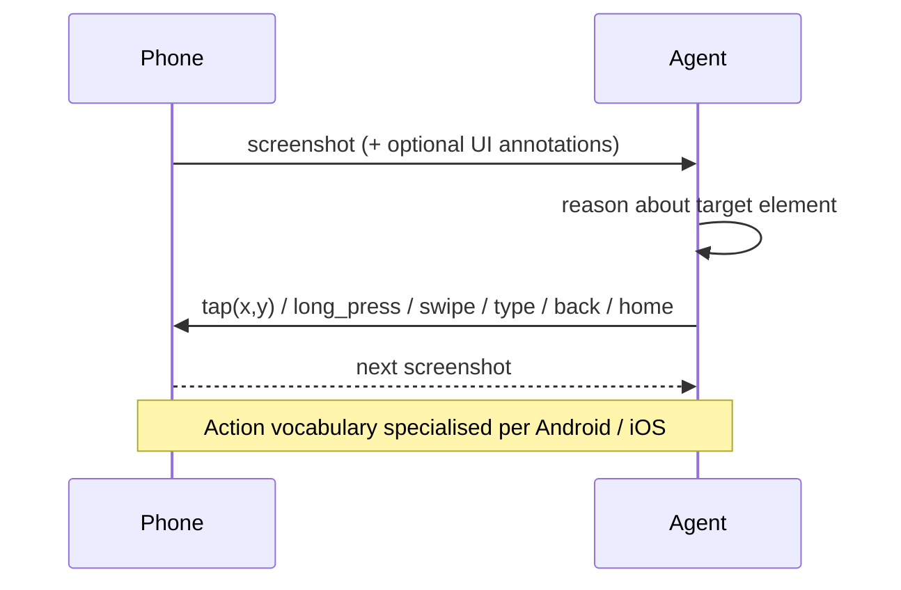

# Mobile UI Agent

**Also known as:** Smartphone Agent, Mobile App Agent, Touch-UI Agent

**Category:** Tool Use & Environment  
**Status in practice:** emerging

## Intent

Drive a smartphone end-to-end through a small, touch-native action vocabulary (tap, long-press, swipe, type, back, home) over screenshots, as a distinct interaction surface from desktop Computer Use and from web Browser Agents.

## Context

The user task lives in a mobile app whose data and behaviour are not exposed via a public API or web frontend; only the touch UI is available.

## Problem

Desktop Computer Use action sets (mouse, keyboard, scroll wheel) and Browser Agent abstractions (DOM, accessibility tree) are wrong shape for a touch UI; pixel-level control without an action vocabulary is too low-level to reason over.

## Forces

- Mobile actions are touch-native, gesture-based, and screen-coordinate dependent.
- Per-app APIs do not exist; only the UI is available.
- Screen size is small; what fits on one screen does not generalise.
- Visual state is the source of truth, but text is what the model reasons in.

## Applicability

**Use when**

- The target environment is a smartphone where touch is the only useful input.
- Desktop Computer Use or Browser Agent action sets are the wrong shape for the task.
- A small touch-native vocabulary (tap, swipe, type, back, home) covers the workflow.

**Do not use when**

- The task can be done via a web Browser Agent against the same service.
- Desktop Computer Use is the natural fit and a phone is incidental.
- Pixel-level control without an action vocabulary is acceptable for the use case.

## Therefore

Therefore: define a touch-native action vocabulary (tap, long-press, swipe, type, back, home) over screenshots, so that the agent drives apps that expose no API while keeping the loop platform-agnostic above the gesture layer.

## Solution

Define a touch-native action vocabulary (tap(x,y), long_press(x,y), swipe(dir), type(text), back, home). The agent receives a screenshot (optionally with extracted UI element annotations), reasons in text about which element to act on, emits an action call, and observes the next screenshot. Specialise the action vocabulary per platform (Android vs iOS) but keep the agent loop platform-agnostic.

## Structure

```
Screenshot + history -> agent -> action_call(tap|swipe|type|...) -> device -> next screenshot -> ...
```

## Example scenario

A team tries to reuse their desktop computer-use agent on Android by injecting mouse-and-keyboard actions through ADB. The agent fights the touch interface, mistakes long-press menus for hover tooltips, and cannot find the back button. They rebuild as a mobile-ui-agent: a touch-native action vocabulary (tap, long-press, swipe, type, back, home), screenshots with extracted UI element annotations, and the model reasons about which element to act on instead of which pixel. The agent completes mobile flows like food ordering and ride-booking end to end.

## Diagram



## Consequences

**Benefits**

- Works against any app whose UI is visible, including third-party Chinese super-apps with no APIs.
- Single agent loop generalises across apps once the vocabulary is fixed.
- Vision + small action set is a tractable model footprint.

**Liabilities**

- Coordinate-based taps are brittle to screen size, theme, locale changes.
- Pure-vision grounding mistakes are common; element-annotation pipelines add complexity.
- Sensitive actions (payments, deletions) are easy to mis-fire.

## What this pattern constrains

The agent may only emit actions in the registered touch-action vocabulary; arbitrary system or shell access is forbidden by construction.

## Known uses

- **[AppAgent (Tencent)](https://github.com/TencentQQGYLab/AppAgent)** — *Available*. Touch-action vocabulary plus exploration-phase documentation per app.
- **[Mobile-Agent (Alibaba)](https://github.com/X-PLUG/MobileAgent)** — *Available*. Vision-first smartphone agent.
- **Mobile-Agent-v2 (Alibaba)** — *Available*. Multi-agent mobile assistant: planning, decision, reflection.
- **AutoGLM (Zhipu)** — *Available*. Phone agent with decision/grounding split.
- **CogAgent (Tsinghua + Zhipu)** — *Available*. Vision-language model purpose-built for GUI screens.

## Related patterns

- *alternative-to* → [computer-use](computer-use.md) — Sibling pattern for desktop UI.
- *alternative-to* → [browser-agent](browser-agent.md) — Sibling pattern for web UI.
- *uses* → [structured-output](structured-output.md)
- *complements* → [app-exploration-phase](app-exploration-phase.md)
- *complements* → [dual-system-gui-agent](dual-system-gui-agent.md)

## References

- (paper) Zhang et al., *AppAgent: Multimodal Agents as Smartphone Users*, 2023, <https://arxiv.org/abs/2312.13771>
- (paper) Wang et al., *Mobile-Agent: Autonomous Multi-Modal Mobile Device Agent with Visual Perception*, 2024, <https://arxiv.org/abs/2401.16158>
- (paper) Wang et al., *Mobile-Agent-v2: Mobile Device Operation Assistant with Effective Navigation via Multi-Agent Collaboration*, 2024, <https://arxiv.org/abs/2406.01014>

**Tags:** tool-use, gui-agent, china-origin, mobile
