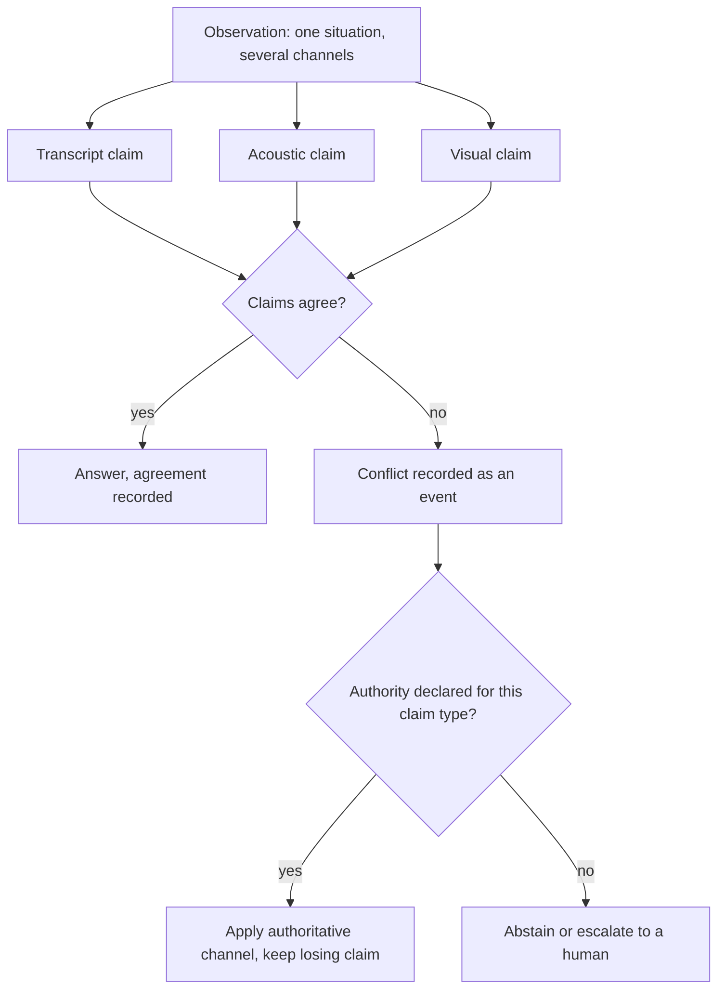

# Modality-Conflict Arbitration

**Also known as:** Cross-Modal Arbitration, Cross-Modal Disagreement Detection, Per-Channel Claim Reconciliation

**Category:** Verification & Reflection  
**Status in practice:** emerging

## Intent

Have each observation channel emit its own recorded claim, treat disagreement between channels as a detected event, and resolve it against a pre-declared per-claim-type modality authority rather than an implicit fused guess.

## Context

An agent observes one situation through more than one channel at the same time: a call arrives as both an audio stream and a transcript, a web page arrives as both an accessibility tree and a screenshot, a clip arrives as both a caption and its frames, a clinical intake arrives as text, voice and video together. Each channel carries something the others do not. Standard practice fuses them early — the channels are encoded into one representation, or the cheapest channel is rendered into text and the rest are dropped — and a single generation pass produces one answer. Nothing in that pass records what each channel said on its own.

## Problem

Channels do not always agree, and a fused pass has no way to report that they disagreed. The measurements are consistent across modalities. On audio-grounded dialogue, text-only reasoning exceeds 90 percent accuracy when transcript and acoustics agree but falls to 33-48 percent when they conflict, and audio-native models still pick the transcript-biased answer in roughly 30 to 40 percent of conflict cases. Attention-level analysis shows the bias is structural rather than incidental: a distributed set of heads drives generation toward the textual premise while only a small localised set resists it, so the erroneous premise wins by routing. Benchmarks over long audio-visual material find that omni-modal models caption and answer questions on temporally aligned content yet cannot reliably perceive that the two tracks contradict each other. The output is not a hedged answer but a confident one, and the contradiction that was present and detectable in the inputs leaves no trace.

## Forces

- Early fusion is cheaper and usually more accurate than keeping the channels apart, because most observations are consistent and one representation exploits their overlap.
- The textual channel is the cheapest to produce and the one models see most in training, so the prior toward it is strong, systematic and invisible from the output alone.
- Disagreement between channels is itself information about the world — sarcasm, a dubbed clip, a mislabelled screenshot, an edited document — so collapsing it removes the only evidence that the situation is unusual.
- Which channel deserves to win depends on the kind of claim being made rather than on any fixed ranking, so a single global modality preference is wrong in a large share of the cases where it matters.
- Recording a claim per channel costs an extra pass and adds new places to be wrong, and a conflict nobody can resolve leaves the agent with no answer to give.

## Therefore

Therefore: keep each channel's claim separate and recorded, raise disagreement between channels as a detected event, and settle it with an authority declared in advance for that claim type, abstaining or escalating when no declared authority applies.

## Solution

Split the observation into per-channel claims before anything is fused. Each channel — transcript, acoustics, frames, accessibility tree, document text — answers the question in its own right and records a typed claim with its own confidence and the span of evidence it rests on. A comparison step then checks the claims slot by slot and marks agreement or disagreement explicitly, so a contradiction becomes a named event instead of a difference that dissolves inside a fused representation. Resolution runs against a table declared in advance and indexed by claim type, not by channel alone: what was literally said is settled by the transcript, how it was said by the acoustics, what was physically present by the frames, what an interface element is called by the accessibility tree. Where the table has an entry, the authoritative channel is applied and the losing claim is kept next to the decision as the reason the answer is uncertain. Where it has no entry, or where the authoritative channel is itself low-confidence, the agent abstains or escalates instead of picking. A reflection step revisits only the disagreeing slots, which keeps the extra reasoning proportional to the conflict rather than to the whole observation.

## Structure

```
Observation -> per-channel claim extractors (claim, confidence, evidence span) -> claim comparator (agree/disagree per slot) -> authority table indexed by claim type -> resolved answer with the losing claim retained, or abstain/escalate. Conflict reflection revisits only the disagreeing slots.
```

## Diagram



*Each channel commits to its own claim first; a disagreement becomes an event that a pre-declared per-claim-type authority resolves, or that sends the case to abstention.*

## Example scenario

A support agent processes a recorded call. The transcript reads "that is exactly what I needed, thanks", so the text branch marks the caller satisfied and closes the ticket. The audio branch heard a flat, clipped delivery and marks the caller annoyed. Because the two claims were recorded separately, the disagreement is caught, the declared authority for tone is the acoustic channel, and the call goes to a human instead of being closed.

## Consequences

**Benefits**

- A contradiction between channels leaves the system as a recorded event rather than as a confident single answer, so a reviewer can see that the observation was in tension.
- The uncertainty signal comes from a comparison the agent can actually compute, instead of being asked of the model as an introspective confidence estimate.
- The per-claim-type authority table is inspectable, can be argued about by domain experts, and does not shift with prompt wording the way an implicit preference does.
- The losing claim is retained beside the decision, so a case can be re-decided later without re-running perception.

**Liabilities**

- Running a claim extractor per channel multiplies inference cost and adds a channel's worth of new error sources, including disagreements that are extraction artefacts rather than real conflicts.
- The authority table has to be authored per domain and goes stale; an entry naming the wrong channel converts a detectable conflict into a confidently wrong resolution with an audit trail attached.
- Abstention has a price: where the conflict is genuine but a decision is still needed, the agent hands back nothing.
- Per-channel claims can be correlated through a shared encoder or through an acoustic branch conditioned on the transcript, so apparent agreement may be one channel counted twice.

## Failure modes

- Channels are fused before any claim is recorded, so the disagreement never exists as an event and the answer inherits the textual prior silently.
- The comparison step runs but every conflict is settled by one global preference such as trusting the transcript, which reproduces the text-dominance bias with extra steps.
- The extractor for a non-textual channel is itself conditioned on the transcript, so it agrees by construction and the measured conflict rate reads as near zero.
- Conflicts are detected and logged but nothing downstream consumes the flag, so the abstention path is never taken and the recorded disagreement is decoration.
- The authority table accumulates an entry for every observed conflict until it encodes dataset idiosyncrasies instead of a rule anyone would defend.

## What this pattern constrains

An answer may not be emitted from a fused representation while the channels disagree: each channel must record its own claim before fusion, a detected conflict cannot be settled by an implicit or global modality preference, and only the authority declared in advance for that claim type — or abstention and escalation — may resolve it.

## Applicability

**Use when**

- One situation is observed through two or more channels that can each support a claim independently, such as transcript and acoustics, screenshot and accessibility tree, or caption and frames.
- Disagreement between the channels is itself informative — sarcasm, dubbing, editing, mislabelled interface elements, stale document text.
- A wrong answer costs more than a late one, so abstaining or escalating on an unresolvable conflict is acceptable.
- Domain experts can state in advance which channel is authoritative for which kind of claim.

**Do not use when**

- Only one channel carries the information at issue, so there is nothing to compare a claim against.
- The channels are derived from each other, such as an acoustic branch conditioned on the transcript, so agreement is guaranteed by construction and carries no information.
- Latency or cost budgets rule out a claim extraction pass per channel and the task tolerates the error rate of the fused answer.
- No defensible authority per claim type can be stated, so the resolution would collapse into a fixed global preference for one modality.

## Components

- Per-channel claim extractor — answers the question from one channel alone and records the claim, its confidence and the evidence span it rests on
- Shared claim schema — fixes the slots every channel must fill so two claims about the same slot can be compared at all
- Claim comparator — checks per-slot agreement across channels and raises a disagreement as a named event rather than a numeric difference
- Modality authority table — declares in advance which channel is authoritative for which claim type, and which claim types have no declared winner
- Conflict reflection step — revisits only the disagreeing slots before a decision, keeping the extra reasoning proportional to the conflict
- Abstention and escalation path — the required outcome when no declared authority applies or the authoritative channel is itself low-confidence
- Conflict record — stores the losing claim beside the decision so a reviewer can re-decide without re-running perception

## Tools

- Speech recognition plus acoustic feature models — produce the transcript claim and the prosody claim as separate outputs instead of one fused caption
- Vision-language models with region grounding — produce a visual claim tied to an evidence span that can be compared against the text claim
- Accessibility tree readers and screen parsers — supply a second, non-pixel channel for interface claims in computer-use agents
- Structured-output validators — force each channel's claim into the shared slot schema so the comparison is mechanical
- Cross-modal conflict benchmarks such as AVID and HumDial-EIBench — measure whether a model perceives conflict at all before arbitration is added

## Evaluation metrics

- Conflict-case accuracy against consistent-case accuracy — the size of the gap is the text-dominance bias the arbitration is meant to remove
- Conflict detection rate on labelled conflicting inputs — whether disagreements are seen rather than fused away
- False-conflict rate — how often a flagged disagreement is an extraction artefact rather than a real contradiction in the observation
- Authority-table coverage — share of detected conflicts a declared entry could resolve, the remainder going to abstention
- Abstention precision — share of abstentions where the fused answer would in fact have been wrong
- Added latency and cost per observation — the price of running one claim extractor per channel

## Known uses

- **[DepressionAgent (multimodal depression risk assessment)](https://arxiv.org/abs/2608.13891)** _pure-future_ — Its stated contribution is an explicit cross-modal arbitration stage that examines agreement and disagreement between branches, plus a conflict-reflection step that revisits inconsistent assessments before the decision, in place of implicit feature fusion.
- **[Inconsistency-aware reasoning for audio-grounded dialogue](https://arxiv.org/abs/2608.27176)** _pure-future_ — Formalises cross-modal disagreement as a failure mode and measures it: text-only reasoning above 90 percent accuracy on consistent cases falls to 33-48 percent on conflict cases, and audio-native models still take the transcript-biased trap in roughly 30 to 40 percent of them.
- **[AVID audio-visual inconsistency benchmark](https://arxiv.org/abs/2604.13593)** _pure-future_ — A measurement harness for whether omni-modal models perceive a cross-modal conflict at all; models strong on temporally aligned captioning and question answering do poorly at noticing that the two tracks contradict each other.

## Related patterns

- _complements_ **Multimodal Guardrails** — That pattern filters each modality for attacks and disallowed content; this one arbitrates between two honest channels of the same observation that report different facts, with no adversary required.
- _complements_ **Priority Matrix (Conflict Resolution)** — The same discipline of a pre-declared table, applied to a different conflict: there the rows are classes of goal conflict, here they are claim types and the winner is a modality.
- _alternative-to_ **Self-Consistency** — Both derive a signal from repeated answers, but sampling one channel several times cannot surface a contradiction that only exists between channels, and a majority vote has no notion of which channel is authoritative.
- _complements_ **Cross-Reflection** — There a different model critiques the same input to decorrelate critique error from generation error; here one reasoner compares observations of different physical channels and the resolution rule is modality-typed rather than vote-based.
- _complements_ **Epistemic Fault-Domain Quorum** — Counts how many independent roots a coalition really rests on; a shared encoder or a transcript-conditioned acoustic branch is exactly the collapsed root that makes cross-channel agreement worthless.
- _complements_ **Confidence Reporting** — Supplies the surface for the uncertainty this pattern computes, turning an inter-channel disagreement into a stated confidence rather than an introspective guess.
- _complements_ **Mandatory Red-Flag Escalation** — Gives the handoff route for a conflict the authority table cannot resolve, so abstention has somewhere to go.

## References

- [When Text Misleads: Inconsistent-Aware Reasoning for Audio-Grounded Dialogue](https://arxiv.org/abs/2608.27176) — 2026
- [Causal Evidence for Attention Head Imbalance in Modality Conflict Hallucination](https://arxiv.org/abs/2605.19250) — 2026
- [DepressionAgent: Reading, Listening, Seeing, and Deliberating Multimodal Evidence for Depression Risk Assessment](https://arxiv.org/abs/2608.13891) — 2026
- [AVID: A Benchmark for Omni-Modal Audio-Visual Inconsistency Understanding via Agent-Driven Construction](https://arxiv.org/abs/2604.13593) — 2026
- [HumDial-EIBench: A Human-Recorded Multi-Turn Emotional Intelligence Benchmark for Audio Language Models](https://arxiv.org/abs/2604.11594) — 2026
