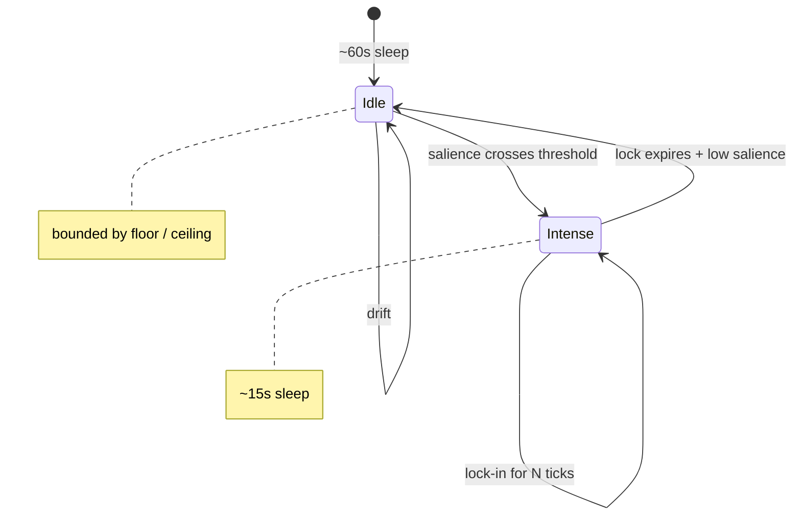

# Mode-Adaptive Cadence

**Also known as:** Idle/Intense Modes, Variable Tick Rate, Salience-Driven Cadence

**Category:** Cognition & Introspection
**Status in practice:** emerging

## Intent

Vary the agent's loop interval based on current salience so the agent thinks faster when something is happening and slower when nothing is, instead of running on a fixed cron.

## Context

A team is running an agent on a continuous tick loop whose workload is bursty by nature: long quiet stretches with nothing happening, punctuated by intense periods when the user is actively engaging, a deadline is close, or new events keep arriving. The agent has access to signals about its own current load — salience scores on recent ticks, affect levels, the recency of external input — but its loop interval is a single fixed number set in configuration.

## Problem

A fixed-cadence loop is wrong in both directions. Running every fifteen seconds wastes tokens on idle evenings when nothing has changed since the last tick. Running every five minutes makes the agent feel sluggish during active conversation when the user is waiting for the next response. The agent already has the signal needed to decide which regime it should be in, but nothing reads that signal and adjusts the interval, so compute spend and responsiveness are decoupled from what is actually happening.

## Forces

- Cadence too high wastes tokens on nothing happening.
- Cadence too low misses fast-moving events.
- Self-set cadence can run away if the agent rewards itself for going faster.
- The user may need to force a mode without the agent overriding.

## Therefore

Therefore: vary the loop interval between an idle and an intense mode driven by a salience threshold with bounded floor, ceiling, and lock-in, so that compute and latency track what is actually happening instead of running flat against a fixed cron.

## Solution

Define two (or more) modes with different sleep intervals (idle around 60s, intense around 15s). Score each tick's outcome for salience or external impulse; if it crosses a threshold, lock into intense mode for N ticks. Otherwise drift back to idle. Mode transitions are written to the ledger. The user can force a mode but cannot bypass the configured floor and ceiling. Lock-in cannot be self-extended without an explicit external trigger.

## Example scenario

A long-running personal agent runs a fixed-cadence loop every 60 seconds, which is wasteful when nothing is happening and too slow when the user is actively typing. The team adds mode-adaptive-cadence: each tick scores its own salience, and crossing a threshold locks the agent into a 15-second 'intense' mode for the next several ticks before drifting back to the 60-second 'idle' cadence. Mode transitions are written to the ledger. Compute spend drops on quiet evenings and responsiveness rises during active windows.

## Consequences

**Benefits**

- Compute spend tracks the actual signal rate.
- Latency on salient events drops without paying for it on idle stretches.
- Mode transitions are visible in telemetry as their own signal.

**Liabilities**

- Threshold tuning is empirical and per-deployment.
- Mode flapping at the threshold edge wastes ticks on transitions.
- Two modes is the simplest case; more granular modes add complexity quickly.

## What this pattern constrains

The cadence cannot exceed configured floor or ceiling (e.g. minimum 5s, maximum 5min), and mode lock-in cannot be self-extended by the agent without an explicit external trigger; runaway intense mode is blocked.

## Applicability

**Use when**

- The agent runs as a long-lived loop and idle ticks are observable cost.
- Salience signals (new events, user activity, scheduled fires) are reliable enough to drive the cadence.
- Both responsive and idle behaviour matter — fixed cadence wastes one or the other.

**Do not use when**

- The agent is request-response only and has no background loop.
- Cadence must be fixed for compliance, billing, or deterministic test reasons.
- Salience signals are too noisy to trust as the loop driver.

## Variants

### Two-mode hot/cold

Switch between a fast cadence (e.g. 5s) when salience is non-zero and a slow cadence (e.g. 5min) when it is zero.

*Distinguishing factor:* binary mode

*When to use:* Default. Simple and predictable.

### Continuous decay

Cadence is a continuous function of the salience signal — high salience -> short interval, decaying smoothly to the floor.

*Distinguishing factor:* smooth function

*When to use:* When binary mode produces visible jitter at the threshold.

### User-pinned override

User input or an explicit lock can pin the agent into hot mode for a configurable window regardless of salience.

*Distinguishing factor:* external override

*When to use:* When the user is actively present and expects responsive cadence even during apparent idleness.

## Diagram

## Known uses

- **Author's long-running personal agent (single private deployment)** — *Available* — Single-source evidence: one private deployment by the catalog author; no independently documented use yet.

## Related patterns

- *complements* → [salience-triggered-output](salience-triggered-output.md)
- *complements* → [step-budget](step-budget.md)
- *alternative-to* → [scheduled-agent](scheduled-agent.md)
- *uses* → [salience-attention-mechanism](salience-attention-mechanism.md)

## References

- (paper) Park, O'Brien, Cai, Morris, Liang, Bernstein, *Generative Agents: Interactive Simulacra of Human Behavior*, 2023, <https://arxiv.org/abs/2304.03442>

**Tags:** tick-loop, cadence, salience, mode
