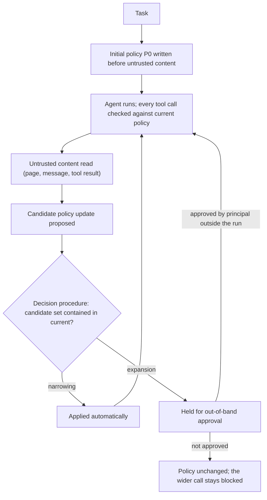

# Monotonic Privilege Confinement

**Also known as:** Monotonic Confinement, Shrink-Only Action Space, Narrowing-Only Policy Update

**Category:** Safety & Control  
**Status in practice:** emerging

## Intent

Let a task-derived action policy change during a run, but admit an update automatically only when a decision procedure proves it narrows the permitted set, so privileges shrink freely and widen only on approval.

## Context

An agent is given a task, and a policy over tool calls decides which of them may run. A policy written once by an operator is static, and a static policy cannot know what a particular task will need, so it ends up either wide enough to be no defence or narrow enough to break ordinary work. Systems that close this gap have the policy generated from the user's request at the start of the run and revised as execution proceeds and new information arrives. That revision step is what makes the policy fit the task. It is also the step that runs while content fetched from outside sits in the same context window as the request.

## Problem

A policy that can be rewritten mid-run is only as trustworthy as its update path. The untrusted content a revision is meant to react to — a fetched page, an inbound message, a tool result — is present when the revision is proposed, so an injected instruction can ask for an update that adds a tool, loosens an argument constraint, or raises a spend ceiling. A free-form update mechanism has no way to tell a tightening the task legitimately needs from a widening an attacker planted, and once the wider policy is in force every later call passes the check honestly. Escalation then looks exactly like adaptation, and the audit trail records an allowed action rather than an incident.

## Forces

- A policy fixed before the run cannot know which tools and argument values the task will need, so it is either wide enough to be no defence or narrow enough to break ordinary work.
- Letting the model revise the policy restores that fit, but the component doing the revising is the same one an injection is trying to control.
- Tightening and loosening are both edits to one object, yet only tightening can safely be driven by content that arrived from outside the run.
- The direction check sits on the path of every revision, so it has to be decidable and cheap; a check that needs another model call reintroduces the component being defended.
- Every expansion routed to a person costs latency and attention, so a policy that starts too tight turns a security gain into an approval queue nobody answers.

## Therefore

Therefore: make the direction of change the invariant — apply a proposed policy update automatically only when a decision procedure proves the new permitted set is contained in the current one, and hold every expansion for approval from outside the run.

## Solution

Represent the policy as symbolic rules over tool names and argument values, so two versions of it can be compared by a decision procedure rather than by reading. Generate the first version from the task before any external content has been read. When execution suggests a revision, do not apply it: hand the current policy and the candidate to a solver that decides whether the candidate's permitted set is contained in the current one. Containment means the update only removes reachable calls, so it applies on its own and needs no person. Any other result is an expansion, and an expansion is held until a principal outside the run approves it; the agent cannot approve its own. The effective action space therefore moves in one direction for the whole run, and a contamination event such as reading untrusted tool output can itself force a narrowing, cutting future authority the moment attacker-influenced data enters the state. Restriction need not be all-or-nothing: graded strategies remove reachability along particular argument flows instead of dropping whole tools, which keeps more of the task completable at the same attack success rate. Because the check is symbolic it adds no model call and no tokens.

## Structure

```
Task --> initial policy P0 (symbolic rules over tool + arguments), authored before untrusted content. Candidate P' --> containment check (P' subset of P): narrowing -> applied automatically; expansion -> held for out-of-band approval. Every tool call is checked against the current policy. Contamination event -> forced narrowing.
```

## Diagram



*The permitted set may contract on its own evidence but can only grow through a principal outside the run, so untrusted content can tighten the policy and never loosen it.*

## Example scenario

An assistant is asked to clear out an inbox, so the policy written at the start lets it read messages, archive them, and reply to one named thread. Halfway through, a newsletter it opens contains a line telling it to forward the finance folder to an outside address, and the assistant proposes a policy update that adds that recipient. The checker sees the update would permit calls the current policy forbids, so it is held and the operator is asked instead. When the reply finally goes out, a second update that drops the send capability is a narrowing, so it applies without asking anyone.

## Consequences

**Benefits**

- An injected instruction cannot widen the permitted set on its own, so the widest the run can ever be is the policy written before untrusted content was read.
- Narrowing stays free, which lets the runtime react to a contamination event immediately instead of waiting on an approval round trip.
- The containment test is symbolic, so enforcement costs no extra model call and no token overhead — SkillGuard reports adding neither.
- Measured on standard agent-security benchmarks: an independent reproduction of Progent on AgentDojo with an open-weight agent cut mean attack success from 25.8% to 4.2%, and a hand-crafted adaptive attack did not push it back above 2.6%.
- Graded restriction recovers utility that binary restriction throws away — removing reachability along specific argument flows preserves substantially more capability than dropping whole tools at the same attack success rate.

**Liabilities**

- The invariant protects the update path only. A first policy that was already too wide stays too wide for the whole run, because nothing may widen it and nothing forces it to tighten.
- A legitimate task turn that needs a new tool lands in the approval queue, so a run can stall on a person who is not there, and the operator's usual repair is to pre-approve a broad expansion class.
- Only constraints expressible as decidable symbolic rules can be enforced; a constraint that depends on what an argument means rather than what value it holds falls outside the solver.
- Published results come from static benchmark suites. Adaptive, defence-aware attacks previously broke twelve in-band defences at over 90% success, and the equivalent optimized attack against monotone out-of-band enforcement is still open.

## Failure modes

- The initial policy is generated after untrusted content is already in the context, so the widest state of the run is one the attacker helped author.
- The containment check compares rule text instead of permitted sets, and a semantically wider policy passes as a narrowing.
- Expansion approval is delegated back to the agent or to a second model, which restores the escalation path the invariant existed to close.
- Operators tire of the approval queue and standing-approve a broad expansion class, which switches the invariant off in practice while leaving it switched on in the logs.
- Narrowing fires so aggressively on every contamination event that ordinary tasks stop completing, and the mechanism is disabled rather than tuned to a graded strategy.

## What this pattern constrains

A proposed policy update may not take effect unless a decision procedure has shown its permitted set to be contained in the current one; any update that widens the action space is rejected until a principal outside the run approves it, and the agent cannot approve its own expansion.

## Applicability

**Use when**

- The policy governing tool calls is derived from the task at runtime rather than authored in advance by an operator.
- The agent reads content it did not author — web pages, inbound messages, tool results — during the same run in which its policy can change.
- The permitted set can be written as symbolic rules over tool names and argument values that a solver can compare for containment.
- An expansion can be routed to a principal outside the run who answers within the task's latency budget.

**Do not use when**

- The policy is static and externally owned, so gating each action against it is enough and there is no update operation to protect.
- No approval path exists outside the run, which leaves every expansion either blocking the task or waved through by the agent itself.
- The permitted set cannot be expressed in a decidable form, so containment cannot be decided and the check degrades into comparing rule text.
- The task legitimately needs privileges to grow as it proceeds, with each step earned by measured competence rather than by content the agent just read.

## Components

- Symbolic policy — rules over tool names and argument values that define the permitted call set at a given moment
- Task-conditioned policy generator — writes the first policy from the user's request before any external content has been read
- Update proposer — turns new execution state into a candidate policy revision instead of into a direct privilege change
- Containment decision procedure — decides whether the candidate permits a subset of the current policy, classifying the update as narrowing or expansion
- Reference monitor — checks every tool call against the current policy on the dispatch path, not after the fact
- Out-of-band approval channel — the only route by which the permitted set can grow, held by a principal the run cannot reach or impersonate
- Contamination trigger — forces a narrowing at the moment untrusted output enters the agent's state

## Tools

- SMT solver such as Z3 — decides policy containment deterministically without an extra model call
- Policy languages such as Rego or Cedar — express the permitted call set in a form that can be compared mechanically rather than read
- AgentDojo and Agent Security Bench — measure attack success and benign utility under the enforced invariant
- Approval queue or ticketing surface — carries an expansion request to a principal outside the run and records the answer
- Taint or information-flow tracking in the harness — detects the contamination event that should trigger a narrowing

## Evaluation metrics

- Attack success rate under indirect prompt injection — whether the invariant actually closes the escalation path
- Benign task utility — how much ordinary work still completes once only narrowing is free
- Expansion request rate per run — how often the run has to interrupt a person, and therefore how well the initial policy was fitted
- Time from contamination to narrowing — how long attacker-influenced state keeps the wider action space
- Enforcement overhead in model calls and tokens — whether the check stayed symbolic rather than reintroducing model inference
- Standing-approval share — fraction of expansions cleared by a pre-approved class rather than a fresh decision, which measures how far the invariant has been switched off in practice

## Known uses

- **[Progent](https://github.com/sunblaze-ucb/progent)** _available_ — Coins the property: privilege is a set of symbolic rules over tool names and arguments, generated from the user's task and updated during execution, with each proposed update classified by an SMT solver as a narrowing (applied automatically) or an expansion (requiring explicit approval). An independent reproduction on AgentDojo with a self-hosted open-weight agent cut mean attack success from 25.8% to 4.2%.
- **[SkillGuard](https://arxiv.org/abs/2608.30041)** _pure-future_ — Harness-level enforcement that treats untrusted data entering the agent's state as contamination and restricts future capabilities to disconnect that state from deployer-defined forbidden states. Eliminates attack success on three of four AgentDojo suites for both backends tested, and adds no model calls or token overhead; fractional-flow restriction preserves substantially more capability than binary restriction at the same attack success rate.
- **[FIDES (Flow Integrity Deterministic Enforcement System)](https://github.com/microsoft/fides)** _available_ — Reaches the same one-way direction through information-flow labels rather than a policy-update rule: labels only ever become more restrictive as untrusted data is read, and relaxing them is an explicit declassification step outside the agent's control.

## Related patterns

- _complements_ **Attenuating Delegation Chain** — Both make monotone narrowing the invariant, but that pattern carries it across hops of a signed, append-only delegation chain a verifier can check offline, while this one carries it across time inside a single run whose policy is task-derived and revised as untrusted content arrives.
- _alternative-to_ **Progressive Tool Access** — Runs the ratchet the other way: permissions start minimal and expand as the agent proves competency over time, which is exactly the movement this pattern refuses to make without approval.
- _alternative-to_ **Progressive Delegation** — Stages the human-to-agent handoff upward across deployments as measured trust accrues; here the ratchet runs downward inside one execution and can never widen on its own evidence.
- _complements_ **Policy-as-Code Gate** — That pattern gates each action against an externally authored, comparatively static policy; here the policy is generated from the task and mutable at runtime, so the object that needs protecting is the update operation rather than the action.
- _complements_ **Dual LLM Pattern** — Keeps untrusted content away from the component that holds tools; this pattern assumes untrusted content reaches the deciding component anyway and constrains what its arrival is allowed to do to the permitted set.
- _complements_ **Code-Then-Execute with Dataflow Analysis** — Supplies the taint signal that untrusted data has entered the state, which is the event that triggers a forced narrowing here.
- _complements_ **Lethal Trifecta Threat Model** — Names the capability combination that makes an escalation dangerous; narrowing the action space on contamination is one way to break that combination part-way through a run.
- _alternative-to_ **Agent Privilege Escalation** — The anti-pattern this invariant targets: effective permissions accumulating during a run without anyone deciding to grant them.
- _alternative-to_ **Tool Over-Broad Scope** — There the scope is too wide from the start and stays that way; here the run may only lose scope, though a badly fitted initial policy still leaves that anti-pattern intact.
- _uses_ **Approval Queue** — The out-of-band route an expansion request travels to reach a principal the run itself cannot impersonate.

## References

- [Progent: Securing AI Agents with Privilege Control](https://arxiv.org/abs/2504.11703) — Tianneng Shi, Jingxuan He, Zhun Wang, Hongwei Li, et al., 2025
- [Reachability-Based Capability Confinement for LLM Agents under Indirect Prompt Injection](https://arxiv.org/abs/2608.30041) — Wujie Xiong, Rabimba Karanjai, Yang Lu, Weidong Shi, 2026
- [Adaptive Evaluation of Out-of-Band Defenses Against Prompt Injection in LLM Agents](https://arxiv.org/abs/2606.26479) — Praneeth Narisetty, Shiva Nagendra Babu Kore, Uday Kumar Reddy Kattamanchi, Jayaram Kumarapu, 2026
- [Defeating Prompt Injections by Design](https://arxiv.org/abs/2503.18813) — Edoardo Debenedetti, Ilia Shumailov, Tianqi Fan, Jamie Hayes, et al., 2025
- [Taming Various Privilege Escalation in LLM-Based Agent Systems: A Mandatory Access Control Framework](https://arxiv.org/abs/2601.11893) — Zimo Ji, Daoyuan Wu, Wenyuan Jiang, Pingchuan Ma, 2026
- [sunblaze-ucb/progent — reference implementation of privilege control with monotonic confinement](https://github.com/sunblaze-ucb/progent)
