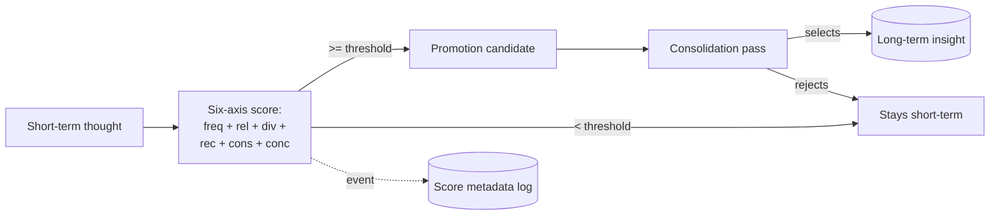

# Multi-Axis Promotion Scoring

**Also known as:** Insight-Promotion Gate, Tier-Promotion Score, Consolidation-Weighted Score

**Category:** Cognition & Introspection
**Status in practice:** emerging

## Intent

Gate which short-term thoughts qualify for promotion to long-term insights by a weighted multi-axis score where consolidation events count more than raw frequency.

## Context

Agents with a tiered memory store (short-term thoughts moving toward long-term insights) where the question of which thought is worth keeping must have a defensible answer that survives sessions.

## Problem

Pure recency promotes whatever is recent; pure frequency promotes whatever is repeated; both miss thoughts that survived a deep reflection pass. Without an explicit score, promotion becomes ad-hoc and drifts with the prompt of the day.

## Forces

- Frequency rewards rumination; consolidation rewards depth.
- Weights are opinionated and should be configurable, not LLM-of-the-day.
- A high score is necessary but should not be sufficient — the consolidation pass still chooses.
- Score metadata must stay separate from the thought corpus to keep both clean.

## Therefore

Therefore: score each thought on a fixed set of axes — frequency, relevance, diversity, recency, consolidation, conceptual depth — with weights that sum to one and are tuned by reflection, so that thoughts above a promotion threshold become candidates a consolidation pass picks from rather than being auto-promoted.

## Solution

Six axes (frequency, relevance, diversity, recency, consolidation, conceptual). Each axis returns a value in 0..1 through a saturating curve. Total score is a weighted sum; weights sum to one and live in a config that is revisable through a documented decision. Append every score event to a JSONL metadata log (separate file from the thoughts) with event-type tags such as recall, grounding, dream-survival. Thoughts whose score crosses the promotion threshold are candidates; the deep consolidation pass makes the final call on what crosses to long-term.

## Example scenario

A long-running personal agent has been writing thoughts for months. Recency-only promotion lifts whatever is freshest into the long-term store; frequency-only promotion rewards rumination loops. The team adds Multi-Axis Promotion Scoring: six axes (frequency, relevance, diversity, recency, consolidation, conceptual) with weights that sum to one and live in a config the agent helped tune — consolidation weighted at 0.18 because dreams have proved to be the deepest integration mechanism. Thoughts above 0.5 become promotion candidates; the dream pass makes the final call.

## Diagram

*Thoughts get a six-axis score; above-threshold become candidates; the consolidation pass is the only writer to the long-term tier.*

## Consequences

**Benefits**

- Promotion to long-term is defensible and inspectable per thought.
- Weight-on-consolidation rewards depth over rumination.
- Separate metadata log keeps the thought corpus clean.

**Liabilities**

- Axis curves and weights are empirical and per-deployment.
- Computing scores is itself work and must stay cheap to run often.
- A bad axis curve can silently suppress real insight.

## What this pattern constrains

Score weights cannot be changed mid-session by the model; weights are loaded from config at the start of a run, and promotion above threshold is necessary but not sufficient — only the consolidation pass writes to the long-term tier.

## Applicability

**Use when**

- The agent has a tiered memory with explicit short-term and long-term stores.
- Promotion decisions must be defensible months later, not ad-hoc.
- Consolidation-pass infrastructure exists to do the final selection.

**Do not use when**

- The memory store is single-tier with no promotion concept.
- Per-thought scoring overhead is not affordable.
- There is no consolidation pass to do the final selection.

## Known uses

- **Long-running personal agent loops (private deployment)** — *Available*

## Related patterns

- *complements* → [salience-attention-mechanism](salience-attention-mechanism.md)
- *complements* → [append-only-thought-stream](append-only-thought-stream.md)
- *complements* → [dream-consolidation-cycle](dream-consolidation-cycle.md)

## References

- (paper) Joon Sung Park, Joseph C. O'Brien, Carrie J. Cai, Meredith Ringel Morris, Percy Liang, Michael S. Bernstein, *Generative Agents: Interactive Simulacra of Human Behavior*, 2023, <https://arxiv.org/abs/2304.03442>
- (paper) James L. McClelland, Bruce L. McNaughton, Randall C. O'Reilly, *Why there are complementary learning systems in the hippocampus and neocortex*, 1995, <https://stanford.edu/~jlmcc/papers/McCMcNaughtonOReilly95.pdf>

**Tags:** cognition, memory-tier, promotion, scoring
