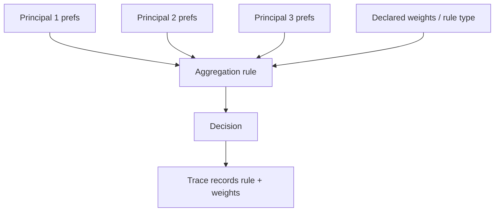

# Multi-Principal Welfare Aggregation

**Also known as:** Multi-Principal Assistance Game, Social-Choice Aggregation for Agents

**Category:** Governance & Observability  
**Status in practice:** experimental

## Intent

When an agent serves multiple humans with conflicting preferences, declare the aggregation rule explicitly rather than letting it be implicit in the prompt or fine-tune.

## Context

An agent serves a team, a household, a customer cohort, or an entire user base. The principals have conflicting preferences: different staff want different summary styles, different customers want different escalation defaults, different users in a shared workspace want different behaviours. Some preferences are zero-sum.

## Problem

Without an explicit aggregation rule the agent silently picks one principal — usually the loudest, the most recently heard, or the one whose preferences were fine-tuned in earliest. Gibbard's theorem says any aggregation rule that aggregates more than two principals' preferences is manipulable: principals can strategically misreport. Pretending there is no aggregation rule does not avoid this; it picks the implicit rule and hides it from review.

## Forces

- Multiple principals with conflicting preferences is the common case at scale.
- Every aggregation rule has trade-offs; none is uniformly best.
- Hidden aggregation is gameable and unaccountable.
- Explicit aggregation invites disputes that hidden aggregation avoided.

## Applicability

**Use when**

- Agent serves multiple principals whose preferences can conflict.
- Actions are zero-sum or rivalrous across principals.
- Operators or users need to understand and adjust how aggregation works.

**Do not use when**

- Single-principal agent where aggregation is trivially identity.
- Aggregation rule cannot be made legitimate by any choice; the agent should not arbitrate at all.
- Engineering complexity of explicit aggregation exceeds the welfare gain.

## Therefore

Therefore: declare the aggregation rule (sum-of-utilities, weighted welfare, collegial mechanism, role-priority order) explicitly and as configuration, so the trade-off is reviewable and operators can change it deliberately.

## Solution

When the agent's action space affects multiple principals, route the decision through an explicit aggregation function. Options: sum-of-utilities (utilitarian); weighted welfare (declared per-principal weights); collegial mechanism (each principal must be obtaining 'enough' reward through their own actions for their preferences to count); role-priority (some principals have veto). Surface the active rule in traces and documentation. Make it a configuration change, not a prompt change.

## Example scenario

A household assistant must schedule shared resources (the family calendar, the thermostat). Two adults have conflicting work-from-home preferences. The product declares a weighted-welfare rule with declared weights and exposes them in settings. When the rule produces an outcome one adult dislikes, the dispute is about the weights and the rule, not about the agent's hidden disposition.

## Diagram

## Consequences

**Benefits**

- Aggregation choice becomes a deliberate policy, not an implicit accident.
- Disputes over agent behaviour have a vocabulary — they argue about the rule.
- Operators can switch rules without retraining or re-prompting.

**Liabilities**

- Explicit rules invite explicit attacks on them (strategic misreporting per Gibbard).
- Some rules require principal-weight assignment that itself becomes contested.
- Computational cost of welfare aggregation scales with the principal count.

## What this pattern constrains

An agent serving multiple principals must not aggregate their preferences implicitly; the aggregation rule is declared as configuration and surfaced in traces.

## Known uses

- **Multi-Principal Assistance Games (Fickinger, Zhuang, Hadfield-Menell, Russell, 2020)** — *Available* — <https://arxiv.org/abs/2007.09540>
- **Shared-workspace assistants needing per-user weight assignment** — *Available*

## Related patterns

- *complements* → [preference-uncertain-agent](preference-uncertain-agent.md)
- *uses* → [cooperative-preference-inference](cooperative-preference-inference.md)
- *composes-with* → [policy-as-code-gate](policy-as-code-gate.md)
- *complements* → [decision-log](decision-log.md)
- *complements* → [trust-and-reputation-routing](trust-and-reputation-routing.md)

## References

- (paper) *Multi-Principal Assistance Games*, Fickinger, Zhuang, Hadfield-Menell, Russell, 2020, <https://arxiv.org/abs/2007.09540>
- (book) *Human Compatible*, Stuart Russell, 2019, <https://www.penguinrandomhouse.com/books/566677/human-compatible-by-stuart-russell/>

**Tags:** alignment, social-choice, multi-user
