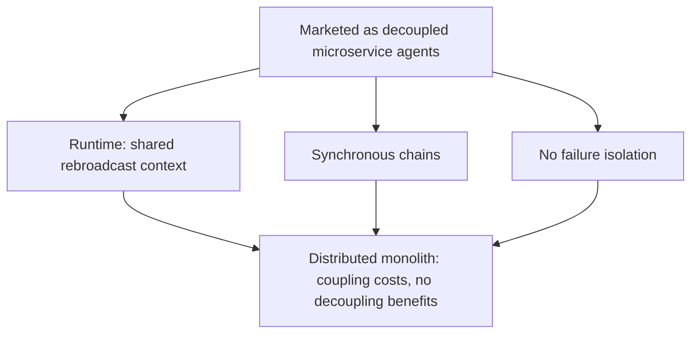

# Hidden Distributed Monolith (Multi-Agent)

**Also known as:** False-Decoupling Multi-Agent, Microservices-in-Name Agents

**Category:** Anti-Patterns  
**Status in practice:** emerging

## Intent

Anti-pattern: a multi-agent system is presented as decoupled, independently deployable agents, but at runtime they share context, run in synchronous chains, and have no failure isolation, so it behaves as a tightly-coupled distributed monolith.

## Context

A system is built as multiple agents and described as a set of independent services — each agent its own component, deployable and scalable on its own, communicating over messages. The microservices framing promises the usual benefits: independent deployment, failure isolation, and loose coupling. The team reasons about the agents as if those benefits hold.

## Problem

At runtime the agents are not decoupled at all. They share context — the same artifact or conversation state is rebroadcast to every agent that might need it — they run in synchronous chains where each waits on the previous, and a failure in one is not isolated from the rest. The result has the coupling costs of a monolith and none of the decoupling benefits the microservices framing promised: no agent can be deployed, scaled, or reasoned about in isolation, because in practice they are one tightly-coupled system wearing the appearance of many. Calling it multi-agent hides that it is a distributed monolith.

## Forces

- The microservices framing is attractive and easy to claim, but the runtime coupling determines the real behaviour, not the diagram.
- Shared context across agents is convenient for coherence yet recreates the shared mutable state that decoupling was meant to remove.
- Synchronous chains are simple to build but make each agent block on the others, eliminating independent execution.
- Genuine decoupling — isolated state, asynchronous boundaries, independent deployability — is real engineering the appearance of agents does not provide for free.

## Therefore

Therefore: do not assume the multi-agent label confers decoupling; verify whether agents actually have isolated state, asynchronous boundaries, and independent deployability, and either provide those or treat the system as the coupled monolith it is.

## Solution

Judge the architecture by its runtime coupling, not its framing. Check whether each agent really has isolated state instead of a shared rebroadcast context, whether boundaries are asynchronous instead of synchronous chains, and whether one agent can fail, deploy, and scale independently of the others. Where the multi-agent split is supposed to buy decoupling, actually provide it — bound and scope what state crosses agent boundaries, make handoffs asynchronous, and isolate failures — so the benefits are real. Where decoupling is not provided, name the system a distributed monolith and design it as one, rather than paying the coordination cost of many agents for the reliability of one tightly-coupled process. The test is isolated state, asynchronous boundaries, and independent deployability, not the number of agents.

## Structure

```
Marketed as decoupled microservice agents -> runtime: shared rebroadcast context + synchronous chains + no failure isolation -> coupling costs, no decoupling benefits (BROKEN: distributed monolith) ; Corrected: isolated state + async boundaries + independent deploy, or name it a monolith
```

## Diagram



*Despite the multi-agent framing, shared context, synchronous chains, and no failure isolation make the system a tightly-coupled distributed monolith.*

## Example scenario

A team ships a multi-agent pipeline of five agents, described in the design doc as independent microservices. In production they share one conversation state the orchestrator rebroadcasts to each agent in turn, every step waits on the one before, and when the third agent errors the whole run hangs. Trying to scale just the slow agent is impossible — it only runs inside the synchronous chain. It is one monolith in five costumes.

## Consequences

**Liabilities**

- No agent can be deployed, scaled, or reasoned about in isolation, despite the system being described as if it could.
- A failure in one agent is not contained, because the runtime coupling gives no isolation boundary.
- Shared rebroadcast context duplicates state across agents, adding cost and a place for them to fall out of sync.
- The team pays the coordination overhead of many agents while getting the reliability profile of a single coupled process.

## Failure modes

- Shared-context rebroadcast — the same state is injected into every agent, recreating shared mutable state.
- Synchronous chaining — each agent blocks on the previous, so nothing runs independently.
- No failure isolation — one agent's failure propagates because there is no boundary to contain it.
- Decoupling-in-name — the microservices framing is claimed while none of its properties hold.

## What this pattern constrains

A system must not be treated as decoupled merely because it is split into agents; without isolated state, asynchronous boundaries, and independent deployability the coupling is real, and the architecture cannot be reasoned about as independent services.

## Applicability

**Use when**

- Recognising this failure when a system described as decoupled agents is, at runtime, shared-state, synchronous, and not failure-isolated.
- Reviewing a multi-agent design that claims microservices benefits without isolated state or asynchronous boundaries.
- Diagnosing why one agent cannot be deployed, scaled, or fail independently of the rest.

**Do not use when**

- The agents genuinely have isolated state, asynchronous boundaries, and independent deployability.
- The system is honestly designed and named as a single coupled process, not sold as decoupled agents.
- There is only one agent, so there is no multi-agent decoupling claim to test.

## Components

- Agent set — the multiple agents the system is split into and described as independent
- Shared rebroadcast context — the state injected into every agent, recreating shared mutable state
- Synchronous chain — the ordering where each agent blocks on the previous
- Missing failure isolation — the absent boundary that would contain one agent's failure
- Microservices framing — the decoupling claim the runtime coupling contradicts

## Tools

- Multi-agent orchestrator — the runtime that rebroadcasts state and chains the agents synchronously
- State-scoping mechanism — the corrective that bounds what crosses agent boundaries
- Asynchronous messaging and isolation — the corrective boundaries that make decoupling real

## Evaluation metrics

- Independent-deployability check — whether any agent can be deployed or scaled on its own
- Cross-agent state-sharing volume — how much context is rebroadcast across agents
- Failure-isolation rate — fraction of single-agent failures contained without halting the system
- Synchronous-coupling depth — how many agents block in a chain per request

## Known uses

- **[Token Coherence analysis of multi-agent synchronization](https://arxiv.org/abs/2603.15183)** _available_ — Finds that across every multi-agent LLM framework instrumented the synchronization is uniformly full-state rebroadcast — the orchestrator injects the complete shared artifact into every agent's next prompt — coupling supposedly-independent agents.
- **[Distributed-monolith critique of multi-agent systems](https://habr.com/ru/companies/otus/articles/986962/)** _available_ — Argues the microservices framing for multi-agent topologies is impractical because of shared context, synchronous chains, and no independent failure or deploy isolation.

## Related patterns

- _complements_ **Hidden State Coupling** — Hidden-state-coupling is generic shared mutable state; the distributed monolith names the broader false-decoupling where agents marketed as independent share context and run synchronously.
- _complements_ **Orchestrator as Bottleneck** — Orchestrator-as-bottleneck is single-orchestrator throughput; the distributed monolith is the whole topology being coupled despite looking like independent services.
- _complements_ **Multi-Agent on Sequential Workloads** — Sequential degradation is quality decay over a chain; the distributed monolith is the architectural coupling that produces those synchronous chains in the first place.
- _complements_ **Cascading Agent Failures** — No failure isolation means one agent's failure is not contained — a direct consequence of the hidden coupling this anti-pattern names.

## References

- [Token Coherence: Adapting MESI Cache Protocols to Minimize Synchronization Overhead in Multi-Agent LLM Systems](https://arxiv.org/abs/2603.15183) — 2026
- [Multi-Agents Are Hidden Distributed Monoliths](https://habr.com/ru/companies/otus/articles/986962/) — 2026
