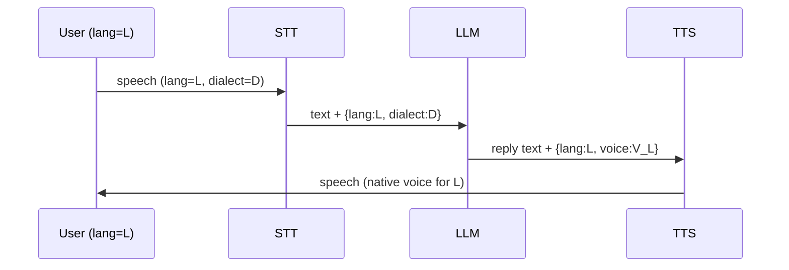

# Multilingual Voice Agent Stack

**Also known as:** Voice-First Multilingual Agent, STT-LLM-TTS Pipeline, Indic Voice Agent

**Category:** Tool Use & Environment  
**Status in practice:** emerging

## Intent

Compose a low-latency voice agent as a tightly co-located pipeline of speech-to-text, language-aware LLM reasoning, and text-to-speech, where the same vendor or operator owns all three so language identity and dialect propagate cleanly across the boundary.

## Context

A team is building a voice agent for a market where users speak one of many regional languages and dialects, such as India's 22 scheduled languages or Iberian Spanish and Catalan. The product runs on telephony channels (phone calls, WhatsApp voice) where written input is rare and the agent has to converse in the user's own language at sub-second turn-taking latency.

## Problem

Bolting a generic English-trained large language model between a generic speech-to-text (STT) component and a generic text-to-speech (TTS) component loses dialect, code-switching, and accent the moment audio is transcribed. Quality drops at each stage multiply across the pipeline, the model silently replies in a slightly off pivot language, and end-to-end latency exceeds the roughly one-second budget that natural conversation tolerates. Telephony audio (8 kHz) makes every stage noisier still.

## Forces

- STT, LLM, TTS each have their own multilingual coverage curve.
- Real conversation tolerates ~1s round-trip latency; slower than that breaks the illusion.
- Dialect and code-switching are the norm, not the exception.
- Telephony imposes 8 kHz audio constraints on top.


## Applicability

**Use when**

- The agent serves users in multiple languages or dialects with code-switching.
- Sub-second turn-taking requires streaming at every hop (STT, LLM, TTS).
- One vendor or co-located stack can carry language tags end-to-end.

**Do not use when**

- The product is monolingual English with no dialect or accent concern.
- Latency budgets allow non-streaming round-trips between independent services.
- Translating to and from English mid-pipeline is acceptable for the use case.

## Therefore

Therefore: co-locate STT, LLM, and TTS in a streaming pipeline that propagates language and dialect tags end-to-end, so that turn-taking stays under a second and the voice never code-switches back to English by accident.

## Solution

Build the voice agent as a co-located pipeline whose components share language identity and dialect signals end-to-end. Use STT models trained on the target languages and accents. Pass detected language tags as structured metadata to the LLM. Use TTS voices native to the target language; do not translate back to English mid-pipeline. Optimise for streaming at every hop (incremental STT, streaming LLM, streaming TTS) to hit sub-second turn-taking. Treat code-switching as first-class; do not force a single-language assumption.

## Structure

```
Audio in -> streaming STT (per-language) -> language tag + text -> LLM (multilingual) -> streaming TTS (target language) -> Audio out.
```

## Example scenario

A food-delivery startup launches a voice ordering line in Spain by chaining a generic English-trained STT, an English LLM, and a generic TTS. Customers in Catalan and Andalusian Spanish are misheard, the LLM responds in slightly off Spanish, and the TTS speaks with a flat American accent. The team rebuilds as a multilingual-voice-agent with all three stages from one vendor that supports Iberian Spanish and Catalan, dialect tags propagated end-to-end, and TTS voices native to the target languages. Order completion rates climb sharply.

## Diagram



## Consequences

**Benefits**

- Linguistic fidelity preserved across the pipeline.
- Sub-second turn-taking achievable with streaming components.
- Single vendor owns the cross-component quality contract.

**Liabilities**

- Language coverage is bounded by the weakest component.
- Streaming everywhere is harder than batch.
- Telephony audio quality bounds STT accuracy.

## What this pattern constrains

Language identity and dialect tags must propagate through every hop; mid-pipeline silent translation to a pivot language (e.g. English) is forbidden.

## Known uses

- **[Sarvam Samvaad](https://www.sarvam.ai/products/conversational-agents)** — *Available*. Conversational voice/text agents in 11 Indian languages on a single platform; sub-second voice latency target.
- **Krutrim (Ola)** — *Available*. Multilingual Indic voice and text agent stack.
- **Bhashini** — *Available*. Indian government Indic-language services consumed by agent stacks.

## Related patterns

- *uses* → [streaming-typed-events](streaming-typed-events.md)
- *complements* → [multi-model-routing](multi-model-routing.md) — Per-language model selection.
- *uses* → [structured-output](structured-output.md)
- *complements* → [translation-layer](translation-layer.md)
- *alternative-to* → [computer-use](computer-use.md)
- *complements* → [code-switching-aware-agent](code-switching-aware-agent.md)

## References

- (doc) *Sarvam — Samvaad: Conversational AI Agents for Indian Languages*, <https://www.sarvam.ai/products/conversational-agents>

**Tags:** tool-use, voice, india-origin, multilingual, sarvam
