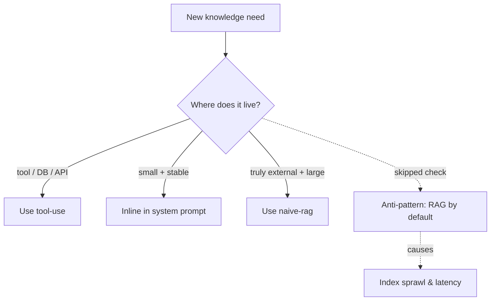

# Naive-RAG-First

**Also known as:** RAG-By-Default, Vector-Store-First

**Category:** Anti-Patterns  
**Status in practice:** deprecated

## Intent

Anti-pattern: reach for naive RAG before checking whether the knowledge actually needs retrieval.

## Context

A team adds RAG because the field talks about RAG, even when the agent's information lives in a database, an API, or a small static document.

## Problem

Vector indexes are added where a SQL query, a tool call, or a system prompt would suffice. Cost and complexity rise; quality often drops because retrieval is the wrong shape.

## Forces

- RAG is on every reference architecture.
- Vector stores feel like a moat.
- Tool use is sometimes harder to build than RAG.

## Applicability

**Use when**

- Never use this; check whether the knowledge belongs in a tool, database, or scoped prompt before adopting RAG.
- Use tool-use when the knowledge lives behind an API or query.
- Adopt naive-rag only when those simpler stores genuinely do not work.

**Do not use when**

- Any project where vector indexes are added by reflex without checking alternatives.
- Any setting where a SQL query, API call, or inlined document would already answer the need.
- Any team treating RAG as a default rather than a deliberate choice.

## Therefore

Therefore: locate where the knowledge actually lives — a database, API, search service, or a small inlined document — before adding a vector index, so that retrieval is shaped to the data rather than reflexed onto it.

## Solution

Don't reach for RAG first. Check whether the knowledge lives in a tool (database, API, search service), a scoped system prompt, or a small inlined document. Only adopt RAG when those genuinely do not work. See tool-use, naive-rag for when it does.

## Example scenario

A team's first move on a new internal Q&A bot is to spin up a vector index over the company wiki. After three weeks they discover that 80 percent of questions are about live ticket status, which is in their helpdesk database, and a vector search over stale wiki pages cannot answer them. They name the failure naive-rag-first: they tear out the index for those queries and route them to a typed helpdesk tool call. RAG stays only for the genuine free-text knowledge questions where the wiki is authoritative.

## Diagram

## Consequences

**Liabilities**

- Architectural complexity that pays for nothing.
- Retrieval misses that a SQL query would not.
- Embedding maintenance burden.

## What this pattern constrains

By definition, this anti-pattern imposes no useful constraint; the missing constraint is the failure mode.

## Known uses

- **Common in 2023-2024 enterprise AI projects** — *Available*

## Related patterns

- *conflicts-with* → [naive-rag](naive-rag.md) — RAG is fine; RAG-first is not.
- *alternative-to* → [tool-use](tool-use.md)

## References

- (blog) *Marco Nissen, Working with the models*, 2026

**Tags:** anti-pattern, rag, architecture
