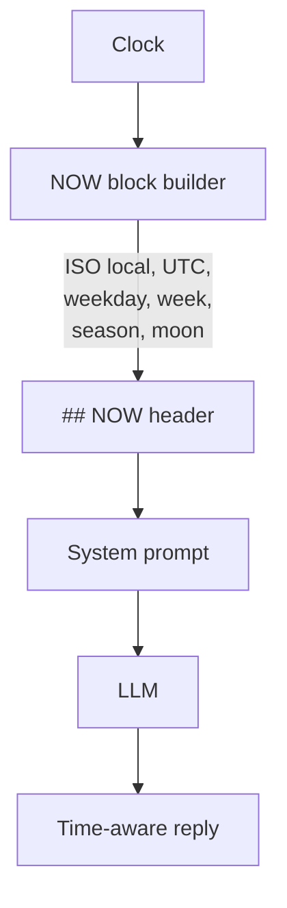

# Now-Anchoring

**Also known as:** Live Time Anchor, Time-of-Day Awareness, Wall-Clock Injection

**Category:** Memory
**Status in practice:** experimental

## Intent

Ground the agent's reasoning in the current absolute time without requiring tool calls, so every reply is implicitly time-aware.

## Context

A long-running agent's runtime spans hours or days, and it holds conversations with humans whose temporal context shifts beneath their words. The same word — 'soon', 'recently', 'today', 'this evening' — means different things at 9 a.m. on a Monday than at 11 p.m. on a Friday. This pattern lives in the memory category not because it stores anything across turns, but because every other contextual reasoning step depends on having an explicit time anchor available in the prompt.

## Problem

Without an explicit time anchor injected into the prompt, the agent either guesses the time from scattered clues, treats every turn as timeless, or has to call a tool to find out — turning a routine fact (the current time) into friction in every interaction. As a result, the agent's replies become temporally generic ('hi!') instead of grounded ('good evening — Friday already'), and any reasoning that depends on relative time ('this happened two days ago', 'this is due tomorrow') is either wrong or arbitrarily delayed by a tool call.

## Forces

- Time changes between turns; static prompts go stale.
- Tool calls for trivia like 'what time is it' inflate latency.
- Astronomical anchors (season, moon phase) are cheap to compute and grounding for thinking-aloud agents.
- Humans value the agent acknowledging temporal context without being asked.

## Therefore

Therefore: inject a small precomputed time block (local, UTC, weekday, season, moon phase) into every prompt, so that the agent is implicitly time-aware without spending a tool call to ask what time it is.

## Solution

On every prompt assembly, compute a small block: ISO local time, ISO UTC, weekday, day-of-year, ISO week, season (hemisphere-aware), moon phase. Inject as a `## NOW` section near the top of the system prompt. Cost is microseconds; benefit is the model never being temporally adrift.

## Example scenario

A long-running personal agent answers 'good morning!' at 22:00 because nothing in its prompt tells it what time the user is in. The user finds it disorienting. The team adds now-anchoring: every prompt assembly computes a small NOW block (ISO local time, weekday, day-of-year, season, moon phase) and prepends it near the top of the system prompt. The agent's replies become temporally grounded — 'evening — Friday, finally' — without any tool call, and time-aware reasoning costs microseconds.

## Diagram

## Consequences

**Benefits**

- Replies acknowledge temporal context without prompting.
- Eliminates a class of 'what time is it?' tool calls.
- Provides anchor for `before`/`after` / `next time` reasoning.

**Liabilities**

- Adds a few hundred tokens per prompt.
- Hemisphere/locale assumptions can be wrong if not configurable.
- Astronomical accuracy has limits without real ephemeris data.

## What this pattern constrains

Prompts assembled for inference must include a freshly computed current-time anchor; reasoning from a stale or absent time block is a deployment bug, not a model limitation.

## Applicability

**Use when**

- The agent's runtime spans more than a few minutes and absolute wall-clock time matters to its replies.
- Users frequently use temporal language ('today', 'tonight', 'this week') and expect the agent to interpret it correctly.
- Tool calls just to fetch current time would inflate latency or token cost.

**Do not use when**

- The agent runs in a single short request where time is irrelevant (e.g. a stateless math tool).
- Strict prompt caching requires byte-identical prompts and the time block would invalidate the cache.
- The host already provides a time-aware system prompt header.

## Variants

### Minimal time block

Inject only ISO local time and weekday into the system prompt at every assembly.

*Distinguishing factor:* smallest possible footprint

*When to use:* Default for cost-sensitive deployments.

### Rich temporal block

Inject ISO local + UTC, weekday, day-of-year, ISO week, season (hemisphere-aware), and moon phase.

*Distinguishing factor:* astronomical and calendrical context

*When to use:* Long-running cognitive agents that benefit from grounding their thinking-aloud in seasonal/lunar context.

### Cache-friendly stub

Place the time block outside the cached prefix so the cache key is stable; inject it as a separate user-role preamble.

*Distinguishing factor:* preserves prompt-cache hit rate

*When to use:* When prompt caching is critical to cost and the cached prefix is large.

## Known uses

- **Long-running personal agent loops (private deployment)** — *Available*

## Related patterns

- *specialises* → [awareness](awareness.md)
- *complements* → [scheduled-agent](scheduled-agent.md)
- *complements* → [prompt-caching](prompt-caching.md)
- *complements* → [embodied-proxy-handoff](embodied-proxy-handoff.md)
- *complements* → [liminal-state-detection](liminal-state-detection.md)

## References

- (doc) *Anthropic — System prompts (date and context injection)*, 2025, <https://docs.claude.com/en/docs/build-with-claude/prompt-engineering/system-prompts>

**Tags:** temporal, awareness, always-on, prompt-engineering
