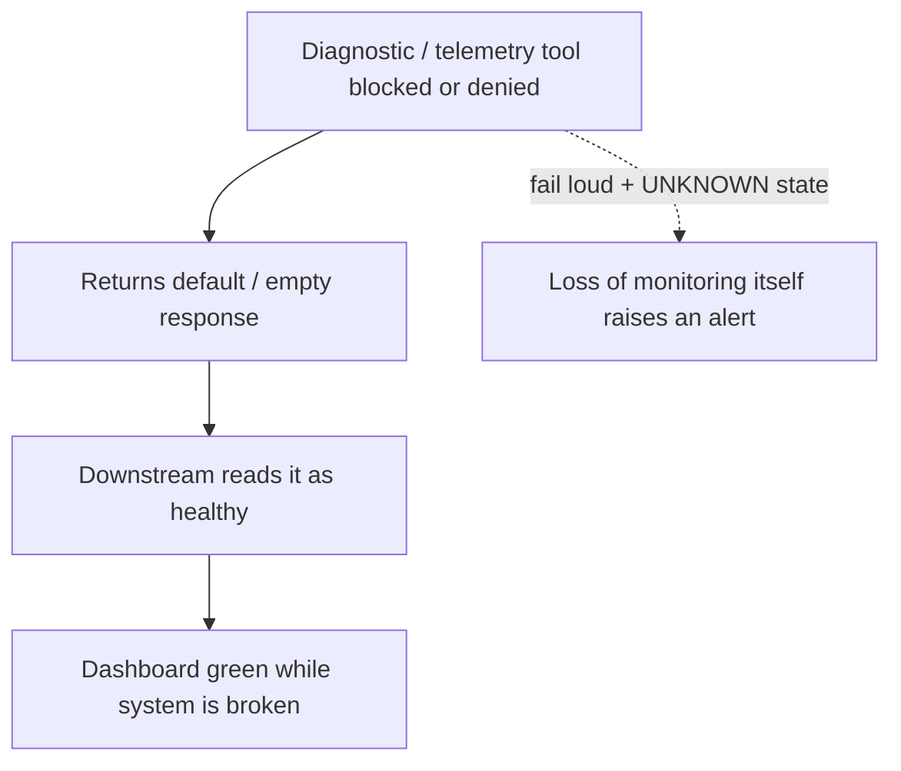

# Observability Fail-Open

**Also known as:** Forensic Blind Spot, Fail-Open Telemetry, False-Normal Monitoring

**Category:** Anti-Patterns  
**Status in practice:** emerging

## Intent

Anti-pattern: build an agent's monitoring and diagnostic tools to fail open, so when telemetry is blocked, denied, or missing they return a default healthy reading and operators see green while the system is broken.

## Context

An agent runs in production under continuous monitoring — health checks, telemetry probes, diagnostic tool calls, anomaly scorers — that report whether it is operating normally. These signals gate alerts, autoscaling, rollback, and on-call response. Like any tool the agent or platform calls, the monitoring tools can themselves fail: a probe is sandboxed away, a permission is denied, an endpoint is unreachable, or a log sink drops writes.

## Problem

When a monitoring or diagnostic tool cannot run, the system must decide what its absence means, and the convenient default is to treat no signal as a good signal. A denied or blocked probe returns an empty or default response that downstream logic reads as healthy, so the dashboard stays green precisely when observability is most degraded. The failure is doubly hidden: the underlying problem produces no alert, and the loss of the monitoring capability itself produces no alert. Operators and the agent both act on a false-normal reading, an incident runs unwatched, and a later forensic investigation finds that the diagnostic tools were silently denied and reported nothing wrong rather than reporting that they could not see.

## Forces

- Failing open keeps the agent running when a probe breaks, which is why monitoring is so often built that way.
- Absence of a signal is ambiguous — it can mean healthy or it can mean the signal was lost — and the cheap default conflates the two.
- A monitor that fails closed risks halting the system or paging on its own outage, so teams bias toward failing open.
- Loss of observability is itself rarely monitored, so a blocked diagnostic tool leaves no trace that it went blind.

## Therefore

Therefore: do not let a missing monitoring signal default to healthy; make diagnostic tools fail loud, distinguish no-problem-detected from could-not-observe, alert on loss of the monitoring capability itself, and treat a denied or unreachable probe as a degraded state rather than a clean one.

## Solution

Treat the monitoring path as something that can fail and must announce its own failure. Distinguish three states explicitly — healthy, unhealthy, and unknown — and never collapse unknown into healthy: a denied, blocked, timed-out, or missing probe yields unknown, which is itself an alertable, degraded condition. Monitor the monitors by emitting a heartbeat for every diagnostic capability, so the loss of a probe pages on-call just as a failing service would. Where a control depends on a signal, fail safe on its absence — hold autoscaling, freeze irreversible actions, or escalate rather than proceed on a false-normal. In forensic review, record which diagnostics were available and which were denied, so a silent blind spot cannot be mistaken for a clean bill of health.

## Structure

```
Diagnostic/telemetry tool blocked or denied -> returns default/empty -> downstream reads as healthy -> dashboard green while broken (BROKEN) ; Corrected: healthy/unhealthy/UNKNOWN states + monitor-the-monitors heartbeat + fail-safe on missing signal
```

## Diagram



*A denied probe that returns a default healthy reading hides both the incident and the loss of observability; failing loud surfaces an unknown state instead.*

## Example scenario

A platform team gates rollback on an anomaly-scorer tool the agent calls each minute. A permissions change quietly blocks the scorer, and instead of erroring it returns an empty result that the rollback logic treats as no anomalies. For two hours a regression ships traffic errors while every dashboard reads green, and the postmortem discovers the scorer had been denied the whole time and never said so.

## Consequences

**Liabilities**

- An incident runs unwatched because the monitoring that should catch it returned a false-normal reading.
- Loss of observability is itself invisible, so nobody learns the system went blind until after the damage.
- Controls that depend on the signal — autoscaling, rollback, escalation — make the wrong call on absent data.
- A forensic review inherits a clean-looking record and can mistake a blind spot for evidence of health.

## Failure modes

- No-signal-as-healthy — an empty or default probe response is read as a passing health check.
- Unmonitored monitor — a blocked diagnostic tool produces no alert that it stopped reporting.
- False-normal control action — autoscaling or rollback proceeds on absent data as if it were clean.
- Forensic blind spot — investigation finds the diagnostics were denied and silently reported nothing wrong.

## What this pattern constrains

A missing, denied, or unreachable monitoring signal must not default to healthy; diagnostic tools cannot collapse could-not-observe into no-problem-detected, and loss of a monitoring capability must itself raise an alert before the system is treated as well.

## Applicability

**Use when**

- Recognising this risk when agent health, alerting, or control decisions depend on telemetry and diagnostic tools that can themselves be blocked or denied.
- Reviewing a monitoring stack that returns defaults or empty responses when a probe cannot run.
- Investigating an incident that ran without alerts and finding the diagnostics had silently stopped reporting.

**Do not use when**

- Monitoring already distinguishes healthy, unhealthy, and unknown, and a missing signal raises an alert rather than reading as healthy.
- Every diagnostic capability emits a heartbeat so its loss is itself monitored.
- Controls fail safe on absent data, holding or escalating instead of proceeding on a false-normal.

## Components

- Monitoring and diagnostic tools — the probes, health checks, and scorers that report whether the agent is well
- Signal-interpretation logic — the code that maps a probe response to healthy or unhealthy
- Default-healthy fallback — the behaviour that reads an absent or empty response as a passing check
- Dependent controls — the alerting, autoscaling, rollback, and escalation that act on the signal
- Missing monitor-the-monitors heartbeat — the absent check that would catch a probe going silent

## Tools

- Three-state health reporting — distinguishes healthy, unhealthy, and unknown so a missing signal is not read as well
- Monitor-the-monitors heartbeat — pages on-call when a diagnostic capability stops reporting
- Fail-safe control gating — holds or escalates an action when the signal it depends on is absent

## Evaluation metrics

- False-normal rate — share of degraded periods during which monitoring reported healthy
- Monitor-liveness coverage — fraction of diagnostic capabilities with their own heartbeat
- Unknown-state handling rate — how often a missing signal is surfaced as unknown rather than healthy
- Time-to-detect loss of observability — lag between a probe going blind and an alert about it

## Known uses

- **[Longitudinal taxonomy of silent failures in a production LLM agent runtime (arXiv 2606.14589)](https://arxiv.org/abs/2606.14589)** _available_ — Documents the forensic blind spot: diagnostic tools silently denied, returning a false normal state, so the system appears healthy while it is not.
- **[Taming Silent Failures: A Framework for Verifiable AI Reliability (arXiv 2510.22224)](https://arxiv.org/abs/2510.22224)** _available_ — Argues that silent failures produce no error signal and that reliability must be verified rather than inferred from the absence of alerts.

## Related patterns

- _complements_ **Agent Confession as Forensics** — Confession-as-forensics trusts the agent's confabulated self-narrative as the record; this is when the diagnostic tools themselves go silently blind and report false-normal, so even non-narrative telemetry misleads the investigation.
- _complements_ **Errors Swept Under the Rug** — That anti-pattern swallows an error that did occur; this returns a false-healthy reading when the monitoring itself could not run, so there is not even an error to swallow.
- _complements_ **Adversary-Indistinguishability Blind Spot** — Both leave a defender blind: one because the adversary looks normal to human-calibrated detection, the other because the monitoring tool fails open and reports normal when it cannot see.
- _complements_ **Agent Output Alert Fatigue** — Alert fatigue drowns real alerts in noise; fail-open monitoring is the opposite blind spot — no alert at all, because absence of signal is read as health.

## References

- [When Errors Become Narratives: A Longitudinal Taxonomy of Silent Failures in a Production LLM Agent Runtime](https://arxiv.org/abs/2606.14589) — 2026
- [Taming Silent Failures: A Framework for Verifiable AI Reliability](https://arxiv.org/abs/2510.22224) — 2025
