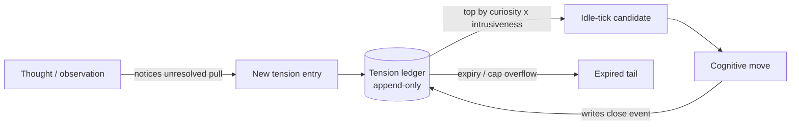

# Open-Question Tension Store

**Also known as:** Tension Ledger, Unresolved-Pull Stack, Curiosity Inbox

**Category:** Cognition & Introspection
**Status in practice:** emerging

## Intent

Persist the agent's unresolved questions as a typed ledger so they drive its next inquiry instead of dissolving when the prompt ends.

## Context

Long-running agents that should initiate inquiry — ask, look up, return to half-understood things — and not only respond. Without a substrate for unresolved questions, every idle tick starts as if from scratch and curiosity decays into amnesia between turns.

## Problem

Open questions vanish at the end of a turn. The agent has no place to record what was noticed-but-unresolved, so the next free moment never returns to it; the prompt buffer is not built to carry forward pulls toward inquiry.

## Forces

- An inbox grows without bound if every passing thought becomes a tension.
- A score is needed to rank which question to pull now — pure recency rewards trivia.
- Self-write of tensions can be gamed: the agent invents tensions to look thoughtful.
- Tensions that never resolve still need to expire or the store becomes a graveyard.

## Therefore

Therefore: record each unresolved pull as a typed entry with curiosity, intrusiveness, and expiry, so that the next idle moment can choose between ask-now, store-for-later, and let-lapse rather than treating every open question alike.

## Solution

Maintain an append-only ledger of tensions. Each entry carries id, opened-at, topic, source, curiosity (0..1), intrusiveness (0..1), and expiry. On each idle tick the agent reads the top entries by curiosity times intrusiveness as candidates for the next move. Intrusiveness gates ask-the-user-now versus store-quietly. Entries below a curiosity floor expire after a TTL. Resolution writes a closing event into the same ledger; the original entry is never edited.

## Example scenario

A long-running personal agent notices in passing that the user mentioned a half-read book by an author the agent has never encountered. Without somewhere to put that, the moment passes and the agent never returns to it. The team adds an Open-Question Tension Store: the agent appends a tension with topic 'who is this author', curiosity 0.6, intrusiveness 0.2, expiry seven days. Three idle ticks later the move-selector picks the tension, the agent does a targeted lookup, writes a small note, and closes the tension — instead of having forgotten the moment.

## Diagram

*Tensions enter the ledger, rank by curiosity times intrusiveness, drive the next idle move, and close via a new append rather than edit.*

## Consequences

**Benefits**

- Open questions survive across turns and across sessions.
- Curiosity and intrusiveness scores make the next move defensible instead of stochastic.
- Expiry plus a cap stops the store from becoming a graveyard.

**Liabilities**

- Score weights are opinionated and a bad calibration suppresses real curiosity.
- Self-write of tensions invites gaming unless the agent's training discourages it.
- Ledger growth is real even with expiry; archive paths must be planned.

## What this pattern constrains

The tension store is append-only; tensions cannot be silently rewritten or back-dated, and the agent cannot exceed a configured cap on net-open tensions — overflow is auto-expired by lowest curiosity times intrusiveness.

## Applicability

**Use when**

- The agent should initiate inquiry on idle ticks, not only respond.
- Unresolved questions otherwise vanish at turn end and never return.
- There is an idle-tick body that can read top-ranked tensions and act on one.

**Do not use when**

- The agent is request-response only and never has idle ticks.
- There is no mechanism for the agent to act on its own initiative.
- Persisting open-question state across sessions creates privacy or alignment risks.

## Known uses

- **Long-running personal agent loops (private deployment)** — *Available*

## Related patterns

- *complements* → [preoccupation-tracking](preoccupation-tracking.md)
- *complements* → [cognitive-move-selector](cognitive-move-selector.md)
- *complements* → [append-only-thought-stream](append-only-thought-stream.md)

## References

- (paper) Leon Festinger, *A Theory of Cognitive Dissonance*, 1957, <https://www.sup.org/books/title/?id=3850>
- (paper) Jürgen Schmidhuber, *Formal Theory of Creativity, Fun, and Intrinsic Motivation*, 2010, <https://people.idsia.ch/~juergen/ieeecreative.pdf>

**Tags:** cognition, self-guidance, tick-loop, append-only
