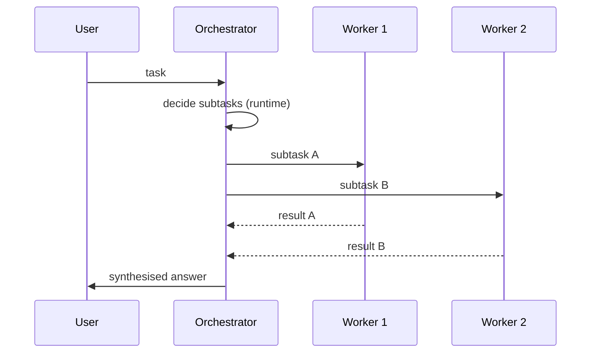

# Orchestrator-Workers

**Also known as:** Dynamic Decomposition, Orchestrator-Subagents

**Category:** Multi-Agent  
**Status in practice:** mature

## Intent

An orchestrator dynamically breaks a task into subtasks at runtime and delegates each to a worker LLM, then synthesises results.

## Context

A team is handling tasks where the right decomposition cannot be known in advance and depends on the input. A coding agent asked to audit a repository does not know how many languages or services it will find; a research agent does not know how many sub-questions a brief will need until it reads the brief. The number and shape of sub-tasks is data-dependent. This is distinct from supervisor, which routes work to a fixed set of pre-existing specialist agents; orchestrator-workers decides the sub-tasks at run time.

## Problem

A static decomposition — a fixed plan-and-execute pipeline or a hard-coded prompt chain — cannot handle tasks whose shape depends on the input. Trying to enumerate every possible sub-task in the prompt produces a sprawling system that still misses the cases the team did not anticipate. Picking the wrong decomposition at design time forces every request through it, even the ones it does not fit. The team needs decomposition to happen after the task arrives, not before.

## Forces

- The orchestrator must reason at a higher level than any worker.
- Workers should not have to know they are workers.
- Synthesis must reconcile conflicting worker outputs.

## Applicability

**Use when**

- The shape of decomposition depends on the input and cannot be planned statically.
- An orchestrator agent can decide subtasks at runtime and synthesise results.
- Worker count and roles legitimately vary per task.

**Do not use when**

- Static decomposition (Plan-and-Execute, Prompt Chaining) already fits the task.
- Per-call orchestration overhead is unacceptable for the latency budget.
- Synthesis is unreliable and worker outputs cannot be reconciled.

## Therefore

Therefore: let an orchestrator decide subtasks at runtime, hand each to a worker, and synthesise the returned results, so that data-dependent decomposition is handled without committing to a static plan up front.

## Solution

Orchestrator agent receives the task, decides at runtime what subtasks to spawn, hands each to a worker (often via tool call), collects results, and synthesises the final output. Worker count and roles can vary per task.

## Example scenario

A coding agent receives a vague request — 'audit our service for unused dependencies and unused env vars'. A static plan-and-execute pipeline cannot decide upfront how many sub-tasks there are because it depends on what the audit finds. The team uses orchestrator-workers: the orchestrator inspects the repo, decides at runtime to spawn one worker per detected language toolchain, collects each worker's findings, and synthesises a single audit report. The worker count varies from one repo to the next.

## Diagram

## Consequences

**Benefits**

- Handles tasks with data-dependent decomposition.
- Workers stay simple; complexity lives in the orchestrator.

**Liabilities**

- Orchestrator failure is unrecoverable without retry logic.
- Token cost scales with worker count; budget awareness matters.

## What this pattern constrains

Workers see only their assigned subtask; only the orchestrator has the global view.

## Known uses

- **Anthropic Building Effective Agents (Workflow #4)** — *Available*
- **Claude Code subagents** — *Available*
- **Anthropic Multi-Agent Research** — *Available*
- **OpenAI Deep Research** — *Available*

## Related patterns

- *alternative-to* → [supervisor](supervisor.md)
- *alternative-to* → [plan-and-execute](plan-and-execute.md)
- *generalises* → [subagent-isolation](subagent-isolation.md)
- *generalises* → [lead-researcher](lead-researcher.md)
- *complements* → [inter-agent-communication](inter-agent-communication.md)
- *generalises* → [hierarchical-agents](hierarchical-agents.md)
- *complements* → [dynamic-expert-recruitment](dynamic-expert-recruitment.md)
- *generalises* → [agent-as-tool-embedding](agent-as-tool-embedding.md)

## References

- (blog) *Anthropic: Building Effective Agents*, 2024, <https://www.anthropic.com/research/building-effective-agents>

**Tags:** multi-agent, orchestrator
