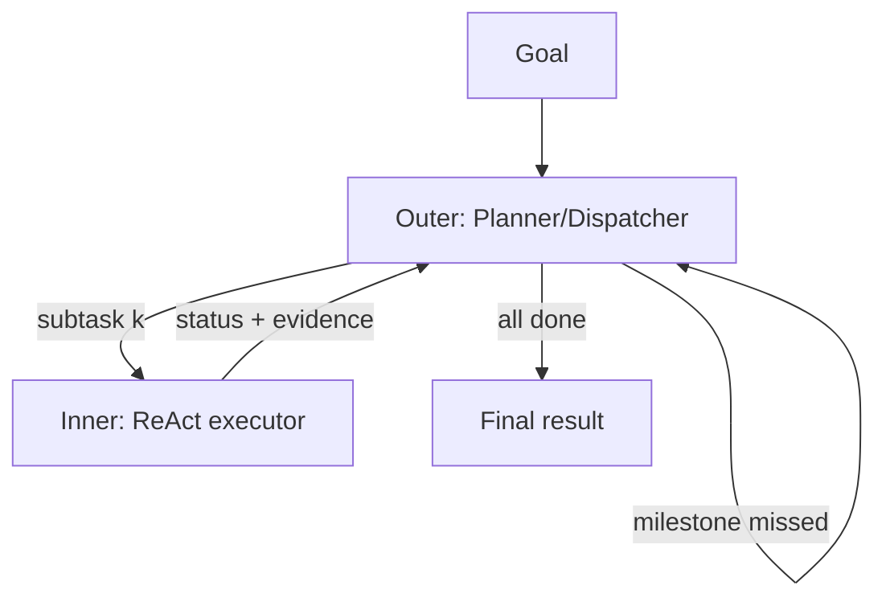

# Outer-Inner Agent Loop

**Also known as:** Dual-Loop Agent, Planner-Outside Executor-Inside, Dispatch-and-Act Loop

**Category:** Planning & Control Flow  
**Status in practice:** experimental

## Intent

Run two nested loops: an outer planner agent that decomposes the goal into subtasks and dispatches them, and an inner executor agent that runs its own tool-use/ReAct loop on each subtask; the outer can interrupt and replan based on the inner's progress.

## Context

A team operates an agent on long-horizon work — multi-step report writing, multi-stage data investigations, multi-day refactors — where the breakdown of the goal matters as much as the individual steps. Partway through the run, the agent may discover something that invalidates the original plan: a missing data source, a contradictory finding, a failed dependency. The team wants the planner to react to that evidence instead of letting execution proceed on a stale plan.

## Problem

A single agent loop that conflates planning and acting (such as ReAct) does both on every turn and pays the cost of replanning at each step even when the plan is still valid. Plan-and-Execute fixes the plan up front but then runs the executor blind — by the time execution finishes, the planner has no chance to react to mid-run evidence except by abandoning the run. The team needs planning and execution on separate cadences, with a controlled channel by which execution evidence can interrupt the plan.

## Forces

- Plans need a stable horizon; execution needs flexibility within steps.
- Replanning is expensive; doing it every turn is wasteful, doing it never is brittle.
- Inner-loop autonomy must not silently expand subtask scope.


## Applicability

**Use when**

- Goals decompose into subtasks where global planning and local action have different cadences.
- An outer planner needs an interruption channel to replan based on inner-loop evidence.
- Global state and local state can be cleanly separated between the two loops.

**Do not use when**

- A single agent loop already balances planning and acting acceptably.
- No clean interruption channel can be built between the loops.
- Operational cost of running two coordinated agents is unjustified.

## Therefore

Therefore: split the agent into an outer planner that dispatches and monitors subtasks and an inner executor that runs each one, connected only by a structured result and an interrupt channel, so that planning evidence and execution evidence flow on separate cadences without conflating.

## Solution

Define two roles. Outer agent (Dispatcher + Planner): decomposes the goal into subtasks with milestones, dispatches each to the inner agent, and may interrupt to replan when milestones are missed or new evidence arrives. Inner agent (Actor): runs a tool-use loop on a single subtask, reports back a structured result. Outer holds the global state; inner holds the local state. The interruption channel is the only path the outer has into the inner's loop.

## Structure

```
Outer (plan, dispatch, monitor) <-- result/interrupt --> Inner (ReAct loop on subtask) <-- tool calls --> Tools.
```

## Example scenario

A research agent that handles multi-step report writing repeatedly drifts mid-execution — it discovers a fact that invalidates its plan but keeps executing because the planning loop has already exited. The team restructures as an outer-inner-agent-loop: the outer planner decomposes the report into subtasks with milestones; the inner executor runs a ReAct loop on each subtask and reports back. When the inner agent reports an invalidating finding, the outer can interrupt and replan instead of letting execution proceed on a stale plan.

## Diagram



## Consequences

**Benefits**

- Planning and execution are separately legible and separately tunable.
- Outer can budget steps and cost per subtask.
- Inner failures are localised; outer can retry with a different plan.

**Liabilities**

- Two loops double the orchestration surface and the failure modes.
- Interrupt semantics are easy to get wrong (mid-step interrupts, partial state).
- Cost: outer's monitoring is itself an LLM call.

## What this pattern constrains

The inner agent may not change its subtask scope; scope changes must come back through the outer planner.

## Known uses

- **[XAgent (OpenBMB)](https://github.com/OpenBMB/XAgent)** — *Available*. Explicit Dispatcher + Planner outer loop and Actor inner loop.
- **Manus** — *Available*. Planner-Execution-Verification sub-agent split is a related shape with three roles instead of two.

## Related patterns

- *specialises* → [planner-executor-observer](planner-executor-observer.md) — Two-loop variant with explicit interrupt channel.
- *specialises* → [plan-and-execute](plan-and-execute.md)
- *uses* → [replan-on-failure](replan-on-failure.md)
- *uses* → [step-budget](step-budget.md) — Outer enforces step budget on inner.
- *complements* → [supervisor](supervisor.md)

## References

- (repo) *XAgent: An Autonomous LLM Agent for Complex Task Solving*, <https://github.com/OpenBMB/XAgent>

**Tags:** planning, multi-agent, china-origin, xagent
