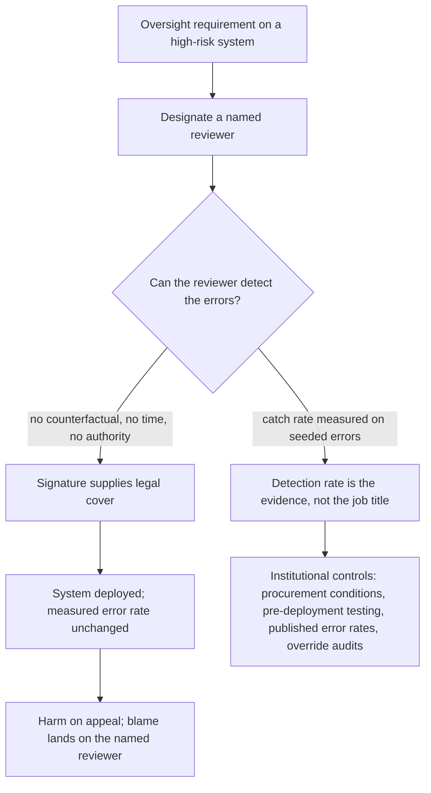

# Oversight as Legitimation

**Also known as:** Oversight Theatre, Nominal Human Oversight, Compliance-Cover Reviewer

**Category:** Anti-Patterns  
**Status in practice:** mature

## Intent

Anti-pattern: satisfy a human-oversight requirement by naming a reviewer who cannot detect the system's errors, so the sign-off supplies legal cover for deployment and relocates blame while no outcome changes.

## Context

A law, procurement rule, or internal policy says a consequential automated decision must be overseen by a person. The deploying body meets the requirement the way it is written: it designates a caseworker, a clinician, an admitted attorney, or an analyst as the responsible reviewer, documents the assignment, and ships. The requirement is discharged by naming someone. Nothing in the requirement asks whether that person, in the conditions they actually work in, can tell a correct output from a wrong one.

## Problem

The designated reviewer usually cannot perform oversight. They see only what the system produced and never the counterfactual, so agreeing with it and being unable to disagree with it look identical from outside. The review window is sized by case volume rather than by how long verification takes, and catching a wrong output often means redoing the work the system was bought to save. Spot-checking the outputs that look shaky does not help either, because a model's own confidence does not track when it is wrong. The reviewer frequently has no authority to stop a case and no incentive to dissent. Ben Green's survey of 41 government oversight policies found that people are unable to perform the desired oversight functions and that the policies therefore legitimise faulty and controversial systems without addressing the underlying problems. The sign-off is what gets the system through the gate; its ineffectiveness stays invisible precisely because the mandate was met.

## Forces

- An oversight duty is auditable by assignment: a regulator can check that a named person was appointed, but not that the person is able to detect an error.
- Genuine review often costs as much as doing the work again, which is the cost the automation was bought to remove, so the review budget is set by throughput instead.
- Sampling assumes the outputs that look shaky are the wrong ones, but a model's self-assessment does not track its own correctness, so a spot-check inspects the wrong items.
- Naming an individual reviewer is cheap and absorbs blame; institutional controls such as procurement conditions, pre-deployment testing and published error rates are expensive and constrain the deploying body.
- Personal liability on the reviewer raises the stakes of a wrong output without raising anyone's ability to spot one, and a vendor claim that a failure mode has been eliminated lowers the effort the reviewer spends looking for it.

## Therefore

Therefore: stop treating a named reviewer as a control until that person's error-detection has been measured under real working conditions, and put the load-bearing checks in institutional mechanisms — procurement conditions, pre-deployment testing, published error rates, audited override rates — that do not depend on one person's attention.

## Solution

The anti-pattern is enacted by reading the oversight requirement as a staffing question. A person is designated, the assignment is documented, and the deployment proceeds on that basis; the reviewer is then handed a caseload, a screen showing only the system's output, no protected way to refuse, and a vendor claim that the worst failure mode has been handled. The signature is doing legitimation work rather than control work, and the deploying body, the vendor and the regulator all point to it when an outcome is challenged. The remedy starts by separating the two: measure what fraction of known-wrong outputs the designated reviewer actually catches, using seeded errors or a held-out set where ground truth exists, and treat that number rather than the job title as the evidence that oversight exists. Give the reviewer the counterfactual, the time verification really takes, and a recorded, protected route to refuse. Where the measured catch rate is low or unmeasurable, move the control off the individual: condition procurement on published error rates, require pre-deployment testing on the deploying body's own cases, audit override rates and outcomes, and accept that some systems are then not deployable. Green's proposal is the same move — institutional oversight as the regulating mechanism, with the individual reviewer as one instrument inside it rather than the whole safeguard.

## Structure

```
Oversight duty --discharged-by--> named reviewer (no counterfactual, no time, no authority, no incentive) --signature--> deployment approved | measured error rate unchanged | blame relocated onto the reviewer ; Corrected: measured reviewer catch rate on seeded errors + institutional controls (procurement conditions, pre-deployment testing, published error rates, override audits)
```

## Diagram



*The same oversight requirement, discharged two ways: naming a reviewer turns the signature into legal cover for an unchanged error rate, whereas measuring the reviewer's catch rate turns oversight into a control that institutional mechanisms can carry.*

## Example scenario

A benefits agency buys a system that drafts eligibility decisions, and the procurement rule says a caseworker must review each one. The caseworker gets forty drafts a day, sees the recommendation but not the case as it would have been decided without the system, and has no way to check the cited rules within the time allowed. Every draft is signed. When a wrongly refused claimant appeals, the agency points to the caseworker's signature, and the caseworker discovers that the responsibility was real even though the review never was.

## Consequences

**Benefits**

- Naming the failure separates two things procurement conflates: a person being designated as overseer versus that person being demonstrably able to catch the system's errors — only the second is testable, and a measured catch rate on seeded errors is the target.
- Naming the failure makes the sign-off auditable as a control rather than as a process step: a review can ask what share of known-wrong outputs the designated reviewer caught, instead of asking whether a review box exists on the diagram.
- Naming the failure gives a reason to compare the deployment's measured error rate against the reviewer's measured catch rate before launch, so a tool measured to hallucinate in 17 to 33 percent of queries is not made acceptable by a signature whose detection rate nobody has ever established.

**Liabilities**

- An unfit system is deployed on the strength of a signature while its error rate is unchanged; the surveyed oversight policies were found to provide a false sense of security and to let vendors and agencies shirk accountability for algorithmic harms.
- Blame is relocated onto the designated reviewer, who carries personal responsibility for errors they were given no practical means to find — an admitted attorney signing a filing produced by a legal research tool measured to hallucinate between 17 and 33 percent of the time.
- Institutional remedies are crowded out: once the oversight requirement is ticked, procurement conditions, pre-deployment testing and published error rates look redundant to everyone who has to pay for them.
- The control's failure produces no signal until an outcome is challenged, because the mandate was met and the paperwork is complete.

## Failure modes

- Sign-off without counterfactual — the reviewer sees only the system's output and never what the decision would have been otherwise, so agreement and inability to disagree are indistinguishable.
- Confidence-guided sampling — the reviewer spot-checks the outputs that look shaky, but the model does not always know when it is producing a fabrication, so the checked set systematically misses the errors.
- Throughput-set review budget — the review window is sized by case volume rather than by the time verification takes, so checking every citation or field is not possible in the time given.
- Dissent without authority — the reviewer may flag a case but cannot stop it, and the flagged case proceeds unchanged.
- Marketing-set expectations — a vendor claim that a failure mode has been eliminated leads the reviewer to allocate no effort to looking for it.
- Blame transfer on incident — the deploying body points to the signature, and the reviewer discovers that the personal liability was real while the means of oversight was not.

## What this pattern constrains

A human-oversight requirement must not be treated as satisfied by designating a person; a sign-off cannot count as a control before the reviewer's catch rate on known-wrong outputs has been measured under real working conditions, and a system whose measured error rate is unacceptable may not be deployed on the strength of that signature alone.

## Applicability

**Use when**

- Recognising this failure when a legal or policy oversight requirement is met by designating a reviewer and documenting the assignment.
- Reviewing a deployment where the reviewer sees only the system's output, has a review budget set by case volume, or has no recorded way to refuse a case.
- Diagnosing why a sign-off step exists in the process and yet no error has ever been caught by it.
- Assessing a vendor claim that a failure mode has been eliminated, where the designated overseer bears personal responsibility for the result.

**Do not use when**

- The reviewer's catch rate on known-wrong outputs has been measured under real conditions and is high enough to carry the risk.
- The reviewer has the counterfactual, the time verification takes, and a recorded, protected route to refuse, and refusals actually stop cases.
- Institutional controls such as pre-deployment testing on the deploying body's own cases and published error rates carry the risk, with the individual reviewer as one instrument inside them.
- No oversight requirement or designated reviewer exists, so there is no mandate for the sign-off to legitimise.

## Components

- Oversight requirement — the statute, procurement rule or internal policy that makes a named human reviewer a condition of deployment
- Designated reviewer — the caseworker, clinician or admitted attorney whose signature discharges the requirement and who carries the personal responsibility
- Missing counterfactual — the absent view of what the decision would have been without the system, without which agreement and inability to disagree are indistinguishable
- Throughput-set review budget — the per-case time allowance derived from volume rather than from how long verification takes
- Absent refusal route — the missing recorded, protected path by which a reviewer can stop a case rather than only flag it
- Institutional controls — the procurement conditions, pre-deployment testing, published error rates and override audits that the ticked oversight box displaces

## Tools

- Seeded-error harness — injects known-wrong outputs into the live review queue to measure what the designated reviewer actually catches
- Held-out ground-truth set — the deploying body's own historical cases, used for pre-deployment testing instead of a vendor benchmark
- Override and refusal log — records every case the reviewer stopped or flagged, and what happened to it afterwards
- Procurement checklist with published error rates — moves the load-bearing condition from a named person to a contract term
- Decision record — captures the reviewer's reasons alongside the system's output so a challenged case has more than a signature

## Evaluation metrics

- Reviewer catch rate — share of seeded or known-wrong outputs the designated reviewer identifies under normal caseload
- Override rate versus expected — how often the reviewer departs from the system, compared with the error rate the case mix implies
- Verification time gap — time allowed per case against the time verification actually takes
- Refusal effectiveness — share of flagged cases that were actually stopped rather than proceeding unchanged
- Deployment error rate after review — measured error rate of decisions that carry a sign-off, which tells you whether the signature changed any outcome

## Known uses

- **[Government algorithm oversight policies (41 surveyed)](https://arxiv.org/abs/2109.05067)** _available_ — Ben Green's peer-reviewed survey finds two flaws across 41 policies prescribing human oversight of government algorithms: people are unable to perform the oversight functions asked of them, and the policies consequently legitimise faulty and controversial systems without addressing their underlying problems.
- **[EU AI Act Article 14 human-oversight duty](https://artificialintelligenceact.eu/article/14/)** _available_ — High-risk systems must be overseen by natural persons who are able to understand the output, stay aware of automation bias, and interrupt the system. Compliance is commonly evidenced by designating people and documenting the assignment, which is the surface on which this failure appears.
- **[Legal research assistants with an admitted attorney as the designated overseer](https://arxiv.org/abs/2405.20362)** _available_ — A preregistered study of the two market-leading tools, marketed as eliminating or avoiding hallucination, measured hallucination in 17 to 33 percent of queries. The attorney who signs the filing bears personal responsibility while the errors are invisible without re-checking every citation by hand.
- **[Public-sector agent benchmarks](https://arxiv.org/abs/2601.20617)** _available_ — A review of agent benchmarks against public-sector procurement requirements found that no single benchmark meets all of the criteria, so a procuring body has no off-the-shelf measurement to put in place of the designated reviewer.

## Related patterns

- _complements_ **Accountability Laundering via Algorithm** — The mirror failure: there a decision is routed through a model so that no person owns it, while here a person is deliberately named as owner and the naming is what makes the deployment possible.
- _conflicts-with_ **Human-in-the-Loop** — Human-in-the-loop assumes a reviewer who can and does refuse; this anti-pattern keeps the checkpoint while removing every condition that makes refusal possible, so the safeguard it imitates is the one it defeats.
- _complements_ **Advisory-to-Mandate Escalation** — There an advisory output is promoted by protocol into a binding order and a correct override is punished; here the reviewer is nominally free to dissent but has no means of knowing when to.
- _complements_ **Agent Output Alert Fatigue** — Alert fatigue is oversight decaying over time under volume; this failure is present at the first case, because the reviewer never had the counterfactual, time, or authority the mandate assumed.
- _complements_ **Supervisor Cognitive Overload** — Overload is attention saturating across parallel sub-agents; legitimation can occur with a single case per day, since the missing ingredient is the ability to detect an error rather than the capacity to look.
- _complements_ **Hidden Validation-Work Amplification** — That anti-pattern is what happens when the validation burden is genuinely paid and eats the productivity gain; this one is what happens when the same burden is assigned on paper and never paid.
- _complements_ **Hallucinated Citations** — The legal seam where this failure was measured: the designated attorney overseer is expected to catch fabricated citations by hand, at rates of 17 to 33 percent, inside a normal filing deadline.
- _complements_ **Blanket-Authorization Accountability Rupture** — Both misplace responsibility at the point of authorisation: a blanket grant leaves no party with whole-process control, while a legitimating sign-off concentrates responsibility on a person with no control at all.

## References

- [The Flaws of Policies Requiring Human Oversight of Government Algorithms (Computer Law & Security Review 45)](https://arxiv.org/abs/2109.05067) — Ben Green, 2022
- [Hallucination-Free? Assessing the Reliability of Leading AI Legal Research Tools](https://arxiv.org/abs/2405.20362) — Varun Magesh, Faiz Surani, Matthew Dahl, Mirac Suzgun, Christopher D. Manning, Daniel E. Ho, 2024
- [Large Legal Fictions: Profiling Legal Hallucinations in Large Language Models (Journal of Legal Analysis 16(1))](https://arxiv.org/abs/2401.01301) — Matthew Dahl, Varun Magesh, Mirac Suzgun, Daniel E. Ho, 2024
- [Agent Benchmarks Fail Public Sector Requirements](https://arxiv.org/abs/2601.20617) — 2026
- [EU AI Act, Article 14: Human Oversight](https://artificialintelligenceact.eu/article/14/) — 2024
