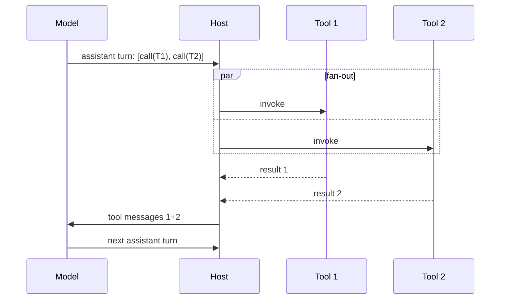

# Parallel Tool Calls

**Also known as:** Concurrent Function Calls, Multi-Tool Turn

**Category:** Routing & Composition  
**Status in practice:** mature

## Intent

Allow the model to emit several independent tool calls in one assistant turn; the host executes them in parallel.

## Context

Tasks where the model can identify independent sub-actions in one breath and parallel execution would cut wall-clock time.

## Problem

Sequential tool calls waste latency on independent operations; full DAG-planning patterns are heavyweight for the simple parallel case.

## Forces

- Concurrency limits per provider.
- Provider must support multi-tool-call turns.
- Aggregation of results back into the next turn.
- Models sometimes emit dependent calls in one turn despite the prompt; the host must detect or document this contract.

## Applicability

**Use when**

- The model frequently issues multiple independent tool calls per turn.
- The provider's API supports multiple tool calls in one assistant message.
- The host can fan out concurrent calls with bounded concurrency and rate-limit handling.

**Do not use when**

- Tool calls have hard sequential dependencies.
- Concurrency would breach external rate limits or transactional invariants.
- Heavyweight DAG planning is already in place and parallel calls would conflict.

## Solution

The provider's API allows the assistant turn to contain multiple tool calls. The host fans them out concurrently (with bounded concurrency and rate-limit handling). Results return as multiple tool messages; the next assistant turn sees all of them.

## Example scenario

An agent that summarises a support ticket needs to fetch the customer record, the recent invoice, and the last three tickets — three independent calls. Sequential dispatch takes a second per call and makes the bot feel sluggish. The team enables parallel-tool-calls in the provider API: the model emits all three tool calls in one assistant turn, the host fans them out concurrently with bounded concurrency, and the next assistant turn sees all three results. Latency drops from three seconds to about one without changing the model.

## Diagram

## Consequences

**Benefits**

- Lower wall-clock latency on parallelisable steps.
- Simpler than full DAG planning.

**Liabilities**

- Provider-specific behaviour.
- Host concurrency control complexity.
- Silent correctness bugs when accidentally-dependent calls are parallelised.

## What this pattern constrains

Tool calls in the same assistant turn are treated as independent; cross-call dependencies are not allowed within one turn.

## Known uses

- **OpenAI parallel function calling** — *Available*
- **Anthropic parallel tool use** — *Available*
- **Claude Code multi-tool turns** — *Available*
- **Cursor parallel reads** — *Available*

## Related patterns

- *uses* → [tool-use](tool-use.md)
- *alternative-to* → [llm-compiler](llm-compiler.md)
- *specialises* → [parallelization](parallelization.md)
- *alternative-to* → [code-as-action](code-as-action.md)

## References

- (doc) *OpenAI: Parallel function calling*, <https://platform.openai.com/docs/guides/function-calling>
- (doc) *Anthropic: Tool use*, <https://docs.anthropic.com/en/docs/build-with-claude/tool-use>

**Tags:** tool-use, parallel, concurrency
