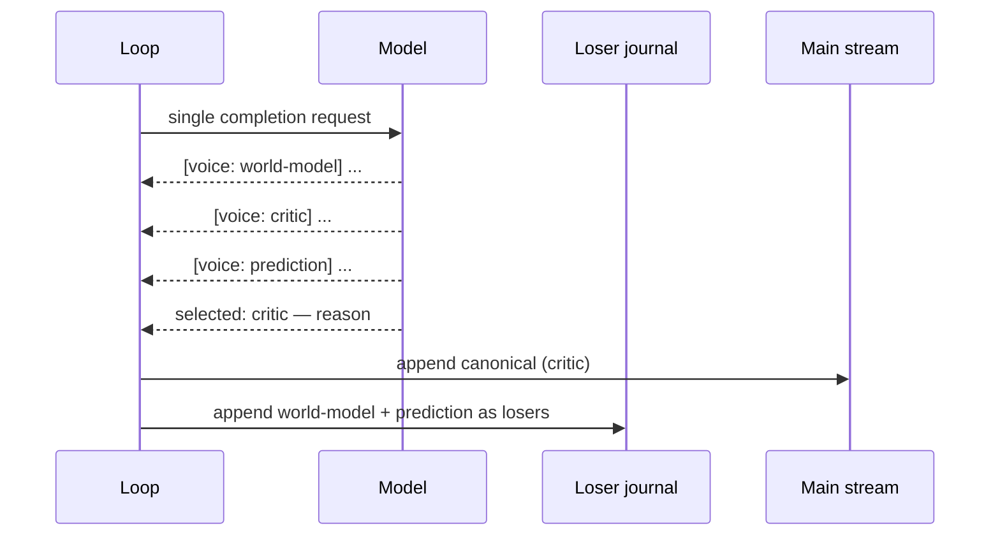

# Parallel-Voice Proposer

**Also known as:** Multi-Voice Generation, Internal Proposers, Tagged-Voice Self-Selection

**Category:** Cognition & Introspection
**Status in practice:** experimental

## Intent

Generate several candidate thoughts in parallel under named voices and have the same model pick the canonical one, logging the losers as audit.

## Context

Single-agent loops where best-of-N is too expensive, inner-committee's sequential roles are too slow, but the agent benefits from seeing its own disagreement before committing to a single line of thought.

## Problem

Single-pass generation collapses the model's internal disagreement into a confident-sounding mean. Sequential persona-switching is slow and depends on role ordering. Best-of-N requires an external scorer that may not exist.

## Forces

- Parallel voices in one completion are cheap but risk all sounding the same.
- Self-selection from candidates can rubber-stamp the first one.
- Logging losers costs disk and tokens but is the auditable substrate.
- More than three or four voices bloat the prompt without adding signal.

## Therefore

Therefore: emit two or three candidate thoughts in one completion each tagged with a named voice that frames a distinct perspective, then have the same model select the canonical and log the rest, so that internal disagreement is preserved as evidence instead of collapsing into a confident mean.

## Solution

Prompt the model to produce two or three candidate next-thoughts in one completion, each prefixed with a voice tag such as `[voice: world-model]`, `[voice: critic]`, `[voice: prediction]`. Then ask for a single `selected: <voice>` line with a one-sentence reason. The canonical thought enters the main stream; the losers are appended to a proposer-losers log for inspection. Voices that never win across a rolling window become eligible for retirement; that retirement decision is explicit, not silent.

## Example scenario

A long-running personal agent keeps producing single-line responses that sound certain but are wrong in subtle ways. The team rebuilds the per-tick generation as Parallel-Voice Proposer: the model emits three tagged candidates (world-model, critic, prediction) in one completion, then a final line names the selected voice and gives a one-sentence reason. The canonical thought enters the stream; the losers are appended to an audit log. Retrospective review shows the critic voice was correctly catching overconfidence the agent had been emitting solo.

## Diagram

*One completion emits multiple voice-tagged candidates plus a selection line; the canonical enters the main stream, the losers go to an audit log.*

## Consequences

**Benefits**

- Internal disagreement is preserved rather than collapsed.
- One completion is cheaper than sequential persona calls.
- Loser log creates an audit substrate for retrospective analysis.

**Liabilities**

- Same model means correlated voices; true diversity is limited.
- Self-selection can rubber-stamp the first candidate without rotation strategy.
- Prompt overhead per tick is non-trivial when voices are kept distinct.

## What this pattern constrains

Each generation governed by this pattern must emit at least two voice-tagged candidates; the selected canonical is the only one entered into main memory and the losers are read-only audit, never re-promoted by the model.

## Applicability

**Use when**

- Single-pass generation produces overconfident output that hides real disagreement.
- Inner-committee's sequential roles are too slow per tick.
- An external reward model for best-of-N is not available.

**Do not use when**

- The agent's task does not benefit from surfaced disagreement.
- Token budget will not absorb two or three voice-tagged candidates per call.
- Auditability of internal disagreement is not a goal.

## Known uses

- **Long-running personal agent loops (private deployment)** — *Available*

## Related patterns

- *alternative-to* → [inner-committee](inner-committee.md)
- *alternative-to* → [debate](debate.md)
- *alternative-to* → [best-of-n](best-of-n.md)

## References

- (book) Marvin Minsky, *The Society of Mind*, 1986, <https://archive.org/details/societyofmind00mins>
- (paper) Xuezhi Wang et al., *Self-Consistency Improves Chain of Thought Reasoning in Language Models*, 2022, <https://arxiv.org/abs/2203.11171>

**Tags:** cognition, inner-thought, multi-voice, self-selection
