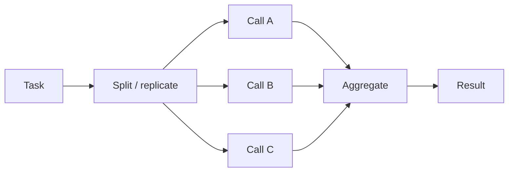

# Parallelization

**Also known as:** Sectioning, Voting, Parallel Branches

**Category:** Routing & Composition  
**Status in practice:** mature

## Intent

Run independent LLM calls concurrently and combine results.

## Context

The task naturally splits (sectioning) or benefits from multiple independent attempts (voting).

## Problem

Sequential execution of independent work wastes wall-clock time; single-attempt execution misses outliers a second look would catch.

## Forces

- Concurrency limits and rate limits.
- Aggregation logic for voting (majority? best? union?).
- Cost multiplies linearly with parallel branches.

## Applicability

**Use when**

- Independent subtasks can run concurrently to cut wall-clock time.
- Voting across multiple attempts catches outliers a single run would miss.
- Aggregation by concatenation, majority, or judge is feasible.

**Do not use when**

- Subtasks have hard dependencies that force sequential execution.
- The cost of running multiple attempts outweighs the quality gain.
- No reliable aggregation step is available for the votes.

## Solution

Two flavours. Sectioning: split a task into independent subtasks, run them concurrently, concatenate results. Voting: run the same task multiple times, aggregate by majority or judge.

## Example scenario

A code-review agent runs three independent checks on each PR — security scan, style review, and test-coverage analysis. Running them in series adds up to thirty seconds per PR. The team applies parallelization in its sectioning flavour: the three checks run as concurrent LLM calls and the results concatenate into one review. For high-stakes PRs they also use the voting flavour: the security check runs three times and an aggregator emits the majority verdict, catching the occasional outlier hit.

## Diagram

## Consequences

**Benefits**

- Wall-clock latency drops; quality rises (voting).
- Independent failures isolate cleanly.

**Liabilities**

- Cost scales with branch count.
- Aggregation logic is its own correctness problem.

## What this pattern constrains

Branches cannot share state during execution; aggregation is the only join point.

## Known uses

- **Anthropic Building Effective Agents (Workflow #3)** — *Available*
- **Self-consistency in mathematical reasoning** — *Available*

## Related patterns

- *generalises* → [self-consistency](self-consistency.md)
- *generalises* → [map-reduce](map-reduce.md)
- *generalises* → [best-of-n](best-of-n.md)
- *used-by* → [llm-compiler](llm-compiler.md)
- *generalises* → [parallel-tool-calls](parallel-tool-calls.md)
- *alternative-to* → [prompt-chaining](prompt-chaining.md)
- *used-by* → [lead-researcher](lead-researcher.md)

## References

- (blog) *Anthropic: Building Effective Agents*, 2024, <https://www.anthropic.com/research/building-effective-agents>

**Tags:** parallel, voting, concurrency
