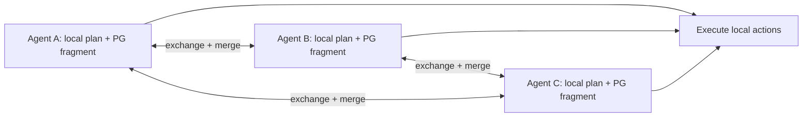

# Partial Global Planning

**Also known as:** PGP, Durfee-Lesser Planning

**Category:** Planning & Control Flow  
**Status in practice:** experimental

## Intent

Each agent maintains a partial view of others' plans and incrementally merges local plans into a shared partial global plan, interleaving coordination with execution.

## Context

A multi-agent system coordinates on a problem where a complete global plan is impractical to compute — the problem is too large, the world is non-stationary, or agents only learn what they need to coordinate as they go. Waiting for a global plan to complete before any agent acts is unworkable.

## Problem

Centralised global planning hits scaling limits and is fragile to change. Fully local planning produces inconsistent action choices that violate global constraints. Without an intermediate — a plan that is partial in coverage and global in scope, refined incrementally as agents share what they know — the team either pauses for impossible centralisation or acts inconsistently in isolation.

## Forces

- Complete global plans are often infeasible to compute or maintain.
- Local plans alone produce inconsistent global behaviour.
- Agents have incentives to share plan fragments only when coordination benefits exceed cost.
- Plan revision must propagate without thrashing.

## Applicability

**Use when**

- Multi-agent problem too large for a single global planner.
- World is non-stationary; plans must keep revising.
- Coordination benefits exceed fragment-exchange cost.

**Do not use when**

- Problem is small enough for one global planner.
- Fragment merging cannot be defined for the domain.
- Agents have no incentive to share plan fragments honestly.

## Therefore

Therefore: maintain a partial global plan that each agent holds a fragment of and refines incrementally as it shares with neighbours, so coordination interleaves with action and the system stays responsive without waiting for a complete plan.

## Solution

Each agent runs a planner that produces both local actions and partial-global-plan fragments. Agents periodically exchange fragments with neighbours; merging produces consistent shared plan structure for the parts agents care about. When new observations or revisions arrive, the affected fragment is updated and shared again. The team never holds a complete global plan; it holds a sufficient partial one. Execution and planning interleave.

## Example scenario

A fleet of research agents investigates a sprawling open question. Each holds a partial plan over its sub-area plus the fragments it has received about adjacent sub-areas. When agent A discovers its sub-area's evidence reframes the global picture, it revises its fragment and shares with the agents whose fragments referenced it. The team never produces a single global research plan; it produces overlapping partial plans that stay consistent enough.

## Diagram

## Consequences

**Benefits**

- Coordinated behaviour without the cost of a complete global plan.
- Resilient to non-stationary worlds — revisions are local fragments.
- Scales beyond what a single planner could handle.

**Liabilities**

- Fragment merging is non-trivial; conflicting fragments need a resolution rule.
- Some coordination cases require global structure the fragments don't capture.
- Thrashing on rapid revisions can degrade into pure local planning.

## What this pattern constrains

Multi-agent coordination must not wait for a complete global plan; agents exchange and merge partial-global-plan fragments while continuing to act.

## Known uses

- **Durfee & Lesser — Partial Global Planning (1987)** — *Available* — <https://cse-robotics.engr.tamu.edu/dshell/cs631/papers/durfee87using.pdf>
- **Multiagent Systems (Weiss) — Distributed planning chapter** — *Available* — <https://mitpress.mit.edu/9780262731317/multiagent-systems/>

## Related patterns

- *complements* → [distributed-constraint-optimization](distributed-constraint-optimization.md)
- *complements* → [blackboard](blackboard.md)
- *complements* → [world-model-as-tool](world-model-as-tool.md)
- *alternative-to* → [hierarchical-agents](hierarchical-agents.md)
- *alternative-to* → [plan-and-execute](plan-and-execute.md)
- *complements* → [joint-commitment-team](joint-commitment-team.md)

## References

- (paper) *Using Partial Global Plans to Coordinate Distributed Problem Solvers*, Edmund Durfee, Victor Lesser, 1987, <https://cse-robotics.engr.tamu.edu/dshell/cs631/papers/durfee87using.pdf>
- (book) *Multiagent Systems, 2nd ed.*, Gerhard Weiss (ed.), 2013, <https://mitpress.mit.edu/9780262731317/multiagent-systems/>

**Tags:** planning, distributed, coordination
