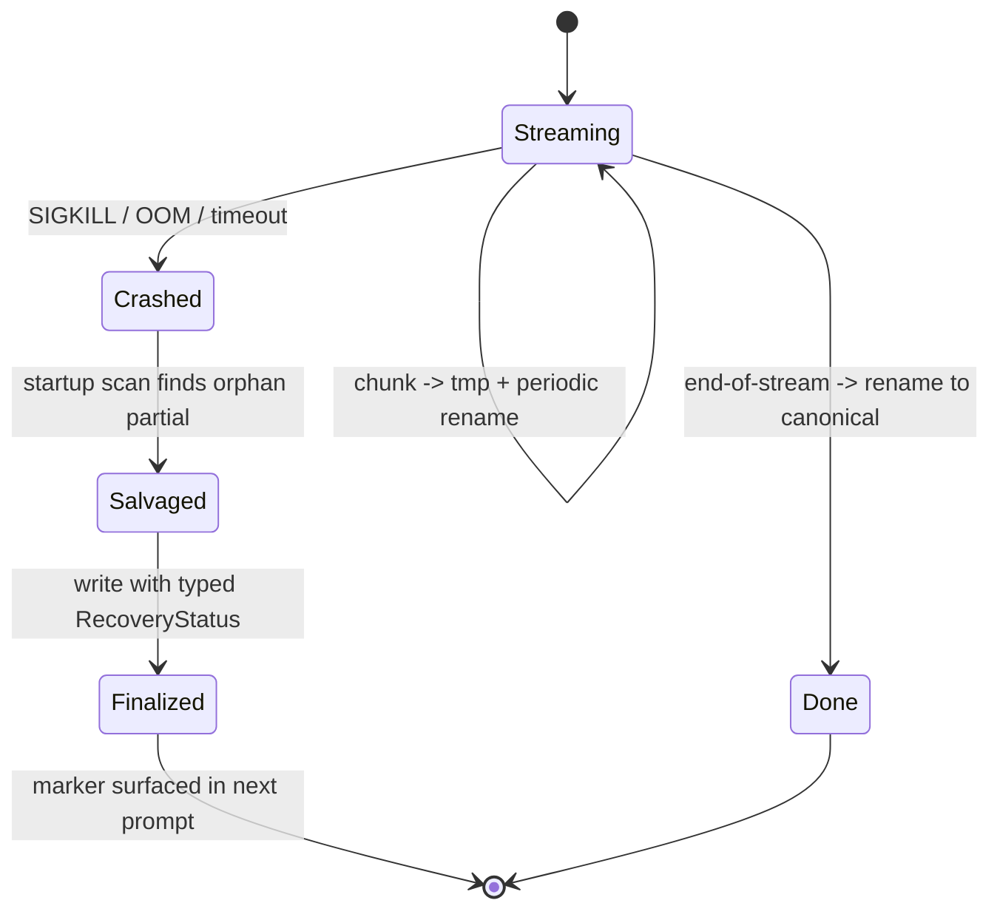

# Partial-Output Salvage

**Also known as:** Crash-Safe Streaming, Tmp-Replace Thought Recovery, Recovered-Partial Marker

**Category:** Cognition & Introspection
**Status in practice:** emerging

## Intent

Stream every model token to a tmp-plus-atomic-replace partial file so crashes mid-inference leave a consistent salvage, then promote partials at startup with a typed recovery marker the model can see.

## Context

Long-running agents on hardware that can crash (OOM kills, watchdog SIGKILL, deploys) where a lost mid-stream thought is hours of context. Agent-resumption handles process state; this handles the in-flight token stream itself.

## Problem

A SIGKILL during model streaming leaves the partial output in in-process memory only — total loss of seconds or minutes of inference. The next run has no idea anything was happening. Worse, the agent may later return to the topic with no awareness that a prior attempt died mid-sentence.

## Forces

- Per-chunk fsync is expensive; tmp-plus-rename is the affordable compromise.
- Recovery should be visible to the model, not silent — surprise about a partial is itself signal.
- A partial-thought stub must not be treated as a finished thought.
- Recovery markers must be typed (timeout vs hard crash) so triage is meaningful.

## Therefore

Therefore: stream every chunk to a tmp file with periodic atomic rename to the canonical partial path; at startup promote any orphan partial to a real thought file with a typed recovery marker and surface the recovery event in the next prompt, so that the model sees it is reading a salvage.

## Solution

Mechanical finite-state machine. On stream start: open `partial.tmp`, write a start marker with thought-id, timestamp, model id. On each chunk: append to tmp, periodically `os.rename(tmp, partial)` for atomicity. On normal stream end: rename to the canonical thought path, delete partial. On startup: scan for orphan `partial.*` files, finalize each with a typed RecoveryStatus enum (RECOVERED_FROM_PARTIAL for hard kill, TIMEOUT_PARTIAL for watchdog timeout). The next prompt's system context includes `last_partial_recovery: <status>` so the model can adjust.

## Example scenario

A long-running personal agent runs on a machine where the OOM killer occasionally takes the process. A four-minute reasoning trace gets killed at the three-minute mark and the entire stream is lost — the agent has no idea anything happened on the next run. The team adds Partial-Output Salvage: each chunk streams to `partial.tmp` with periodic atomic rename. On startup, orphan partials are finalized with a RECOVERED_FROM_PARTIAL marker that appears in the next prompt's system context. The agent sees the salvage, knows it was reading a partial, and decides whether to continue or restart the line of thought.

## Diagram

*Tmp-plus-rename keeps the partial file consistent at all times; startup salvage finalizes orphans with a typed marker.*

## Consequences

**Benefits**

- Mid-stream tokens are not lost on hard crash.
- Typed recovery marker preserves debuggability rather than hiding the salvage.
- Atomic rename keeps the partial file readable at every moment.

**Liabilities**

- Rename overhead per N chunks is non-zero.
- Partials add filesystem clutter if not periodically cleaned.
- Recovery surfaced in the prompt costs tokens every time it fires.

## What this pattern constrains

Partial thought files cannot be silently consumed; every salvaged partial carries a typed recovery marker that propagates into the next prompt, and the model is not allowed to treat a recovered partial as if it were a completed thought.

## Applicability

**Use when**

- The runtime can SIGKILL the agent mid-stream and that loses meaningful work.
- Inference is long enough per call that a partial stream has real value.
- Filesystem supports atomic rename in the working directory.

**Do not use when**

- Inference is fast enough that crashes never land mid-stream in practice.
- Partial output has no semantic value (e.g. binary embeddings only).
- The model cannot be trusted with a typed recovery marker without spiralling.

## Known uses

- **Long-running personal agent loops (private deployment)** — *Available*

## Related patterns

- *complements* → [agent-resumption](agent-resumption.md)
- *composes-with* → [append-only-thought-stream](append-only-thought-stream.md)

## References

- (paper) C. Mohan, Don Haderle, Bruce Lindsay, Hamid Pirahesh, Peter Schwarz, *ARIES: A Transaction Recovery Method Supporting Fine-Granularity Locking and Partial Rollbacks Using Write-Ahead Logging*, 1992, <https://cs.stanford.edu/people/chrismre/cs345/rl/aries.pdf>
- (spec) IEEE / The Open Group, *POSIX rename(2) atomicity*, 2018, <https://pubs.opengroup.org/onlinepubs/9699919799/functions/rename.html>

**Tags:** cognition, crash-safety, streaming, recovery
