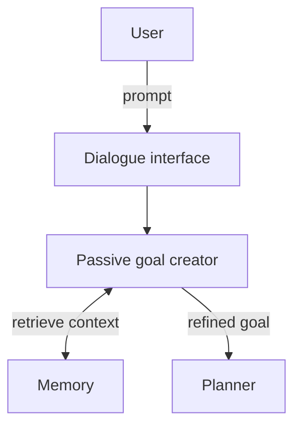

# Passive Goal Creator

**Also known as:** Dialogue Goal Extractor, Goal Refinement from Prompts

**Category:** Planning & Control Flow  
**Status in practice:** emerging

## Intent

Analyse the user's articulated prompts and accompanying context to derive a precise, actionable goal before any planning or tool use begins.

## Context

A team runs an agent behind a dialogue interface — a chatbot, a coding assistant, a personal-assistant surface — where users type short, conversational prompts. Those prompts are often under-specified relative to what the agent has to do: the user says "book me a flight Thursday" and leaves the destination, the time of day, and the preferences implicit. Other relevant context (recent conversation, stored preferences, prior tasks) lives in memory but does not arrive automatically with the prompt.

## Problem

If the planner reads the raw user prompt directly it inherits all of that under-specification. It then either guesses (producing confidently wrong work the user has to correct) or fails on a missing field. Pushing the clarification work into every downstream component spreads the same problem across many places. The team needs one early step that turns a thin dialogue prompt plus retrieved memory into a precise, structured goal that the planner can act on.

## Forces

- Underspecification: users rarely articulate complete context or precise constraints.
- Efficiency: users expect quick responses, so the goal-clarification step must be cheap.
- Reasoning uncertainty: ambiguous goal information propagates into the plan.

## Applicability

**Use when**

- Users interact with the agent through free-form dialogue and prompts are often under-specified.
- Goal context lives in memory or recent history that the planner does not naturally see.
- A single early step can replace many downstream clarifications.

**Do not use when**

- Inputs are already structured (form fields, API calls) and need no refinement.
- Multimodal context capture is essential — use Proactive Goal Creator instead.

## Therefore

Therefore: before planning, route the user's prompt through a goal-creator component that inspects the prompt together with retrieved memory (recent tasks, conversation history, examples) and emits a refined, structured goal, so that downstream planning has a precise target.

## Solution

A dedicated component receives the user's prompt via the dialogue interface, retrieves related context from memory (recent tasks, conversation history, positive/negative examples), and produces a refined goal handed to the planner. In multi-agent setups, the same component can receive goals via API from a coordinator instead of directly from a user.

## Example scenario

A user types: "book me a flight Thursday". A passive goal creator pulls recent conversation (the user mentioned Tokyo last week), checks memory (the user prefers morning departures), and emits a refined goal: "book a morning flight from the user's home airport to Tokyo on the next Thursday". The planner now has something concrete to plan against, instead of the original eight-word prompt.

## Diagram

*Passive Goal Creator refines a dialogue prompt into a planner-ready goal.*

## Consequences

**Benefits**

- Interactivity: a familiar dialogue surface for users.
- Goal-seeking: downstream components plan against an explicit goal, not a raw prompt.
- Efficiency: pushes the lightweight clarification work to a single early component.

**Liabilities**

- Reasoning uncertainty when the prompt is too ambiguous to refine reliably.
- Becomes a single point of misinterpretation if the goal extraction is wrong.

## What this pattern constrains

Downstream planning components must consume the refined goal, not the raw user prompt.

## Known uses

- **HuggingGPT** — *Available*. Cited by Liu et al. (2025) §4.1 — user requests with complex intents are interpreted as the intended goal before task planning. https://huggingface.co/spaces/microsoft/HuggingGPT

## Related patterns

- *alternative-to* → [proactive-goal-creator](proactive-goal-creator.md)
- *complements* → [disambiguation](disambiguation.md)
- *used-by* → [prompt-response-optimiser](prompt-response-optimiser.md)
- *complements* → [plan-and-execute](plan-and-execute.md)

## References

- (paper) Yue Liu, Sin Kit Lo, Qinghua Lu, Liming Zhu, Dehai Zhao, Xiwei Xu, Stefan Harrer, Jon Whittle, *Agent design pattern catalogue: A collection of architectural patterns for foundation model based agents* (2025) — https://doi.org/10.1016/j.jss.2024.112278

**Tags:** goal, dialogue, planning, liu-2025
