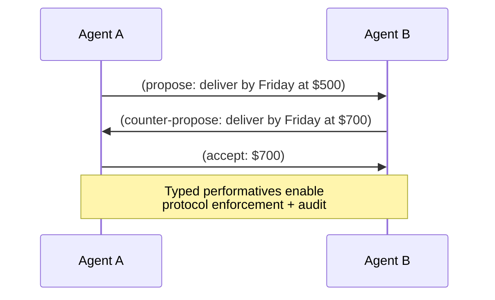

# Performative Message

**Also known as:** Speech-Act Message, KQML Performative, Typed Agent Message

**Category:** Multi-Agent  
**Status in practice:** mature

## Intent

Inter-agent messages are typed by communicative intent (request, inform, propose, accept, refuse, query) rather than by free-form prose, so receivers can dispatch on act type.

## Context

A multi-agent system exchanges messages across agents. The default in LLM-agent deployments is free-form natural language: agent A writes a paragraph that agent B reads as a paragraph. The communicative act — is this a request? a proposal? an answer? — is implicit in the text.

## Problem

Untyped messages collapse in several ways. Receivers must classify the act before dispatching, which is itself an error-prone LLM call. Audit and orchestration tools cannot tell who requested what from whom. Negotiation, query, and information-sharing protocols cannot be enforced because the protocol's state machine has no typed transitions to track. Without typing, multi-agent communication is prose all the way down and the system has no language for 'A proposed X to B, B accepted, C is querying about it'.

## Forces

- Receivers benefit from explicit act type for dispatching.
- Protocol state machines need typed transitions to enforce contracts.
- Free-form payloads are still needed for the act content.
- Type vocabulary must be small and stable across agents.

## Applicability

**Use when**

- Multi-agent communication has recognisable communicative acts.
- Protocols (negotiation, query, contract-net) are run between agents.
- Receivers benefit from typed dispatch.

**Do not use when**

- Communication is purely free-form discussion with no protocol structure.
- Performative vocabulary cannot be standardised across the agents involved.
- Single-agent system with no inter-agent messaging.

## Therefore

Therefore: type every inter-agent message with a performative drawn from a small fixed vocabulary, so receivers can dispatch on act type and protocols can be enforced as state machines.

## Solution

Define a small fixed set of performatives — request, inform, propose, accept, refuse, query, agree, cancel — drawn from KQML/FIPA-ACL tradition. Every inter-agent message carries an explicit performative plus the act content. Receivers dispatch on performative. Protocol state machines (negotiation, query-then-answer, contract-net) become enforceable because the transitions are typed. Free-form natural language remains the content payload; the typing is a metadata layer the LLM sees and produces.

## Example scenario

A negotiation protocol between two agents uses {propose, counter-propose, accept, refuse, withdraw}. Agent A sends `(propose: deliver-by Friday at $500)`. Agent B sends `(counter-propose: deliver-by Friday at $700)`. Agent A sends `(accept: $700)`. The orchestrator's audit log shows the typed exchange; no classification of free-form prose is needed.

## Diagram

## Consequences

**Benefits**

- Receivers can dispatch without an additional classification call.
- Protocol state machines are enforceable, not advisory.
- Audit and orchestration tools have typed events to reason over.

**Liabilities**

- Choosing the performative is one more output the model can get wrong.
- Performative vocabulary can drift or fragment across teams without governance.
- Type-checking adds overhead on each message exchange.

## What this pattern constrains

Inter-agent messages must not be untyped natural-language blobs; every message carries an explicit performative drawn from the fixed vocabulary.

## Known uses

- **KQML / FIPA-ACL classical agent communication languages** — *Available* — <https://en.wikipedia.org/wiki/Knowledge_Query_and_Manipulation_Language>
- **Modern MCP / A2A message schemas (typed call/response)** — *Available*
- **Multiagent Systems (Weiss) — Agent communication chapter** — *Available* — <https://mitpress.mit.edu/9780262731317/multiagent-systems/>

## Related patterns

- *complements* → [agent-adapter](agent-adapter.md)
- *uses* → [contract-net-protocol](contract-net-protocol.md)
- *complements* → [tool-use](tool-use.md)
- *complements* → [mcp-bidirectional-bridge](mcp-bidirectional-bridge.md)
- *uses* → [structured-output](structured-output.md)
- *complements* → [actor-model-agents](actor-model-agents.md)
- *alternative-to* → [stigmergic-coordination](stigmergic-coordination.md)

## References

- (book) *Multiagent Systems, 2nd ed.*, Gerhard Weiss (ed.), 2013, <https://mitpress.mit.edu/9780262731317/multiagent-systems/>
- (doc) *KQML — Knowledge Query and Manipulation Language*, <https://en.wikipedia.org/wiki/Knowledge_Query_and_Manipulation_Language>

**Tags:** multi-agent, communication, protocol
