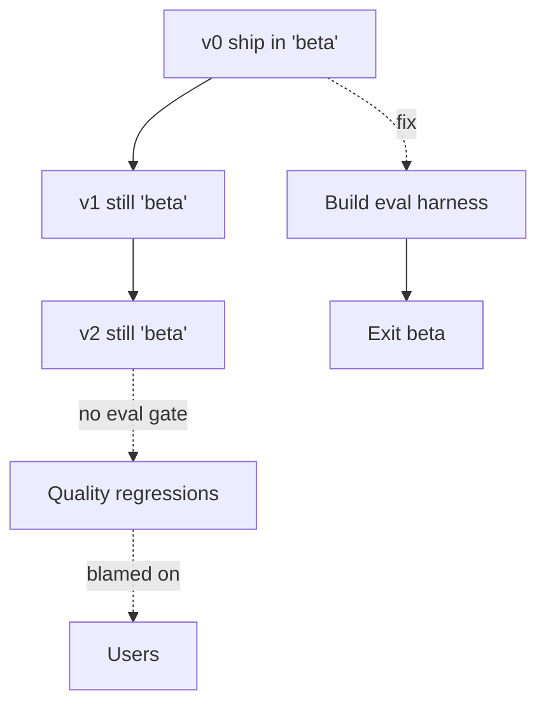

# Perma-Beta

**Also known as:** Forever Beta, Eval Vacuum

**Category:** Anti-Patterns  
**Status in practice:** deprecated

## Intent

Anti-pattern: ship the agent in 'beta' indefinitely so that quality regressions are someone else's problem.

## Context

A team launches an agent product to real users under a 'beta' label, without building an evaluation harness that can measure quality regressions across releases. Months later, the product is still labelled beta, partly because the team genuinely has not measured quality, partly because removing the label would commit them to a quality bar they have no way to defend. The label has quietly shifted from a signal of active iteration to a shield against accountability.

## Problem

Without an evaluation harness, every release is a guess: regressions land invisibly, model upgrades are accepted or rejected on vibe, and customer-facing quality drifts without anyone noticing until churn reveals it. Beta becomes a permanent excuse that costs nothing to keep and absorbs all accountability for unmeasured quality. Eventually a competitor ships a graduated version of a similar product and the beta team discovers, too late, that they never had a measurement story.

## Forces

- Eval harnesses cost time to build.
- GA promises commit to quality bars.
- Beta lets product move fast.

## Applicability

**Use when**

- Never use this; treat indefinite beta as a smell and exit it deliberately.
- Build an eval harness so quality regressions are visible (see eval-harness).
- Pair eval-harness with llm-as-judge and shadow-canary to gate releases.

**Do not use when**

- Any agent serving real users where regressions matter.
- Any product where 'beta' is being used as an excuse for missing evaluation.
- Any team that has the resources to build an eval harness but has not.

## Therefore

Therefore: build the eval harness, set quality gates, and exit beta on a published date, so that regressions become visible and the label stops absorbing accountability for unmeasured quality.

## Solution

Don't. Build the eval harness and exit beta. See eval-harness, llm-as-judge, shadow-canary.

## Example scenario

A startup launches its agent product as 'beta' and uses the label as a blanket excuse for any quality complaint. Eighteen months later the agent is still beta, there is no eval harness, and customers have started churning to a competitor that ships GA. The team names the failure perma-beta and forces an exit: build the eval suite, set quality gates, fix the regressions blocking GA, and remove the beta label. The label was hiding the fact that nobody actually knew whether the product was getting better or worse.

## Diagram

## Consequences

**Liabilities**

- Trust erosion.
- No SLA defensibility.
- Quality stagnates without measurement.

## What this pattern constrains

By definition, this anti-pattern imposes no useful constraint; the missing constraint is the failure mode.

## Known uses

- **[Google Bard 'Experiment' label (2023-2024)](https://blog.google/technology/ai/try-bard/)** — *Deprecated* — Shipped to the public for a year while labeled an experiment; the label acknowledged unreliability without reducing exposure, and quality complaints were answered with the beta framing.

## Related patterns

- *alternative-to* → [eval-harness](eval-harness.md)
- *alternative-to* → [shadow-canary](shadow-canary.md)
- *conflicts-with* → [eval-as-contract](eval-as-contract.md)

## References

- (repo) *ai-standards/ai-design-patterns (Perma-Beta)*, <https://github.com/ai-standards/ai-design-patterns>

**Tags:** anti-pattern, release, beta
