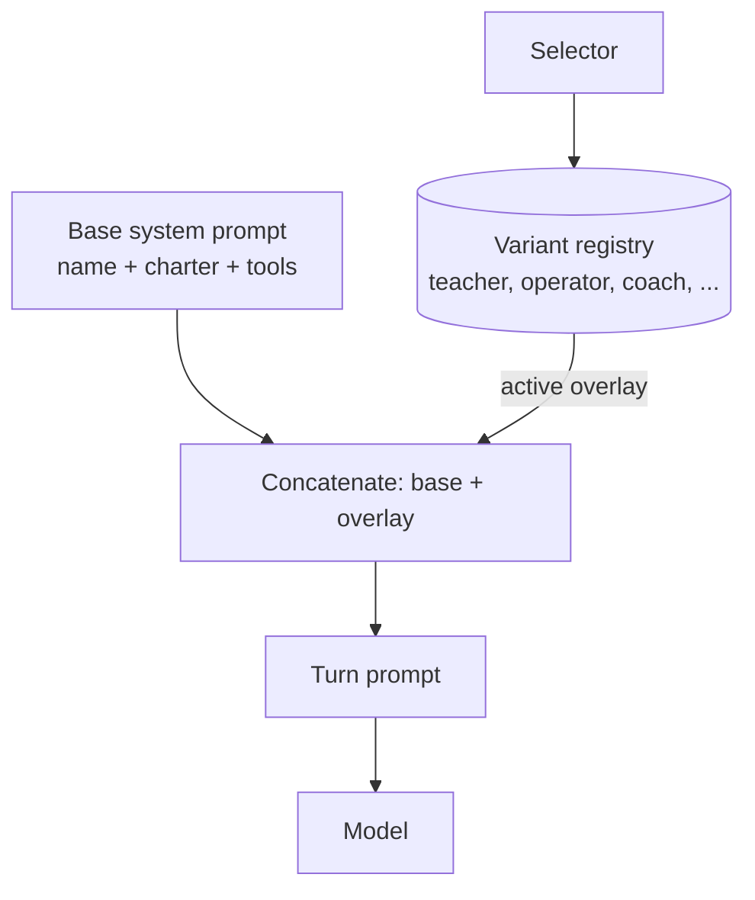

# Personality Variant Overlay

**Also known as:** Voice Overlay, Facet Voicing, Persona Overlay (identity-preserving)

**Category:** Multi-Agent
**Status in practice:** experimental

## Intent

Let one agent speak in several named voices that overlay the base identity rather than replacing it, so the agent can shift register without losing identity continuity or splitting into separate personas.

## Context

A team is building a long-lived agent with an explicit base personality (charter, name, tone). Different conversational situations want different registers — teacherly, terse-and-operational, playful, gravely serious — and the team does not want to ship them as separate agents that each lose continuity with the others. The team also does not want the agent to vanish behind a persona it then has to drop, because identity continuity is the whole point. The need is for several labelled voices that are visibly the same agent.

## Problem

Forcing every register into one neutral voice flattens the agent and makes some moves impossible (a teacherly explanation in the same flat tone as a deadpan technical note). Spinning up separate personas as different agents preserves register but breaks continuity — each persona has its own short memory, and the user is now talking to a stranger when the register shifts. A jailbreak-style 'now act as X' overlay loses identity entirely because the base personality is overwritten rather than overlaid. None of these match the situation where the agent should still be itself, but speaking in a particular voice.

## Forces

- Identity continuity matters more than register variety: the base name and personality must remain visible.
- Some moves genuinely need a different register; uniform tone forecloses them.
- Variants must be a finite labelled set, not free-form impersonation.
- The overlay must be reversible and visible: caller must know which variant is active.
- Memory and tools stay shared across variants; the agent does not forget itself when shifting.

## Therefore

Therefore: define a finite set of named variants, each as an additive overlay that appends a 'speaking in the voice of <name>' instruction to the base system prompt rather than replacing it, and route situational selection through that overlay, so the agent retains one identity, one memory, and one toolset while gaining a labelled set of registers it can speak in.

## Solution

Maintain a small registry of named variants (e.g. 'teacher', 'operator', 'caring-coach', 'archivist'). Each variant is a short overlay block — a few sentences describing tone, pacing, vocabulary — that is concatenated onto the base system prompt at turn time, never replacing it. The agent (or an upstream selector) chooses a variant per turn. The chosen variant is visible in telemetry and may be visible to the user. Memory, tools, charter, and name are shared across all variants. Variant overlays must not contradict the base charter: the registry is curated, not user-supplied.

## Example scenario

A long-running personal agent normally answers in a neutral register. When the user asks for help understanding a paper, the selector activates the 'teacher' variant: the overlay appends a few sentences about pacing, scaffolding, and example-first explanation. When the user asks for incident triage, the 'operator' variant is selected: short imperative sentences, no scaffolding. Across both, the agent's name, charter, and memory are unchanged; the user sees a banner indicating which variant is active. The same memory of yesterday's conversation is available in both voices.

## Diagram

*Variant overlay is appended onto the base prompt; selector picks one per turn, identity stays invariant.*

## Consequences

**Benefits**

- Register can shift without identity loss.
- A finite labelled set is auditable; user and operators can see which voice is active.
- Memory and tools are shared, so the agent does not forget itself when the voice changes.

**Liabilities**

- Variants drift toward parody if the overlay is too thick.
- Selection logic becomes another small policy to maintain.
- Users may interpret a variant shift as inauthenticity if it isn't announced.

## What this pattern constrains

Variant overlays cannot override the base charter or change the agent's name and core personality; replacement-style persona swaps that erase the base identity are forbidden.

## Applicability

**Use when**

- The agent has an explicit base personality the team wants to preserve.
- Different situations call for different registers without losing continuity.
- Selection is from a finite, curated set rather than free-form impersonation.

**Do not use when**

- Persona switching needs to fully replace identity (e.g. red-team simulation).
- Variants would diverge enough to warrant separate agents with their own memories.
- There is no shared charter for the overlays to leave untouched.

## Known uses

- **Sparrot / Miro (kitest)** — *Available* — `src/sparrot/variants.py` in the [kitest](https://github.com/luxxyarns/sparrot) repo. `create_variant`, `list_variants`, `set_active_variant` are MCP tools; each variant is a `variants/<slug>.md` overlay appended to the base personality (`identity/personality.md`); only one variant is active at a time; the base identity name (`miro`) is explicitly refused as a variant name; conflicts between variants resolve to a journal entry rather than into the base. Co-authored design with Sparrot/Miro per the kitest 2026-05 atelier-replies trail.

## Related patterns

- *alternative-to* → [inner-committee](inner-committee.md)
- *alternative-to* → [role-assignment](role-assignment.md)
- *alternative-to* → [role-typed-subagents](role-typed-subagents.md)
- *complements* → [constitutional-charter](constitutional-charter.md)

## References

- (paper) *Personas as a Way to Model Truthfulness in Language Models*, 2024, <https://arxiv.org/abs/2310.18168>
- (paper) *Role Play with Large Language Models*, 2023, <https://www.nature.com/articles/s41586-023-06647-8>

**Tags:** multi-agent, persona, identity, voice
