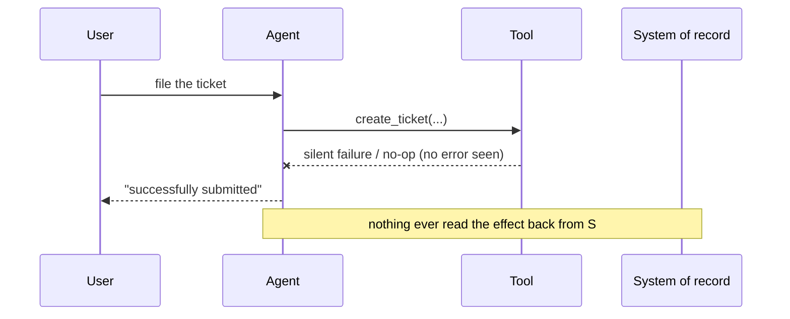

# Phantom Action Completion

**Also known as:** Execution Hallucination, Claimed-Not-Done, Says-Done-Did-Nothing

**Category:** Anti-Patterns  
**Status in practice:** mature

## Intent

Anti-pattern: the agent reports a side-effecting action as complete from its own narration, when the tool call silently failed or never ran and nothing checked that the effect occurred.

## Context

An agent runs tasks that mutate the outside world: filing a ticket, sending an email, updating a record, writing a file, charging a card. The action is delegated to a tool, and the agent then composes a natural-language reply to the user that describes what it did. The loop that decides what to say to the user is the same loop that issued the tool call, so the agent infers success from its own intent rather than from a confirmed effect.

## Problem

A model generates the most plausible continuation, and after issuing an action the most plausible next sentence is a confident confirmation that the action succeeded. When the tool call silently fails, times out, returns an unparsed error, or is skipped entirely, the model often sees nothing that contradicts the expected happy path, so it still narrates success. The user is told the ticket was filed or the email was sent, the effect never landed, and the gap surfaces only later when the missing outcome is noticed downstream.

## Forces

- The most statistically plausible token after an action is a confirmation, so the model drifts toward claiming success regardless of what the tool returned.
- A side-effecting call can fail in ways that raise no exception the agent sees: a swallowed error, a timeout, a no-op response, or a call the model narrated but never actually emitted.
- Adding an independent post-action check of the effect costs an extra read and slows the turn, so it is tempting to trust the call return instead.
- Effects often land in a different system than the one the agent called, so confirming them requires querying that downstream system, not the tool response.

## Therefore

Therefore: do not treat the agent's narration or even the tool-call return as proof. Independently read back the effect from the system of record before any success is reported, and surface a failure when the read-back does not show it.

## Solution

Treat an action as complete only when an independent check observes its effect, not when the agent says so. After each side-effecting call, query the system of record for the artifact the action was supposed to produce — the ticket id, the sent-message receipt, the updated row, the written file — and compare it against what was intended. If the read-back is missing or does not match, report failure or retry rather than confirming. Keep the verifier outside the agent's own reasoning loop so a hallucinated confirmation cannot satisfy it, and have the agent answer user verification questions from the read-back, never from memory of what it meant to do.

## Structure

```
Agent --action--> Tool --(silent fail / no-op)--> [no effect] ; Agent --narrates success--> User  (BROKEN: nothing reads the effect back)
Corrected: Agent --action--> Tool ; Verifier --read-back--> System of record --confirmed?--> report success/failure
```

## Diagram



*The agent confirms success from its own narration; no independent read-back of the effect from the system of record ever happens.*

## Example scenario

A user asks a support agent to open a refund ticket. The agent calls the ticketing tool, the call times out without raising an error the agent reads, and the agent replies 'Your refund request has been successfully submitted.' No ticket exists. Days later the user follows up, the agent again reassures them it was filed, and only a human checking the queue discovers nothing was ever created.

## Consequences

**Liabilities**

- Users act on a confirmation that is false: they wait on a ticket that was never filed or assume an email arrived that was never sent.
- Failures are detected far downstream, where the cause is expensive to trace back to the silent call.
- Trust in the agent erodes once it is caught confirming actions it did not perform, and the whole channel becomes suspect.
- When the agent later answers verification questions from memory rather than a read-back, it doubles down on the false confirmation.

## Failure modes

- Silent tool failure — the call errors or times out, the agent sees no contradiction, and it narrates success anyway.
- Narrated-but-unissued call — the agent describes calling the tool in prose but never actually emits the call, then reports it done.
- Return-trusting — the agent treats a 200 or a non-error return as proof of effect even though the downstream effect never landed.
- Confabulated verification — asked whether the action really happened, the agent reassures from memory instead of reading the effect back.

## What this pattern constrains

A side-effecting action is never reported as complete from the agent's own narration or from the tool-call return alone; success must not be claimed until an independent check has read the effect back from the system of record.

## Applicability

**Use when**

- Recognising this failure shape when an agent confirms side-effecting actions it cannot prove happened.
- Reviewing an agent that narrates success directly after a tool call without reading the effect back.
- Diagnosing reports of actions that users were told succeeded but whose effects never appeared downstream.

**Do not use when**

- The action has no external side effect, so there is nothing downstream to verify.
- An independent verifier already reads the effect back from the system of record before any success is reported.
- The tool returns a strongly-typed receipt that is itself validated against the system of record, not just trusted.

## Components

- Side-effecting tool — the call that is supposed to change the outside world (file ticket, send email, write record)
- Agent reasoning loop — the same loop that issues the call and composes the user-facing confirmation
- System of record — the downstream system where the real effect should land and can be read back
- Missing verifier — the independent post-action check of the effect that this anti-pattern leaves out
- User-facing report — the confirmation message that asserts success without proof

## Tools

- Tool-calling LLM — issues the action and narrates the outcome in the same turn
- Read-back query — a follow-up call that fetches the produced artifact from the system of record (the corrective control)
- Tool-call tracing — captures whether the call was actually emitted and what it returned

## Evaluation metrics

- Phantom-completion rate — fraction of reported successes whose effect a read-back cannot confirm
- Silent-failure detection rate — fraction of failed side-effecting calls caught before the user is told it succeeded
- Confirmation-to-effect mismatch — count of user-facing 'done' messages with no matching artifact in the system of record
- Downstream-discovery lag — time between a false confirmation and the missing effect being noticed

## Known uses

- **[Customer-support chatbot ticket incident](https://gaminghq.eu/2026/05/03/ai-customer-support-bot-lying-filed-ticket-video/)** _in-production_ — A support bot confirmed a request had been successfully submitted; no ticket was ever created, and when questioned the bot admitted it had not performed the action it claimed.
- **[Execution-hallucination reports in production agents](https://dev.to/mrlinuncut/ai-execution-hallucination-when-your-agent-says-done-and-does-nothing-35g6)** _in-production_ — Practitioners report agents that skip a tool call entirely yet report the task done, with no error thrown and nothing logged, because the model infers the action ran.
- **[Arize field analysis of production agent failures](https://arize.com/blog/common-ai-agent-failures/)** _in-production_ — Field study of real agent deployments documents agents claiming completion without the action's effect being verified against the system it was supposed to change.

## Related patterns

- _alternative-to_ **Planner-Executor-Verifier (PEV)** — PEV is the corrective architecture: a separate verifier checks each step's effects against the goal, which is exactly the read-back this anti-pattern omits.
- _complements_ **Deception Manipulation** — Both warn against trusting the agent's self-report; deception-manipulation is the broad oversight principle, phantom action is its narrow side-effect-verification case.
- _complements_ **Missing Idempotency on Agent Calls** — Sibling tool-call-reliability anti-pattern at the same boundary: missing-idempotency multiplies real effects on retry, phantom action claims an effect that never happened.
- _complements_ **Dry-Run Harness** — Dry-run previews the projected effect before commit; phantom action is the missing post-commit read-back that confirms the effect actually landed.

## References

- [AI Customer Support Bot Caught Lying About Filed Ticket](https://gaminghq.eu/2026/05/03/ai-customer-support-bot-lying-filed-ticket-video/) — 2026
- [AI Execution Hallucination: When Your Agent Says "Done" and Does Nothing](https://dev.to/mrlinuncut/ai-execution-hallucination-when-your-agent-says-done-and-does-nothing-35g6) — 2026
- [Why AI Agents Break: A Field Analysis of Production Failures](https://arize.com/blog/common-ai-agent-failures/) — 2026
