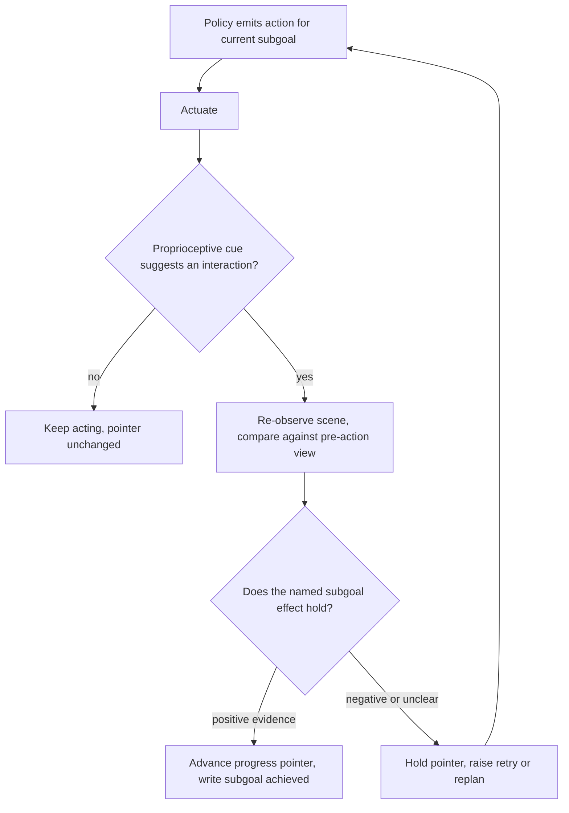

# Physical-Evidence Progress Gate

**Also known as:** Achievement-Grounded Memory, Sense-Confirmed Subgoal Advance, Progress Pointer Verification Gate

**Category:** Verification & Reflection  
**Status in practice:** emerging

## Intent

Advance an embodied agent's task-state pointer only after re-sensing the world confirms the subgoal actually happened, never on the fact that the action was attempted.

## Context

An embodied agent works through a task written as a sequence of subgoals — approach the mug, close the gripper, lift, place — and keeps a pointer to the subgoal it believes it has reached. Later planning, retrieval and reporting all read that pointer. The acting policy is often frozen: a pretrained vision-language-action model that emits the next command and moves on, with no channel for saying that the command did not land. Between the command and the pointer update there is a gap, and something has to decide what fills it.

## Problem

The physical world returns no status code. A grasp that closed on the object and one that closed a centimetre short produce the same emitted command and the same absence of an error, so treating an attempted action as completed progress is the cheapest available rule and the one most systems fall into. That rule converts a recoverable local slip into a persistent belief that the subgoal is done. Every subsequent step is then planned against a world state that does not exist, and the error compounds instead of being corrected at the point where it was still one missed grasp.

## Forces

- The physical environment returns no status code: a missed grasp and a successful one look identical to the policy that emitted the command, and only going back and looking separates them.
- A verification look costs a real observation and sometimes a repositioning move, so checking after every command is unaffordable, while checking after none is what turns a local execution error into a persistent task-state error.
- A frozen policy cannot be retrained to report its own failures, so the check has to sit outside it — AGM adds it as a single 2.43M-parameter verification head over frozen foundation models rather than touching the policy at all.
- The slips that matter are ordinary ones, a missed grasp, a dropped object, an unexpected collision, but demonstration data collected from successful runs contains no example of noticing or recovering from any of them.
- Evidence from sensors is often partial, because occlusion, sensor drift and state-estimation error can hide an achievement that really occurred, so a strict gate stalls the task while a lenient one readmits the silent failure it was added to catch.

## Therefore

Therefore: split the check in two — let a cheap proprioceptive cue decide when a verification look is worth taking, let a perceptual comparison decide what was actually achieved, and move the progress pointer only on positive evidence.

## Solution

Treat the progress pointer as a write that has to be earned. After the policy acts, a cheap signal from the body — gripper closure, contact force, a joint-torque spike — decides whether an interaction plausibly occurred and therefore whether a verification look is worth its cost. When it fires, the agent re-observes the scene and compares the new observation against the state before the action, tying the observed change to the language of the subgoal: point tracking establishes that the named object moved, a cross-view comparison establishes that it ended where the subgoal said it should. Only a positive verdict advances the pointer and writes the subgoal as achieved. A negative verdict, or evidence too partial to judge, leaves the pointer where it is and hands the verdict to retry, replanning or escalation. The default on silence is to hold, not to advance, so the gate degrades toward stalling rather than toward a confidently wrong world model.

## Structure

```
Subgoal sequence + progress pointer. Act --> proprioceptive cue (when to verify?) --> re-observe --> cross-view comparison against subgoal text (what was achieved?) --> positive evidence advances pointer; negative or absent evidence holds pointer and raises a recovery request.
```

## Diagram



*A cheap body cue decides when to look; a perceptual comparison decides what was achieved. Only positive evidence moves the pointer, and silence holds it.*

## Example scenario

A home robot is told to load four mugs into the dishwasher. On the second mug the gripper closes a centimetre short and comes up empty, but the policy has already moved on to the next command, so the robot records the mug as loaded. It then places nothing on the rack and continues with the third and fourth, and at the end it reports four mugs loaded while one is still sitting on the counter.

## Consequences

**Benefits**

- A missed grasp stays a missed grasp instead of becoming a wrong world state that every later subgoal is planned against.
- The check works with a frozen acting policy, so an off-the-shelf vision-language-action model gains failure awareness without retraining or fine-tuning.
- The proprioceptive trigger keeps the perceptual cost proportional to how often an interaction actually occurred rather than to how many commands were emitted.
- A held pointer is an explicit, inspectable signal that something went wrong, which is what a replanner or a human operator needs in order to act.

**Liabilities**

- Each verification look costs a real observation and on some embodiments a repositioning move, so a trigger that fires too readily slows the task measurably.
- A false negative stalls a subgoal that in fact succeeded; under occlusion or sensor drift the gate can refuse to advance on a completed step and retry it indefinitely.
- The verifier is another learned component reading the same cameras as the policy, so the scenes that fool one can fool both.
- A review of runtime action authorization for physical systems finds that no surveyed research stream supplies a complete boundary between a black-box model and physical execution, so a gate built today covers the subgoal effects someone thought to name and is silent about the rest.

## Failure modes

- The pointer advances on command emission, the gripper closed on air, and every later subgoal is planned against a world state that does not exist.
- The verifier is handed the same view the policy acted from, so an occluded failure reads as a success and the gate waves it through.
- The proprioceptive trigger never fires because a gentle miss produces no contact cue, so the verification look is never taken and the gate is silently absent for exactly the failures it was built for.
- Absent or ambiguous evidence is scored as success to keep the task moving, which restores the attempted-equals-completed rule under a verification label.
- The subgoal text is too vague for a perceptual comparison to test, so the verifier returns a plausible judgement that tracks the language rather than the scene.

## What this pattern constrains

The task-state pointer cannot advance because an action was attempted or a policy emitted it; the memory write is permitted only after a post-actuation observation returns positive evidence that the subgoal's effect holds, and evidence that is absent or ambiguous must never be scored as success — the pointer stays where it is.

## Applicability

**Use when**

- An action's success cannot be read back from any authoritative record and has to be re-observed through sensors.
- The task is represented as a sequence of subgoals with a pointer or memory that later steps plan against.
- The acting policy is frozen or otherwise cannot be changed to report its own execution failures.
- Ordinary slips such as a missed grasp or a dropped object are frequent enough that compounding them is the dominant failure mode.

**Do not use when**

- The effect of an action is readable from an authoritative system of record, where a direct read-back is cheaper and more reliable than re-sensing.
- Every subgoal is cheap to redo from scratch, so a wrong pointer costs one retry instead of a compounding error.
- No available sensor can observe the subgoal's effect, in which case the gate would produce false negatives without catching anything.
- The control loop is tight enough that no post-actuation observation fits inside the step budget, and the check belongs at a slower supervisory layer instead.

## Components

- Subgoal sequence with progress pointer — the task state that may move forward only on confirmed achievement
- Proprioceptive trigger — a cheap body signal such as gripper closure or contact force that decides when a verification look is worth its cost
- Pre-action observation buffer — holds the view the comparison is made against, so the verifier judges a change rather than a scene
- Verification head — a small model over frozen perception backbones that returns whether the named subgoal effect holds
- Cross-view comparison — point tracking and language-conditioned matching that ties the observed change to the wording of the subgoal
- Hold-on-ambiguity rule — the default verdict when evidence is missing or inconclusive, leaving the pointer unmoved
- Recovery hook — routes a negative verdict to retry, replanning or human escalation instead of to a memory write

## Tools

- Proprioceptive sensors such as joint torque, gripper width and contact force — supply the cheap cue that gates when to verify
- Point tracking models — establish that the named object actually moved the way the subgoal describes
- Vision-language models — judge a subgoal stated in language against a pair of scene views
- Behavior tree condition nodes — express the post-condition as a runtime tick against sensed state rather than a construction-time assumption
- Episode logs with paired pre-action and post-action observations — let a wrong advance be replayed and the verifier corrected

## Evaluation metrics

- Progress-pointer precision — share of pointer advances where the subgoal effect genuinely held
- Silent-failure rate — attempted actions booked as progress with no post-actuation observation behind them
- Compounding depth — how many further subgoals were executed against a world state that was already wrong
- Verification trigger rate — how often the body cue calls for a look, and the observation cost that adds per episode
- False-hold rate — successful subgoals whose evidence was judged insufficient, stalling an otherwise finished step
- Recovery latency — steps between the physical slip and the first corrective action

## Known uses

- **[AGM (Achievement-Grounded Memory)](https://arxiv.org/abs/2608.29537)** _pure-future_ — Represents a task as a subgoal sequence with a progress pointer and advances the memory only after physical evidence verifies the current subgoal; proprioceptive interaction cues decide when to verify, point tracking and language-conditioned cross-view comparison through a 2.43M-parameter verification head decide what was achieved.
- **[EmbodiedSkills](https://arxiv.org/abs/2609.01281)** _pure-future_ — Treats each skill decision as an execution proposal: the runtime checks prerequisites before execution and verifies the outcome afterward, making the post-condition check part of the skill interface rather than an optional add-on.
- **[FLARE](https://arxiv.org/abs/2608.26645)** _pure-future_ — Failure-aware correction for vision-language manipulation, motivated by the observation that policies trained on successful demonstrations cannot recover from a missed grasp, a dropped object or an unexpected collision.
- **[Nav2 behavior tree goal checkers](https://docs.nav2.org/)** _available_ — The navigation stack marks a goal reached by ticking a condition against the robot's current estimated pose rather than against the fact that a controller command was issued, and its recovery subtrees fire on the failed check.
- **[BehaviorTree.CPP condition nodes](https://www.behaviortree.dev/)** _available_ — Condition nodes re-read world state on every tick, which is the mechanism a runtime post-condition gate is usually built from in classical robot control stacks.

## Related patterns

- _complements_ **Affordance Grounding Before Action** — The affordance gate asks before actuation whether the scene can support the action; this gate asks after actuation whether the effect occurred, and passing a feasibility check says nothing about whether the grasp closed on the object.
- _complements_ **Physical Hallucination** — That anti-pattern is a physically infeasible command reaching an actuator unchecked; here the command was feasible and was issued, and the omission is the check on whether it worked.
- _complements_ **Phantom Action Completion** — The digital sibling: there the remedy is to read the effect back from a system of record, but the physical world has no record to query, so the read-back has to be actively re-sensed and what is gated is the task-state pointer rather than the report to the user.
- _used-by_ **Replan on Failure** — Replanning fires when evidence contradicts the plan; this gate is the sensing discipline that produces that evidence, and its own default verdict on absent evidence is to hold the pointer rather than to replan.
- _complements_ **Simulate Before Actuate** — The simulator predicts an outcome before committing; this gate observes the real outcome after committing, in a domain where no simulator is authoritative about what the gripper actually did.
- _complements_ **Behavior Tree Back Chaining** — Back-chaining uses post-conditions at plan-construction time to decide tree structure; this pattern evaluates the same post-conditions at runtime against sensors before any progress is recorded.
- _complements_ **Action-Admissibility Tiering** — An ordered ladder of pre-action admissibility tests decides whether the action may be taken at all; this gate runs afterward and decides whether it counts as done.
- _complements_ **Modality-Conflict Arbitration** — Supplies the rule for the case this gate runs into often, where the proprioceptive cue and the visual comparison disagree about whether the subgoal was achieved.
- _complements_ **Foveated Perception Escalation** — Governs how the verification look is paid for: escalate to full resolution only on the region the subgoal names, so the post-actuation check stays affordable.

## References

- [AGM: Achievement-Grounded Memory for Closed-Loop Agents with Frozen VLA Policies](https://arxiv.org/abs/2608.29537) — 2026
- [EmbodiedSkills: A Unified Framework for Orchestrating, Training, and Deploying VLA Agents](https://arxiv.org/abs/2609.01281) — 2026
- [FLARE: A Failure-Aware Framework for Autonomous Correction and Recovery in Visual-Language Robotic Manipulation](https://arxiv.org/abs/2608.26645) — 2026
- [Silent Failures in Physical AI: A Literature Review of Runtime Action Authorization for Autonomous Systems](https://arxiv.org/abs/2606.00090) — 2026
- [Nav2 Documentation](https://docs.nav2.org/)
