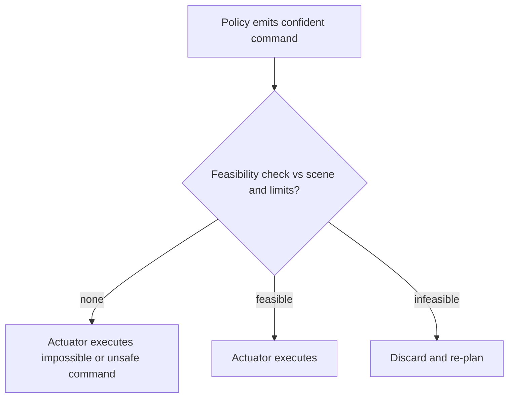

# Physical Hallucination

**Also known as:** Embodied Hallucination, Infeasible-Command Hallucination

**Category:** Anti-Patterns  
**Status in practice:** emerging

## Intent

Anti-pattern: an embodied or process-control agent issues a confidently-phrased command that is syntactically valid but physically infeasible or unsafe, because nothing checks it against geometry, dynamics, or actual plant state before actuation.

## Context

An agent drives an embodied or physical system — a robot arm, a mobile robot, a process-control loop — by emitting commands to actuators or controllers. The model produces those commands from a language or vision-language policy, the same way it produces text, choosing the most plausible next action given the goal. The physical world, unlike a text channel, has hard constraints: reachable poses, dynamic limits, collision geometry, and a current plant state the command must be consistent with.

## Problem

The model has no faithful internal model of physics, so it can emit a command that reads as correct and is phrased with full confidence yet cannot be executed: an unreachable arm pose, a dynamically infeasible motion, a path through an obstacle, or a setpoint inconsistent with the plant's current state. Because the command is syntactically valid and confident, downstream systems that trust the policy pass it through to actuation, where it fails, damages equipment, or creates a hazard. The failure is grounded in the physical world the model cannot perceive faithfully, not in missing facts or tools.

## Forces

- A language or vision-language policy generates the most plausible command, and plausibility is not feasibility — a fluent command can be physically impossible.
- Physical constraints (reach, dynamics, collision, plant state) are not legible in the token stream, so the policy is not penalised for violating them at generation time.
- A confidently-phrased command invites trust from a controller that has no independent feasibility check.
- Adding a grounding or simulation gate before actuation costs latency and engineering that a direct policy-to-actuator path avoids.

## Therefore

Therefore: do not let a policy command reach an actuator on its confidence alone; ground each candidate action against the current scene and the system's physical limits, or simulate it, and discard or correct any command the physical world cannot support before it executes.

## Solution

Treat every command from the policy as a proposal to be checked against physics, not an instruction to execute. Insert a feasibility stage between policy and actuator that grounds the candidate action in the current scene and the system's kinematic, dynamic, and state limits — for example by predicting its affordance from perception, or by rolling it out in a simulator or world model — and rejects or repairs any action the environment cannot support. Only feasible, in-state commands reach the controller; infeasible ones are discarded, re-planned, or escalated. The check is independent of the policy's own confidence, so a fluent but impossible command cannot pass merely by being well-phrased.

## Structure

```
Policy --confident command--> [no feasibility check] --> actuator (BROKEN: impossible/unsafe command executes) ; Corrected: Policy --candidate--> feasibility/affordance/simulation gate --> feasible? --> actuator / discard + re-plan
```

## Diagram



*Without a feasibility check a confidently-phrased but physically impossible command reaches the actuator; a grounding or simulation gate discards it instead.*

## Example scenario

A warehouse robot is told to place a box on the top shelf. The vision-language policy confidently emits an arm pose to reach it, but the pose is outside the arm's workspace; with no feasibility check the controller accepts it, the arm jams against its limit, and the motion faults. A grounding gate that predicted the pose was unreachable would have rejected the command before the arm ever moved.

## Consequences

**Liabilities**

- An infeasible command sent to an actuator can damage hardware, collide with the environment, or create a safety hazard.
- A setpoint inconsistent with plant state can push a process outside safe operating bounds.
- Because the command was confident and valid, the failure surfaces at execution, where it is costly and sometimes dangerous to diagnose.
- Operators lose trust in the autonomy once it issues commands the physical system visibly cannot perform.

## Failure modes

- Unreachable pose — the policy commands an arm configuration outside the manipulator's workspace.
- Dynamically infeasible motion — the commanded trajectory exceeds velocity, acceleration, or torque limits.
- Collision path — the command routes the body through an obstacle the policy did not account for.
- State-inconsistent setpoint — a process command assumes a plant state that does not currently hold.

## What this pattern constrains

A policy-generated command must not reach an actuator on its confidence alone; it has to pass an independent feasibility check against the current scene and the system's physical limits before execution, and an infeasible command is discarded rather than issued.

## Applicability

**Use when**

- Recognising this failure when an embodied or process-control agent issues commands the physical system cannot actually perform.
- Reviewing a policy-to-actuator path that has no feasibility or affordance check between the model and the hardware.
- Diagnosing actuation faults, collisions, or unsafe setpoints that trace back to confidently-phrased but impossible commands.

**Do not use when**

- The agent only produces text or advisory output with no actuation, so there is no physical command to be infeasible.
- A grounding, affordance, or simulation gate already checks every command against physical limits before it executes.
- Actuators hard-reject infeasible commands at a lower layer the agent cannot bypass.

## Components

- Policy — the language or vision-language model that emits action commands from the goal
- Command channel — the path from policy to actuator that this anti-pattern leaves unchecked
- Actuator or controller — the hardware interface that executes whatever command it receives
- Missing feasibility gate — the absent affordance or simulation check against scene and physical limits
- Physical environment — the geometry, dynamics, and plant state the command must be consistent with

## Tools

- Vision-language policy — proposes the actions, sometimes physically infeasible ones
- Affordance or feasibility predictor — the corrective check that grounds an action against the scene
- Simulator or world model — rolls out a candidate command to test feasibility before actuation

## Evaluation metrics

- Infeasible-command rate — fraction of issued commands the physical system could not execute
- Actuation-fault incidents — faults, collisions, or unsafe setpoints traced to impossible commands
- Feasibility-gate catch rate — share of infeasible commands rejected before reaching the actuator
- Confidence-feasibility gap — how often high-confidence commands were physically impossible

## Known uses

- **[HEAL embodied-hallucination study](https://arxiv.org/pdf/2506.15065)** _available_ — Empirical study finding embodied-agent hallucinations are qualitatively different from conversational ones, stemming from a failure to ground instructions in the observed physical environment.
- **[Neuro-symbolic verification for process control](https://www.mdpi.com/2227-9717/14/2/322)** _available_ — Documents hallucinated control commands that are syntactically valid and confident yet physically infeasible or inconsistent with plant state, and adds a verification layer.
- **[Embodied physical-safety diagnosis for LLM decision-making](https://arxiv.org/pdf/2505.19933)** _available_ — Framework showing embodied agents overlook hazardous effects of actions under unsafe preconditions or execute safe actions in an unsafe order.

## Related patterns

- _alternative-to_ **Affordance Grounding Before Action** — Affordance grounding is the corrective — discard actions the scene cannot physically support before the controller; physical hallucination is the failure when no such gate exists.
- _complements_ **Simulate Before Actuate** — Simulating an irreversible action before issuing it catches exactly the physically-infeasible command this anti-pattern lets through.
- _complements_ **Hallucinated Tools** — Both are hallucination at the action boundary; hallucinated-tools invents a nonexistent tool, physical hallucination issues a real-tool command the physical world cannot execute.
- _complements_ **Phantom Action Completion** — Phantom completion narrates an action as done that never ran; physical hallucination actually issues a command that is physically impossible to carry out.
- _complements_ **Mental-Model-In-The-Loop Simulator** — Running candidate strategies in an internal simulator before committing is one way to reject the infeasible commands this anti-pattern produces.

## References

- [HEAL: An Empirical Study on Hallucinations in Embodied Agents Driven by Large Language Models](https://arxiv.org/pdf/2506.15065) — 2025
- [Neuro-Symbolic Verification for Preventing LLM Hallucinations in Process Control](https://www.mdpi.com/2227-9717/14/2/322) — 2026
- [Subtle Risks, Critical Failures: A Framework for Diagnosing Physical Safety of LLMs for Embodied Decision Making](https://arxiv.org/pdf/2505.19933) — 2025
- [LLMs Add Safety Risks To Physical AI](https://semiengineering.com/llms-add-safety-risks-to-physical-ai/) — 2026
