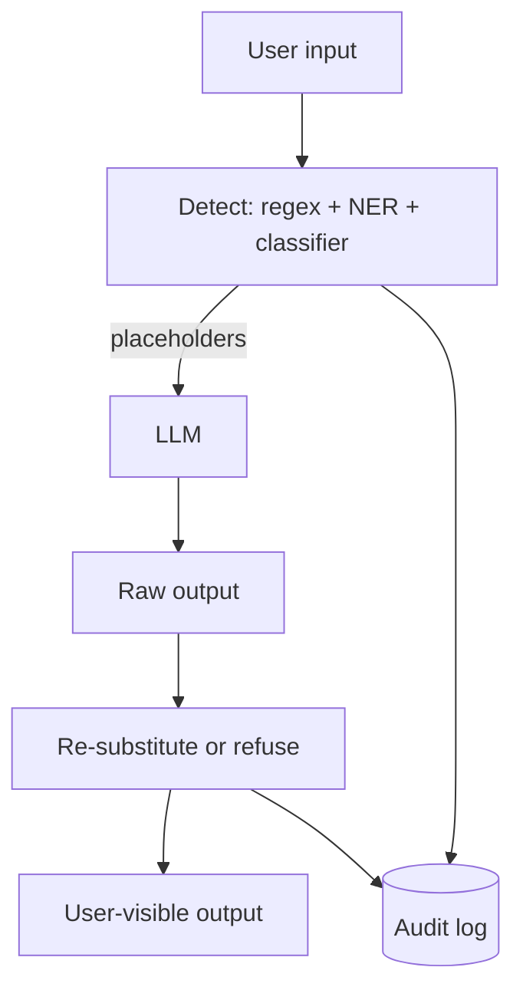

# PII Redaction

**Also known as:** Data Loss Prevention, Sensitive Data Filtering

**Category:** Safety & Control  
**Status in practice:** mature

## Intent

Detect and remove personally identifiable information from inputs to and outputs from the model.

## Context

A team runs an agent in a regulated environment — healthcare, finance, public sector — where legal frameworks (the EU General Data Protection Regulation, the US Health Insurance Portability and Accountability Act, sectoral data-protection rules) restrict what personally identifying information the system is allowed to see, store, log, or pass on to a third party. The agent's inputs and outputs flow through prompt logs, trace stores, evaluation harnesses, and, for hosted models, the provider's infrastructure.

## Problem

Large language models echo what they see in context: any personally identifying information that enters the prompt can end up in the model's response, in the application's trace log, in the eval harness export, and in the third-party provider's request records. Once a customer's name, date of birth, or social-security number has crossed those boundaries, containment is essentially impossible after the fact. Without detection and redaction at the boundary where data enters the model, the operator cannot honestly claim that personal data is protected.

## Forces

- Detection precision vs recall.
- Reversible vs irreversible redaction.
- Token-level vs entity-level redaction.

## Applicability

**Use when**

- Inputs to the model may carry personally identifiable information.
- Outputs and logs must not echo PII the user did not request.
- Detectors (regex, NER, classifier) can be combined for acceptable recall.

**Do not use when**

- Data is already PII-free at the boundary that feeds the model.
- Detector false-positive rates would break the user experience.
- End-to-end encryption or other controls already cover the same risk.

## Therefore

Therefore: detect PII at the boundary, substitute placeholders before the model sees it, and re-substitute or refuse on the way out, so that personal data never enters prompts, logs, or third-party training surfaces.

## Solution

Pre-process inputs: detect PII (regex + NER + classifier), replace with placeholders. Post-process outputs: re-substitute placeholders back, or refuse if outputs contain unrequested PII. Audit log of redactions.

## Example scenario

A health-tech company's support agent logs are reviewed by a security auditor who finds patient names and dates of birth in plaintext across hundreds of transcripts, and worse, the model has occasionally echoed an SSN back into a response. The team installs pii-redaction: an input pipeline detects PII via regex plus NER and substitutes placeholders before anything reaches the model; an output pipeline re-substitutes only when explicitly required and refuses on unrequested PII. Every redaction is logged for audit. The next audit finds zero plaintext PII.

## Diagram

## Consequences

**Benefits**

- Compliance posture improves.
- Logs and prompts become safer to retain.

**Liabilities**

- Redaction errors are user-visible.
- Some workflows need PII; redaction must be selective.
- Re-identification risk: redacted artefacts plus side-channel data still re-identify; redaction is not anonymisation.
- Detection has known evasions: leetspeak, homoglyphs, partial-token splits; false negatives are the security failure.

## What this pattern constrains

PII categories listed in the policy must not appear in model inputs or outputs without explicit authorisation.

## Known uses

- **Microsoft Presidio** — *Available*
- **AWS Comprehend PII** — *Available*

## Related patterns

- *specialises* → [input-output-guardrails](input-output-guardrails.md)
- *complements* → [session-isolation](session-isolation.md)
- *complements* → [secrets-handling](secrets-handling.md)
- *complements* → [open-weight-cascade](open-weight-cascade.md)

## References

- (repo) *microsoft/presidio*, <https://github.com/microsoft/presidio>

**Tags:** safety, pii, compliance
