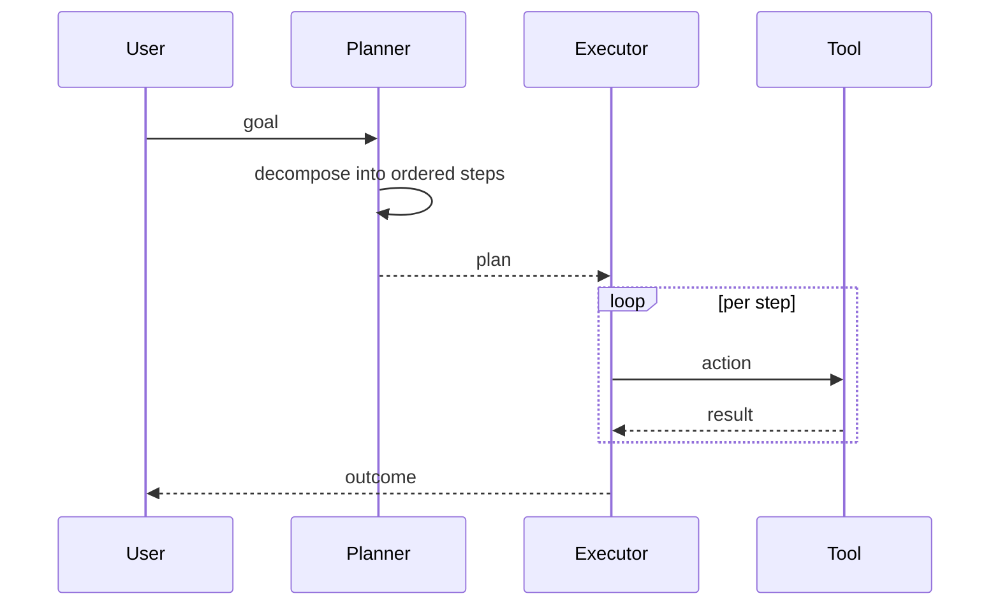

# Plan-and-Execute

**Also known as:** Plan-Then-Execute, Outline-Then-Run

**Category:** Planning & Control Flow  
**Status in practice:** mature

## Intent

Plan all the steps once with a strong model, then execute each step with a cheaper model under the plan.

## Context

A team runs an agent on a task that decomposes into several mostly-known steps — book a venue, then a restaurant, then send invitations — and a strong, expensive model is available alongside a cheaper, faster one. The team would like to use the strong model where its judgment matters (deciding the steps and their order) and the cheaper model where it does not (typing each step's tool call). The world is stable enough that a plan written once is still good a few minutes later.

## Problem

A ReAct loop (reason-act-observe) runs the strong model on every single step, including trivial ones where the next action is obvious, so it pays full price for routine execution. Hand-coding the workflow gives up the agent's ability to handle small surprises. Without an inspectable plan emitted before any tool fires, reviewers cannot see what the agent intends to do until it has already partially done it, and a wrong assumption near the start cannot be caught until the run produces a bad result.

## Forces

- Planning quality depends on context the planner has at planning time.
- Execution may discover the plan was wrong; replan-versus-fail is a real choice.
- Cheaper model may not faithfully execute the plan.

## Therefore

Therefore: pay the strong model once to produce an inspectable ordered plan and then walk it with a cheaper executor, replanning only on surprise, so that token cost shifts off routine steps without giving up plan visibility.

## Solution

Two-stage loop. Planner: produce an ordered list of steps with explicit dependencies. Executor: run each step (often with tools) and accumulate results. On failure or surprise, replan with the new evidence in context.

## Structure

```
Planner -> [Step_1, Step_2, ..., Step_N] -> Executor -> Result. On failure, return to Planner.
```


## Applicability

**Use when**

- The task decomposes cleanly into mostly-independent steps.
- The world is stable enough that a plan made once is still good to execute.
- Cost of replanning per step would dominate the run.

**Do not use when**

- Each step's outcome materially changes what the next step should be — ReAct fits.
- The task is a single step; planning is overhead.
- Steps are tightly interdependent and a DAG with placeholders fits better — see ReWOO or LLMCompiler.

## Example scenario

An office-assistant agent is told, 'Book a team offsite in Barcelona for ten people next month, find a restaurant for dinner, and email everyone the schedule.' Up front it writes a five-step plan: search venues, pick one, search restaurants, pick one, send emails. The executor walks the plan in order. Because the venue list does not depend on what restaurants exist, planning once is cheaper than re-thinking every step.

## Diagram



## Consequences

**Benefits**

- Plan is inspectable before execution starts.
- Cost shifts to the cheap model for routine steps.

**Liabilities**

- Plans can be brittle when the world differs from the planner's mental model.
- Replans add latency and complicate debugging.

## What this pattern constrains

The executor cannot deviate from the current plan without raising a replan request.

## Known uses

- **Bobbin (Stash2Go)** — *Available*. Explicit planner + screen_executor nodes in the agent lane.
- **LangChain Plan-and-Execute** — *Available*

## Related patterns

- *alternative-to* → [react](react.md)
- *generalises* → [rewoo](rewoo.md)
- *generalises* → [planner-executor-observer](planner-executor-observer.md)
- *complements* → [step-budget](step-budget.md)
- *complements* → [structured-output](structured-output.md)
- *alternative-to* → [orchestrator-workers](orchestrator-workers.md)
- *complements* → [least-to-most](least-to-most.md)
- *complements* → [replan-on-failure](replan-on-failure.md)
- *generalises* → [goal-decomposition](goal-decomposition.md)
- *generalises* → [outer-inner-agent-loop](outer-inner-agent-loop.md)

## References

- (paper) Wang, Xu, Lan, Hu, Lan, Lee, Lim, *Plan-and-Solve Prompting: Improving Zero-Shot Chain-of-Thought Reasoning by Large Language Models*, 2023, <https://arxiv.org/abs/2305.04091>
- (blog) *LangChain: Plan-and-Execute Agents*, 2023, <https://blog.langchain.com/planning-agents/>
- (paper) Yue Liu, Sin Kit Lo, Qinghua Lu, Liming Zhu, Dehai Zhao, Xiwei Xu, Stefan Harrer, Jon Whittle, *Agent design pattern catalogue: A collection of architectural patterns for foundation model based agents* (2025) — https://doi.org/10.1016/j.jss.2024.112278

**Tags:** planning, two-stage
