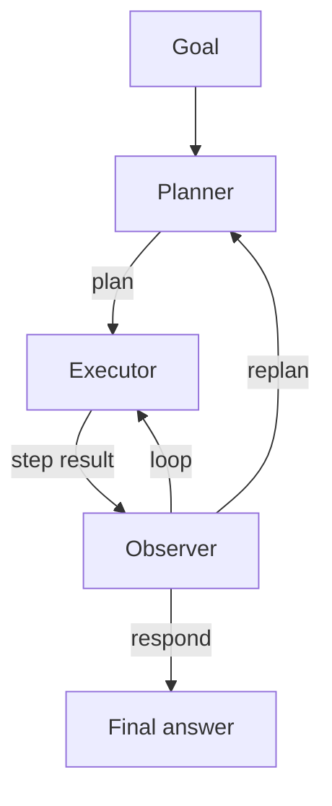

# Planner-Executor-Observer

**Also known as:** Three-Role Loop, POE

**Category:** Planning & Control Flow  
**Status in practice:** emerging

## Intent

Add an explicit Observer role between Planner and Executor so progress is checked against the plan instead of trusted blindly.

## Context

A team runs a Plan-and-Execute agent: a planner emits an ordered plan once and an executor walks the steps. The executor's work needs to be checked against the original intent — does the cumulative output still match what the planner asked for, or has the executor wandered onto an adjacent topic? The team is willing to spend a small amount of supervision overhead to catch drift early instead of paying for an entire bad run.

## Problem

Two existing shapes both fail this requirement. Letting the executor run blind means the planner only finds out at the end whether the run was on-track, at which point fixing it requires starting over. Reporting back to the planner after every step rebuilds the ReAct loop and reintroduces the per-step planner cost the team adopted Plan-and-Execute to avoid. There is no clean place for a cheap, focused check that reads the executor's cumulative output against the plan and decides whether to keep going, stop, or replan.

## Forces

- Observation must be cheap or it negates the plan-execute speedup.
- Triggering replans too eagerly thrashes; too lazily wastes effort.
- The Observer needs visibility into plan and tool results both.

## Applicability

**Use when**

- Plan quality must be checked against execution evidence rather than trusted blindly.
- Three roles (planner, executor, observer) can be defined with their own prompts.
- Observer signals (loop, respond, replan) drive the agent's next move.

**Do not use when**

- The task is short enough that planner-executor without supervision suffices.
- Observer cost dominates and there is no payoff in catching mid-run drift.
- Roles cannot be cleanly separated without overlapping prompts.

## Therefore

Therefore: insert a third Observer role that reads cumulative execution against the plan and is the only one allowed to call loop, respond, or replan, so that mid-run drift is caught early without rebuilding ReAct's monolithic step.

## Solution

Three roles: Planner produces a plan; Executor runs steps; Observer reads the cumulative result and decides loop / respond / replan. Each role has its own prompt and (optionally) its own model.

## Example scenario

A research agent that uses a Planner and Executor loop produces fluent reports that quietly drift from the plan: the executor swaps in adjacent topics and the planner never notices because no one is checking. The team adds an Observer role: after each executor step the observer reads the cumulative output against the plan and emits loop, respond, or replan. When the executor wanders into 'related-but-off-plan' territory the observer triggers a replan instead of letting the drift compound.

## Diagram

## Consequences

**Benefits**

- Catches plan failure earlier than end-of-run.
- Cleaner separation of concerns than ReAct's monolithic step.

**Liabilities**

- Three coordinated prompts to maintain.
- Latency adds up if Observer runs every step.

## What this pattern constrains

The Executor cannot decide to stop or replan; only the Observer can.

## Known uses

- **Bobbin (Stash2Go)** — *Available*. planner / screen_executor / observe with route_after_observe edge.

## Related patterns

- *specialises* → [plan-and-execute](plan-and-execute.md)
- *composes-with* → [evaluator-optimizer](evaluator-optimizer.md)
- *alternative-to* → [react](react.md)
- *used-by* → [replan-on-failure](replan-on-failure.md)
- *generalises* → [outer-inner-agent-loop](outer-inner-agent-loop.md)

## References

- (blog) *Marco Nissen, Working with the models (Code Different #14)*, 2026

**Tags:** planning, three-role
