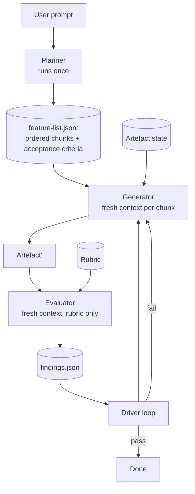

# Planner-Generator-Evaluator Harness

**Also known as:** Three-Agent Harness, GAN-Inspired Agent Architecture, Spec-Plan-Generate-Evaluate Loop

**Category:** Planning & Control Flow
**Status in practice:** emerging

## Intent

Decompose a long-running coding or creative job into three role-isolated agents — a Planner that emits a structured feature list, a Generator that builds one chunk per fresh context, and an Evaluator that grades the artefact against a fixed rubric without seeing the Generator's reasoning trace.

## Context

Long-running application development, large refactors, and other multi-day creative jobs run by a coding-agent harness where a single agent run cannot fit the task into one context window. The work has a clear external artefact (code, document, design) that can be evaluated independently of how it was produced.

## Problem

Single-agent long-runs hit context limits and conflate planning, generation, and self-grading inside one head. Two-role evaluator-optimizer loops let the optimiser game the evaluator by reading its critiques as hints. Generic orchestrator-workers patterns do not specify a *grader* role with hard isolation, so quality drifts. The harness needs a three-way split where each role works in its own context and the evaluator cannot be social-engineered by the generator's reasoning.

## Forces

- Each role's context must stay small enough to fit, yet the overall job spans days.
- The evaluator must judge the artefact, not the process, but the generator naturally wants to argue.
- Plans must be machine-checkable so the generator can pick up the next chunk without re-reading the user's prompt.
- Role isolation costs orchestration complexity and inter-role hand-off latency.

## Therefore

Therefore: split the harness into three agents with disjoint contexts — Planner produces a structured feature list, Generator works one chunk at a time from a fresh context seeded only by the plan plus prior artefact, and Evaluator scores the artefact against a fixed rubric without access to the Generator's reasoning trace — so each role optimises one objective and cannot collude with the others.

## Solution

The Planner runs once (or rarely) and emits a structured feature-list artefact: ordered chunks, acceptance criteria, dependencies. The Generator is invoked per-chunk in a fresh context that includes only (a) the feature-list, (b) the current artefact state, and (c) the chunk to build; it produces a new artefact revision and exits. The Evaluator is invoked in its own fresh context with only the artefact and the fixed rubric; it returns pass/fail plus structured findings, and never sees the Generator's chain of thought or scratch notes. A small driver loop routes between the three: failed evaluation re-invokes the Generator with the findings as input (not the full Evaluator transcript). The fixed rubric makes Evaluator behaviour reproducible across runs.

## Structure

```
Driver --> {Planner | Generator | Evaluator}. Planner reads user prompt, writes feature-list.json. Generator reads feature-list.json + artefact, writes artefact'. Evaluator reads artefact' + rubric, writes findings.json. Driver dispatches based on findings.
```

## Diagram



*Three role-isolated agents talk only through structured artefacts on disk; the evaluator never sees the generator's trace.*

## Example scenario

A coding agent is asked to add OAuth support across a large web app. The Planner reads the prompt and writes feature-list.json: ten ordered chunks with acceptance criteria. The Generator boots a fresh context per chunk, edits files, exits. The Evaluator boots its own fresh context, reads only the diff and the rubric ("does it compile, do the new tests pass, are there no plaintext secrets"), and returns findings. Chunk 4 fails; the driver re-invokes the Generator with the findings but not the Evaluator's reasoning trace. Across two days the artefact converges without any one context exceeding its limit.

## Consequences

**Benefits**

- Each role's context stays small and bounded.
- Evaluator isolation makes scores harder to game from inside the generator.
- Fresh-context generation per chunk avoids long-trace attention rot.
- Plans are durable artefacts that survive crashes and resumption.

**Liabilities**

- Three-agent orchestration adds significant harness complexity over single-agent loops.
- Inter-role hand-offs through files add latency.
- A weak or mis-specified rubric makes the Evaluator useless or actively harmful.
- Planner errors propagate through the whole run because the Generator trusts the plan.

## What this pattern constrains

The Evaluator must never receive the Generator's reasoning trace or scratch context, only the artefact and the rubric; the Generator must not re-plan (any plan change goes back to the Planner); the Planner must not generate the artefact directly.

## Applicability

**Use when**

- A single agent run cannot fit the job into one context window.
- There is a clear external artefact that can be evaluated without inspecting how it was produced.
- A stable rubric exists or can be authored.

**Do not use when**

- The job is short enough for a single agent with extended thinking.
- No meaningful rubric can be written; the evaluator will degrade to noise.
- Latency matters more than quality; the inter-role hand-offs are too expensive.

## Known uses

- **[Anthropic harness for Claude Code long-running tasks](https://www.anthropic.com/engineering/harness-design-long-running-apps)** — *Available* — Three-agent harness described in Anthropic engineering posts on long-running application development.
- **[Anthropic effective-harnesses guidance](https://www.anthropic.com/engineering/effective-harnesses-for-long-running-agents)** — *Available* — Codifies role isolation and fresh-context generation as harness primitives.

## Related patterns

- *specialises* → [evaluator-optimizer](evaluator-optimizer.md) — Adds a separate Planner role and enforces evaluator isolation.
- *alternative-to* → [planner-executor-observer](planner-executor-observer.md) — POE's observer is a monitor; here the evaluator is a peer grader with veto power.
- *specialises* → [orchestrator-workers](orchestrator-workers.md) — Fixes three named roles instead of dynamic worker decomposition.
- *complements* → [spec-first-agent](spec-first-agent.md) — The Planner output is a machine-readable spec.
- *uses* → [frozen-rubric-reflection](frozen-rubric-reflection.md) — Evaluator runs against a fixed rubric.

## References

- (blog) Anthropic Engineering, *Harness design for long-running application development*, 2026, <https://www.anthropic.com/engineering/harness-design-long-running-apps>
- (blog) Anthropic Engineering, *Effective harnesses for long-running agents*, 2025, <https://www.anthropic.com/engineering/effective-harnesses-for-long-running-agents>
- (blog) InfoQ, *Anthropic Details Three-Agent Harness for Long-Running Coding Agents*, 2026, <https://www.infoq.com/news/2026/04/anthropic-three-agent-harness-ai/>

**Tags:** harness, long-running, role-isolation, coding-agent, rubric
