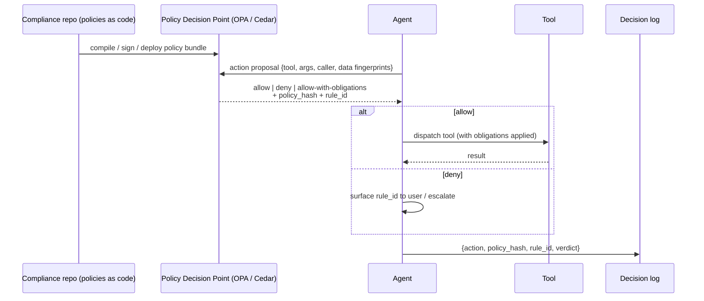

# Policy-as-Code Gate

**Also known as:** OPA Action Gate, Compiled Governance, Policy-as-Prompt, Rego-Gated Agent, External Policy Engine

**Category:** Safety & Control
**Status in practice:** emerging

## Intent

Evaluate every proposed agent action against externally-managed machine-readable policies before dispatch, so compliance authorship lives outside the prompt and outside the agent code.

## Context

Production agents operating in regulated or compliance-sensitive domains where the set of permitted actions is governed by policy documents authored by compliance, legal, or security teams rather than by prompt engineers. Tool/action surfaces are non-trivial and the policy surface changes on a different cadence than the agent code.

## Problem

When governance rules are baked into the system prompt or hard-coded into the agent, every policy change requires a prompt edit and a redeploy, and the people accountable for compliance cannot read, audit, or change the rules without going through engineering. Natural-language constitutional rules in the prompt also drift: there is no machine-evaluable contract between the rule and the action that fired, no signed version, and no independent audit trail. Compliance officers need an authoring surface and an evaluation engine that is not the LLM itself.

## Forces

- Compliance officers must own the rules, but they do not write prompts and do not deploy agent code.
- Policies change faster than agent prompts and on a different release cadence than model weights.
- Natural-language rules embedded in the prompt are not independently auditable and have no signed version.
- A machine-evaluable policy engine must be deterministic and fast enough to sit on the hot path of every tool call.
- Policy documents are often authored in prose; manually translating them to code is a bottleneck and a source of drift.

## Therefore

Therefore: route every proposed tool call through an external policy engine that evaluates the action against versioned, signed, machine-readable rules authored and owned by the compliance function, so that policy changes ship independently of the agent and every allow/deny decision carries a checkable policy version.

## Solution

Maintain policies as code (OPA/Rego, Cedar, or equivalent) in a repository owned by compliance, optionally generated by a policy compiler that translates prose policy documents into the rule language. Before any tool dispatch, the agent emits a structured action proposal (tool, arguments, caller context, retrieved data fingerprints) to an external policy decision point. The engine returns allow, deny, or allow-with-obligations together with a policy hash and rule id. The agent dispatches the tool only on allow; on deny the agent surfaces the rule id to the user or escalates. Policies are versioned, signed, and ship through a separate pipeline from the agent. Evaluation results are logged with the policy hash so any decision can be re-checked against the exact rule version that fired.

## Structure

```
Agent --(action proposal)--> Policy Decision Point (OPA/Cedar) --(allow|deny|obligations + policy_hash)--> Agent --(on allow)--> Tool. Policy repo (compliance-owned) --(compile/sign/deploy)--> Policy Decision Point. Decision log captures {action, policy_hash, rule_id, verdict}.
```

## Diagram



*Every action is gated by an external policy engine; compliance authorship lives outside the agent and outside the prompt.*

## Example scenario

A bank deploys an agent that can move money, open accounts, and call external KYC services. The compliance team writes its rules in Rego in a separately versioned policy repository, including jurisdiction-by-jurisdiction holds, sanctions checks, and threshold-based human-approval requirements. Before any tool call, the agent serialises the proposed action and sends it to an OPA sidecar. OPA returns allow with obligations (require dual approval, mask the customer name in the downstream call), and the agent honours those obligations on dispatch. When a regulator asks why a particular transfer was permitted, the audit log replays the action against the exact policy hash that was active at that moment.

## Consequences

**Benefits**

- Compliance owns the rules in their native form; engineering owns the agent.
- Policy changes ship without touching prompts or model weights.
- Every allow/deny carries a signed policy version that an auditor can replay.
- Deterministic rule evaluation removes the LLM from the enforcement path.
- Prose-to-code compilation reduces translation drift between policy documents and runtime checks.

**Liabilities**

- Adds a synchronous decision point to every tool call; latency and availability of the policy engine become production concerns.
- Rule language (Rego, Cedar) is itself a skill the compliance team must acquire or be supported in.
- Prose-to-code compilation can introduce its own translation errors; the compiled output still needs human review.
- Policies that depend on free-text content (intent, tone) cannot be fully expressed as code and fall back on classifier obligations.
- Action proposals must serialise enough context for the policy to evaluate, which expands the agent's structured-output surface.

## What this pattern constrains

The LLM must not dispatch any governed tool call without first obtaining an allow verdict from the external policy engine, must not modify or paraphrase rule content at runtime, and must surface the rule id behind any deny rather than synthesising its own explanation.

## Applicability

**Use when**

- Governance rules are owned by a compliance, legal, or security function distinct from agent engineering.
- Policies change more often than the agent or model.
- Auditors require a signed, replayable rule version for each agent action.
- The action surface is non-trivial and contains operations that vary in risk.

**Do not use when**

- The deployment is a personal or research-grade prototype with no compliance surface.
- The action surface is so small that a handful of natural-language rules in the prompt are sufficient and stable.
- Latency budgets cannot tolerate any synchronous decision point on the tool-call path.

## Known uses

- **[Giskard Guards](https://www.giskard.ai/)** — *Available* — Policy-as-code guardrails for LLM agents (Paris).
- **[Microsoft Agent Governance Toolkit](https://opensource.microsoft.com/blog/2026/04/02/introducing-the-agent-governance-toolkit-open-source-runtime-security-for-ai-agents/)** — *Available* — Open-source runtime governance for AI agents, announced 2026-04.
- **[heise/BSI KRITIS reference architectures](https://www.heise.de/hintergrund/Agentic-AIOps-KI-Agenten-in-kritischen-Infrastrukturen-11267508.html)** — *Planned* — German critical-infrastructure deployments wrap agent tool dispatch behind OPA-style policy engines.

## Related patterns

- *alternative-to* → [constitutional-charter](constitutional-charter.md) — Constitutional charters keep rules as natural-language inside the prompt; policy-as-code externalises them as machine-evaluable rules with their own release cycle.
- *complements* → [input-output-guardrails](input-output-guardrails.md) — Guardrails filter content; policy-as-code gates actions. The two stack: a guardrail can be an obligation attached to an allow verdict.
- *complements* → [human-in-the-loop](human-in-the-loop.md) — A deny or allow-with-obligation verdict can route to a human approver.
- *complements* → [refusal](refusal.md) — When the policy engine denies, the agent's refusal carries an authoritative rule id rather than a synthesised justification.

## References

- (paper) *Policy-as-Prompt: Turning AI Governance Rules into Guardrails for AI Agents*, 2025, <https://arxiv.org/abs/2509.23994>
- (blog) Microsoft Open Source, *Introducing the Agent Governance Toolkit: Open-Source Runtime Security for AI Agents*, 2026, <https://opensource.microsoft.com/blog/2026/04/02/introducing-the-agent-governance-toolkit-open-source-runtime-security-for-ai-agents/>
- (blog) *Agentic AIOps: KI-Agenten in kritischen Infrastrukturen*, <https://www.heise.de/hintergrund/Agentic-AIOps-KI-Agenten-in-kritischen-Infrastrukturen-11267508.html>
- (blog) *BSI Zero-Trust Designprinzipien für LLMs*, 2025, <https://www.datenschutzticker.de/2025/09/bsi-zero-trust-designprinzipien-fuer-llms/>

**Tags:** policy-as-code, governance, opa, rego, compliance, safety-control, tool-gating
