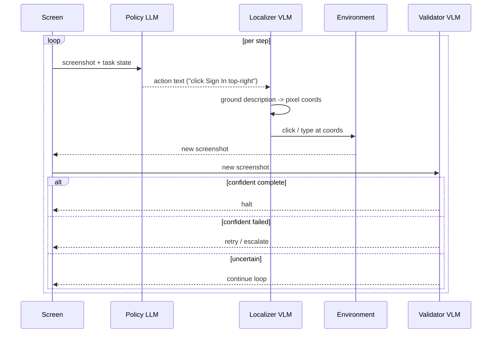

# Policy-Localizer-Validator

**Also known as:** Three-Way GUI Agent, Surfer-H Architecture, Validator-Gated Browser Agent

**Category:** Tool Use & Environment  
**Status in practice:** emerging

## Intent

Split a GUI agent into three specialist models — a Policy that plans, a Localizer that grounds elements to pixels, and a Validator that judges completion — so each role uses the smallest sufficient model.

## Context

A team is operating a browser or desktop agent that reads screenshots and emits clicks, types, and scrolls. Trajectories are long, costs compound at each step, and per-step latency matters for real-time web use. The team wants to attribute failures cleanly and to size each capability with the smallest sufficient model.

## Problem

One large multimodal model that plans, grounds clicks to pixels, and decides when to stop pays the largest-model price on every step, including the steps where it is really just doing perception. Failures cannot be attributed cleanly: a wrong click could be a bad plan, bad pixel grounding, or a premature stop. A two-model split that separates planning from grounding (the Dual-System approach) helps with the first two but still leaves the commit decision implicit in whatever the planner happened to say last, with no independent check that the task actually finished.

## Forces

- Planning, grounding, and completion-judgment have different optimal model sizes.
- Pixel-precise grounding is a perception problem; large reasoning models overpay for it.
- Completion judgment must be uncorrelated with the planner or it just rubber-stamps its own work.
- Costs compound per step in long browser trajectories.
- Latency on every action matters for real-time web use, so each role must be independently latency-tuned.

## Therefore

Therefore: decompose the agent into three independently-trained models — Policy plans, Localizer grounds, Validator commits — and gate each commit on the Validator's separate judgment so grounding errors and premature stops are caught before action.

## Solution

Pipeline each step through three models. Policy LLM reads the current screenshot plus task state and emits a textual action ("click the Sign In button in the top-right"). Localizer VLM, trained specifically for UI grounding, takes that description plus the screenshot and returns pixel coordinates. The action is executed. Validator VLM — separately trained on completion judgments — inspects the resulting screenshot and answers "task complete?" with calibrated confidence; if uncertain, the loop continues; if confident-complete, the agent halts; if confident-failed, the agent retries or escalates. Each model can be sized independently — typically Policy is the largest, Localizer is a small specialist VLM, Validator is mid-sized.

## Structure

```
Loop step: screenshot -> Policy LLM (action text) -> Localizer VLM (pixel coords) -> environment (click/type) -> new screenshot -> Validator VLM (complete? continue? failed?) -> branch.
```

## Diagram



*Each GUI step is split across a Policy LLM, a Localizer VLM, and a Validator VLM, each at the smallest sufficient size.*

## Example scenario

A booking agent must reserve a meeting room on an internal portal. Policy reads the screenshot and says 'click the Book button next to the 10 AM slot'. Localizer VLM, trained on UI grounding, returns coordinates (892, 437). After the click, Validator sees a confirmation modal and judges 'task complete, confidence 0.92'. When grounding once misfires — Localizer clicks the 11 AM Book button — the Validator catches the wrong confirmation slot and signals 'failed, retry'; the loop continues with corrected context.

## Consequences

**Benefits**

- Each role uses the smallest sufficient model — total cost lower than monolithic.
- Failures attribute cleanly: bad plan, bad grounding, or bad commit decision.
- Validator gives a real stop signal uncorrelated with the planner's optimism.
- Specialist VLMs can be trained on open weights without retraining the planner.
- Independent latency tuning per role.

**Liabilities**

- Three models means three deployment targets, three training pipelines, three versioning surfaces.
- Inter-model interface (the textual action description) becomes a contract that must stay stable.
- Validator must be calibrated or it stops too early / too late.
- Cold-start: until the Validator is trained on the target domain, completion judgments are weak.
- More moving parts to monitor at runtime.

## What this pattern constrains

The Policy model must not emit pixel coordinates directly — grounding is the Localizer's exclusive responsibility. The agent must not commit to task-complete based on the Policy model's own output; only the Validator can stop the loop.

## Applicability

**Use when**

- Agent drives a GUI or browser via screenshots and actions.
- Trajectories are long enough that per-step cost matters.
- Failure-mode attribution is needed for debugging or audit.
- Open-weights specialist VLMs are available or trainable for the target domain.

**Do not use when**

- Task is short (a few clicks) — overhead of three models is not amortized.
- Domain is too narrow to justify training a Validator.
- Single capable multimodal model is cheap enough that splitting wastes engineering effort.
- Latency budget cannot absorb sequential three-model passes per step.

## Components

- Policy LLM — reads screenshot and task state and emits a textual action description
- Localizer VLM — grounds the textual action plus screenshot into pixel coordinates
- Validator VLM — judges whether the resulting state advances or completes the task
- Action Executor — carries the grounded action to the environment
- Step Coordinator — sequences policy, localizer, executor, and validator each step

## Tools

- UI grounding VLM (SeeClick, OS-Atlas, or similar) — plays the localizer role
- Completion-judgment VLM — plays the validator role, trained on success and failure traces
- GUI driver (mobile or desktop) — executes the grounded action against the environment

## Evaluation metrics

- Per-role attribution of failures — share of errors traced to policy, localizer, or validator
- Click grounding accuracy — localizer-specific metric on UI-grounding benchmarks
- Validator precision and recall — how reliably the validator catches premature stops and missed completions
- Cost split across three models — how much budget each specialist consumes
- End-to-end task success versus single-model baseline — headline value of the three-role split

## Known uses

- **[H Company Surfer-H + Holo1 (Paris)](https://arxiv.org/abs/2506.02865)** _available_ — Three-model browser agent with explicit Policy / Localizer / Validator roles; open-weights VLMs.
- **[Surfer-H / Holo1 (H Company)](https://github.com/hcompai/surfer-h-cli)** _available_ — Web agent built from three components named policy, localizer, and validator.

## Related patterns

- _specialises_ **Dual-System GUI Agent** — Adds a third specialist (Validator) on top of the planner+vision split.
- _specialises_ **Browser Agent** — A specific architecture for browser-based agents.
- _specialises_ **Computer Use** — Same decomposition applied to desktop GUIs.
- _alternative-to_ **Evaluator-Optimizer** — Evaluator-Optimizer is a rewrite loop on text drafts; Validator here is a per-step gate on commit, not a critic of artifacts.
- _alternative-to_ **Tool-Augmented Self-Correction** — Critic patterns judge a model's draft; Validator judges environment state, not text.

## References

- [Surfer-H Meets Holo1: Cost-Efficient Web Agent Powered by Open-Weights](https://arxiv.org/abs/2506.02865) — H Company, 2025
- [Holo1 collection](https://huggingface.co/Hcompany) — H Company, 2025
- [Surfer-H CLI](https://github.com/hcompai/surfer-h-cli) — H Company, 2025
