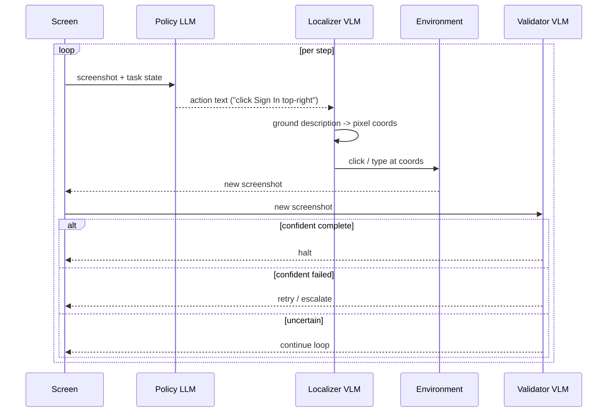

# Policy-Localizer-Validator

**Also known as:** Three-Way GUI Agent, Surfer-H Architecture, Validator-Gated Browser Agent

**Category:** Tool Use & Environment
**Status in practice:** emerging

## Intent

Split a GUI or browser agent into three specialist models — a Policy LLM that plans the next action, a Localizer VLM that grounds described UI elements to pixel coordinates, and a Validator VLM that judges whether the task is complete — so each role uses the smallest sufficient model and grounding errors are caught before commit.

## Context

Web and desktop agents that drive a real browser by reading screenshots and emitting clicks, types, and scrolls. A single multimodal model doing all three roles is expensive, slow, and confounds failure modes — was the click wrong because the plan was wrong, the coordinates were wrong, or the task was already done?

## Problem

Monolithic GUI agents conflate three distinct skills: reasoning about what to do next, mapping a textual description to a pixel target, and deciding when to stop. Failures are hard to attribute, and the largest model is paid for tasks that smaller specialists handle better. Two-model splits (planner+vision, per Dual-System GUI Agent) improve cost but still leave commit decisions implicit in the planner's last token — there is no separate check on "did we actually finish".

## Forces

- Planning, grounding, and completion-judgment have different optimal model sizes.
- Pixel-precise grounding is a perception problem; large reasoning models overpay for it.
- Completion judgment must be uncorrelated with the planner or it just rubber-stamps its own work.
- Costs compound per step in long browser trajectories.
- Latency on every action matters for real-time web use, so each role must be independently latency-tuned.

## Therefore

Therefore: decompose the agent into three independently-trained models — Policy plans, Localizer grounds, Validator commits — and gate each commit on the Validator's separate judgment so grounding errors and premature stops are caught before action.

## Solution

Pipeline each step through three models. Policy LLM reads the current screenshot plus task state and emits a textual action ("click the Sign In button in the top-right"). Localizer VLM, trained specifically for UI grounding, takes that description plus the screenshot and returns pixel coordinates. The action is executed. Validator VLM — separately trained on completion judgments — inspects the resulting screenshot and answers "task complete?" with calibrated confidence; if uncertain, the loop continues; if confident-complete, the agent halts; if confident-failed, the agent retries or escalates. Each model can be sized independently — typically Policy is the largest, Localizer is a small specialist VLM, Validator is mid-sized.

## Structure

```
Loop step: screenshot -> Policy LLM (action text) -> Localizer VLM (pixel coords) -> environment (click/type) -> new screenshot -> Validator VLM (complete? continue? failed?) -> branch.
```

## Diagram



*Each GUI step is split across a Policy LLM, a Localizer VLM, and a Validator VLM, each at the smallest sufficient size.*

## Example scenario

A booking agent must reserve a meeting room on an internal portal. Policy reads the screenshot and says 'click the Book button next to the 10 AM slot'. Localizer VLM, trained on UI grounding, returns coordinates (892, 437). After the click, Validator sees a confirmation modal and judges 'task complete, confidence 0.92'. When grounding once misfires — Localizer clicks the 11 AM Book button — the Validator catches the wrong confirmation slot and signals 'failed, retry'; the loop continues with corrected context.

## Consequences

**Benefits**

- Each role uses the smallest sufficient model — total cost lower than monolithic.
- Failures attribute cleanly: bad plan, bad grounding, or bad commit decision.
- Validator gives a real stop signal uncorrelated with the planner's optimism.
- Specialist VLMs can be trained on open weights without retraining the planner.
- Independent latency tuning per role.

**Liabilities**

- Three models means three deployment targets, three training pipelines, three versioning surfaces.
- Inter-model interface (the textual action description) becomes a contract that must stay stable.
- Validator must be calibrated or it stops too early / too late.
- Cold-start: until the Validator is trained on the target domain, completion judgments are weak.
- More moving parts to monitor at runtime.

## What this pattern constrains

The Policy model must not emit pixel coordinates directly — grounding is the Localizer's exclusive responsibility. The agent must not commit to task-complete based on the Policy model's own output; only the Validator can stop the loop.

## Applicability

**Use when**

- Agent drives a GUI or browser via screenshots and actions.
- Trajectories are long enough that per-step cost matters.
- Failure-mode attribution is needed for debugging or audit.
- Open-weights specialist VLMs are available or trainable for the target domain.

**Do not use when**

- Task is short (a few clicks) — overhead of three models is not amortized.
- Domain is too narrow to justify training a Validator.
- Single capable multimodal model is cheap enough that splitting wastes engineering effort.
- Latency budget cannot absorb sequential three-model passes per step.

## Known uses

- **[H Company Surfer-H + Holo1 (Paris)](https://arxiv.org/abs/2506.02865)** — *Available* — Three-model browser agent with explicit Policy / Localizer / Validator roles; open-weights VLMs.

## Related patterns

- *specialises* → [dual-system-gui-agent](dual-system-gui-agent.md) — Adds a third specialist (Validator) on top of the planner+vision split.
- *specialises* → [browser-agent](browser-agent.md) — A specific architecture for browser-based agents.
- *specialises* → [computer-use](computer-use.md) — Same decomposition applied to desktop GUIs.
- *alternative-to* → [evaluator-optimizer](evaluator-optimizer.md) — Evaluator-Optimizer is a rewrite loop on text drafts; Validator here is a per-step gate on commit, not a critic of artifacts.
- *alternative-to* → [critic](critic.md) — Critic patterns judge a model's draft; Validator judges environment state, not text.

## References

- (paper) H Company, *Surfer-H Meets Holo1: Cost-Efficient Web Agent Powered by Open-Weights*, 2025, <https://arxiv.org/abs/2506.02865>
- (repo) H Company, *Holo1 collection*, 2025, <https://huggingface.co/Hcompany>
- (repo) H Company, *Surfer-H CLI*, 2025, <https://github.com/hcompai/surfer-h-cli>

**Tags:** gui-agent, browser-agent, multimodal, decomposition, cost-efficiency
